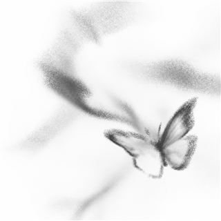

# 友链

在各自的光域里写作、生活，也偶尔隔着链接相遇。

  <a class="friend-card" href="https://p-piu.github.io/friends/" target="_blank" rel="noopener noreferrer">
    
    
      <strong class="friend-card__name">P-Piu 的光合作用空间</strong>
      江浙沪第一菠萝吹雪
      p-piu.github.io ↗
    
  </a>

