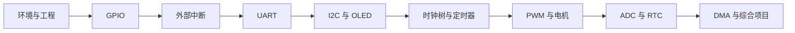

# STM32 Keysking 教程索引

!!! abstract "使用说明"
    这是 Keysking STM32 视频教程的重组笔记。课程知识点保持不变，工程实现统一改为 **STM32CubeMX 生成 CMake 工程 + VSCode 编译、下载和调试**。默认芯片为 `STM32F103C8T6`、HAL 库、ST-LINK；其他 STM32 型号只需按数据手册调整引脚、时钟和外设实例。

>  [半小时学完单片机基础](半小时学完单片机基础.md)

## 学习路线

## 笔记目录

1. [STM32-01-CubeMX与VSCode环境](STM32-01-CubeMX与VSCode环境.md)：新建、生成、构建、烧录、调试和代码保护区。
2. [STM32-02-GPIO与外部中断](STM32-02-GPIO与外部中断.md)：LED、按键、输入模式、消抖、EXTI 和中断规则。
3. [STM32-03-UART与DMA](STM32-03-UART与DMA.md)：轮询、中断、DMA、不定长接收、循环缓冲区和命令解析。
4. [STM32-04-I2C与OLED](STM32-04-I2C与OLED.md)：AHT20、I²C 状态机、OLED 驱动与字模。
5. [STM32-05-时钟树与定时器](STM32-05-时钟树与定时器.md)：时钟计算、基本定时、外部计数、输入捕获和编码器。
6. [STM32-06-PWM与电机控制](STM32-06-PWM与电机控制.md)：呼吸灯、舵机、蜂鸣器、直流电机和 WS2812。
7. [STM32-07-ADC与RTC](STM32-07-ADC与RTC.md)：单/多通道 ADC、NTC、内部参考电压、RTC 和掉电走时。
8. [STM32-08-工程化专题与综合项目](STM32-08-工程化专题与综合项目.md)：寄存器、DMA、模块化、非阻塞程序和项目验收。
9. [STM32-HAL函数速查](STM32-HAL函数速查.md)：重要函数的输入、输出、使用前提和常见回调。
10. [STM32-09-内部结构与总线架构](STM32-09-内部结构与总线架构.md)：CPU、存储器、晶振、时钟树、AHB/APB 与启动过程。
11. [STM32-10-GPIO内部结构与模式](STM32-10-GPIO内部结构与模式.md)：输入缓冲、上下拉、推挽、开漏、复用和模拟模式。
12. [STM32-11-输入输出方式总览](STM32-11-输入输出方式总览.md)：数字、模拟、脉冲和通信接口，以及轮询/中断/DMA 的选择。

## 对应视频范围

| 笔记 | Keysking 视频 |
|---|---|
| 环境 | 0–1 集；原视频使用 CubeIDE，本笔记改为 VSCode |
| GPIO/EXTI | 2–7 集 |
| UART/DMA | 8–11 集；DMA、循环缓冲区补充篇 |
| I²C/OLED | 12–14 集及温湿度计番外 |
| 时钟/定时器 | 15–21 集 |
| PWM/电机 | 20、22、23 集；WS2812、蜂鸣器补充篇 |
| ADC/RTC | 24–27 集 |
| 工程化 | 28 集及后续综合项目 |

## 建议节奏

- 第一次：每学一篇，至少做一个“最小实验”。
- 第二次：不看代码，只根据 CubeMX 清单重新建工程。
- 第三次：使用 [STM32-HAL函数速查](STM32-HAL函数速查.md) 默写函数参数与回调流程。
- 复习标准：能说清楚“输入来自哪里、输出到哪里、何时完成、错误怎么发现”。

## 最小硬件

- STM32F103C8T6 开发板或 Keysking 学习板
- ST-LINK、USB 转串口、杜邦线、面包板
- LED 与限流电阻、按键；后续按实验添加 AHT20、OLED、舵机等

!!! warning "电气安全"
    STM32F103 GPIO 通常是 3.3 V 逻辑。接 5 V 模块前查引脚是否容忍 5 V；舵机、电机和灯带使用独立电源并与 STM32 共地，禁止由 GPIO 直接供电。

## 主要资料

- [Keysking B站课程合集](https://www.bilibili.com/video/BV12v4y1y7uV/)
- [波特律动 STM32 配套文档](https://docs.keysking.com/docs/stm32/intro/)
- [波特律动例程目录](https://docs.keysking.com/docs/stm32/example/)
- [ST STM32CubeIDE for VS Code 扩展](https://marketplace.visualstudio.com/items?itemName=stmicroelectronics.stm32-vscode-extension)

资料核对日期：2026-08-07。

<!-- lhyzs-note-nav:start -->
---
> 下一篇：[STM32 CubeMX 与 VSCode 环境](STM32-01-CubeMX与VSCode环境.md) →
<!-- lhyzs-note-nav:end -->
