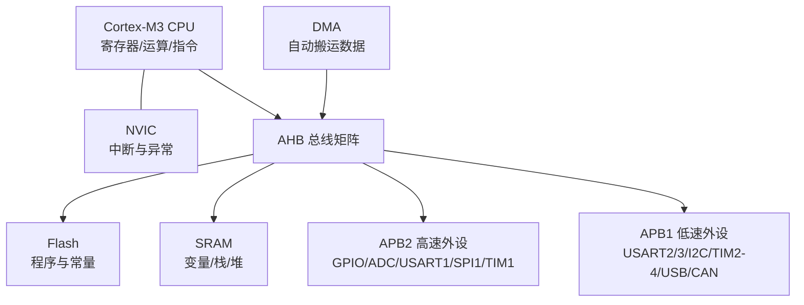
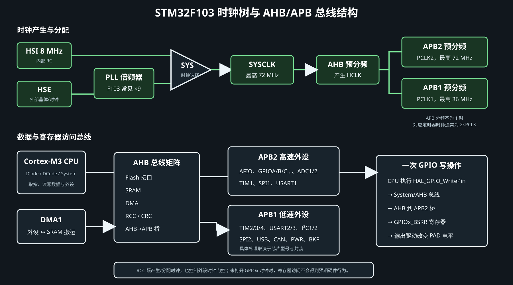
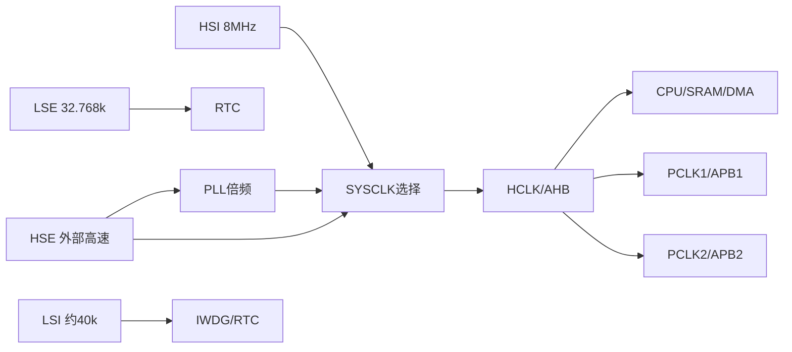

# STM32 内部结构与总线架构

> [STM32-00-Keysking教程索引](STM32-00-Keysking教程索引.md) · [STM32-10-GPIO内部结构与模式](STM32-10-GPIO内部结构与模式.md) · [STM32-11-输入输出方式总览](STM32-11-输入输出方式总览.md)

!!! abstract "一句话认识 MCU"
    MCU 是把 CPU、Flash、SRAM、时钟、总线、GPIO、定时器、通信接口、ADC 和中断控制器集成在一颗芯片里的小型计算机。CPU 只负责执行指令，真正与外界交互的是各类外设。

本篇以 `STM32F103C8T6` 为例。不同封装和容量型号拥有的引脚、存储器和外设数量不同，应以具体料号的数据手册为准。

## 一、整体结构



下面的详细图把“时钟如何产生”和“CPU 如何沿总线访问寄存器”放在一起：



### 模块分工

| 模块 | 作用 | 断电后是否保留 |
|---|---|---|
| Cortex-M3 内核 | 取指、运算、分支、异常处理 | 否 |
| Flash | 保存程序、只读常量和中断向量表 | 是 |
| SRAM | 运行时变量、栈、堆和缓冲区 | 否 |
| RCC | 选择时钟源，给内核和外设分配时钟 | 配置寄存器复位后重置 |
| NVIC | 管理中断使能、优先级和嵌套 | 否 |
| DMA | 在外设和 SRAM 间搬数据 | 否 |
| GPIO/外设 | 与引脚、传感器、执行器交互 | 否 |
| RTC/备份域 | 时间和少量备份寄存器 | VBAT 有效时保留 |

## 二、CPU、MCU、开发板不是一回事

- **CPU/内核**：STM32F103 使用 Arm Cortex-M3，负责执行指令。
- **MCU/芯片**：CPU 加存储器、总线和外设组成 STM32F103。
- **开发板**：MCU 加电源、晶振、复位、下载接口、LED 和传感器等外围电路。

所以“串口收到了数据”不是 CPU 直接监听引脚，而是 USART 外设采样 RX，置状态位或产生 DMA/中断，再由 CPU 处理结果。

## 三、存储器和地址空间

| 区域 | F103 常见基地址 | 放什么 |
|---|---:|---|
| Flash | `0x0800_0000` | 程序、常量、向量表 |
| SRAM | `0x2000_0000` | 全局/静态变量、栈、堆 |
| 外设寄存器 | `0x4000_0000` 起 | GPIO、TIM、USART 等寄存器 |
| Cortex 系统区 | `0xE000_0000` 起 | NVIC、SysTick、调试组件 |

CPU 通过地址访问存储器和外设寄存器，这就是“存储器映射外设”。例如 HAL 最终也是读写某个 `0x400...` 地址的寄存器。

启动时 `0x0000_0000` 是一个别名区：根据 BOOT 配置映射到主 Flash、系统存储器或 SRAM。正常运行通常从主 Flash 启动。

## 四、总线是什么

总线可理解为芯片内部运输数据、地址和控制信号的道路。

### AHB

- 连接 CPU、Flash、SRAM、DMA 和 APB 桥等高速模块。
- 多层总线矩阵允许 CPU 与 DMA 在一定条件下并行访问不同目标。

### APB2

F103 中常放高速或核心外设：AFIO、GPIO、ADC、TIM1、SPI1、USART1 等。

### APB1

常放 TIM2–TIM4、USART2/3、I²C、SPI2、USB、CAN、PWR、BKP 等，最高总线频率通常低于 APB2。

!!! warning "为什么必须开外设时钟"
    外设挂在总线上，但 RCC 默认可能关闭它的时钟以省电。CubeMX 生成的 `__HAL_RCC_GPIOA_CLK_ENABLE()` 等代码，就是给外设“通电开工”。没有时钟，寄存器配置通常不会产生预期效果。

`__HAL_RCC_GPIOA_CLK_ENABLE()` 是无参数、无返回值的宏，名称中的 `GPIOA` 已经指定目标外设；若要开启 GPIOB，应调用对应的 `__HAL_RCC_GPIOB_CLK_ENABLE()`，不能向 GPIOA 宏传入端口参数。

## 五、晶振、振荡器与时钟树

### 四类常用时钟源

| 名称 | 类型 | F103 典型值 | 主要用途 |
|---|---|---:|---|
| HSI | 内部高速 RC | 8 MHz | 快速启动、一般系统时钟 |
| HSE | 外部高速时钟/晶体 | 常见 8 MHz；芯片支持范围看手册 | 高精度系统时钟、经 PLL 倍频 |
| LSI | 内部低速 RC | 约 40 kHz | 独立看门狗、低精度 RTC |
| LSE | 外部低速晶体 | 32.768 kHz | 低功耗、高精度 RTC |

“晶体”是外部无源元件；MCU 内部包含振荡放大电路，两者组成晶体振荡器。`HSE Bypass` 则表示外部直接输入有源时钟，不再接普通晶体。



F103 常见：8 MHz HSE 经 PLL×9 得到 72 MHz SYSCLK。APB1 常分频到 36 MHz，APB2 可到 72 MHz。APB 预分频不为 1 时，对应定时器内核时钟通常为 PCLK 的 2 倍。

### 晶振故障的表现

- 串口波特率错误、定时器周期不准。
- HSE 启动失败，程序进入 `Error_Handler()`。
- RTC 走时偏差大或停走。

排查：晶体型号与负载电容、PCB 走线、CubeMX 模式、时钟源就绪标志和回退策略。

## 六、复位、启动和调试

### 复位

复位会让 CPU 和多数外设回到已知状态。来源包括上电复位、NRST、看门狗、软件复位等。复位不等于擦除 Flash。

### BOOT

| BOOT1 | BOOT0 | 启动区域 |
|---:|---:|---|
| 任意 | 0 | 主 Flash，正常程序 |
| 0 | 1 | 系统存储器，进入 ST ROM Bootloader |
| 1 | 1 | SRAM |

### SWD

常用 `SWDIO + SWCLK + GND`，建议同时引出 `NRST` 和目标参考电压。SWD 可烧录、断点、单步和读取寄存器。

## 七、一次数据输入的完整旅程

以 UART DMA 为例：

```text
RX引脚电平 → GPIO复用输入 → USART采样/组帧
→ USART产生DMA请求 → DMA写入SRAM
→ 完成/空闲事件 → NVIC通知CPU → 程序解析缓冲区
```

这条链解释了为什么引脚、外设时钟、DMA、NVIC 和软件缓冲区缺一不可。

## 八、复习清单

- [ ] 能区分 CPU、MCU 和开发板
- [ ] 能说明 Flash、SRAM、寄存器各保存什么
- [ ] 能画出 AHB→APB1/APB2 的关系
- [ ] 能区分 HSI/HSE/LSI/LSE 与 PLL
- [ ] 能解释为什么 GPIO 使用前必须开 RCC 时钟
- [ ] 能描述一次 UART/ADC 数据如何到达 SRAM

资料：[ST STM32F103C8 产品页](https://www.st.com/en/microcontrollers-microprocessors/stm32f103c8) · [RM0008 参考手册](https://www.st.com/resource/en/reference_manual/cd00171190-stm32f101-103-105-107-stm32f100-series-armbased-32bit-mcus-stmicroelectronics.pdf) · [AN2586 硬件设计指南](https://www.st.com/resource/en/application_note/an2586-getting-started-with-stm32f10xxx-hardware-development-stmicroelectronics.pdf)

<!-- lhyzs-note-nav:start -->
---
> ← 上一篇：[STM32 工程化专题与综合项目](STM32-08-工程化专题与综合项目.md) · 下一篇：[STM32 GPIO 内部结构与模式](STM32-10-GPIO内部结构与模式.md) →
<!-- lhyzs-note-nav:end -->
