# 半小时学完单片机基础

> [!abstract] 这篇笔记怎么用
> 以“能接线、能写程序、能排错”为目标，依次掌握电压与共地、GPIO、PWM、定时器、ADC、中断和常用通信协议。第一次阅读建议按 BA-0 → BA-11 顺序学习；做项目时可直接用目录定位知识点。

> [[面包板笔记]]

> 📺 B站视频链接：[零基础AI配速通，一个视频学完单片机【BA】](https://www.bilibili.com/video/BV1ebwEzAE2a)
>
> 🎯 学习主线：**底层基础 → 最小运行单元 → 核心基础外设 → 模拟量交互 → 实时性处理 → 批量数据通信 → 系统优化升级**

---

## BA-0 总领篇：半小时学完单片机基础

### 单片机是什么

简单来讲，单片机就是一个**指甲盖大小、几块钱一个，专门控制小电器的迷你小电脑**。

它不是用来打游戏、刷视频的大电脑，而是在各种小电器里的"小管家"。

### 典型应用场景

- 电子表、小风扇
- 感应灯、电动车仪表盘
- 小玩具、测温枪、遥控车

**单片机的典型应用场景**：

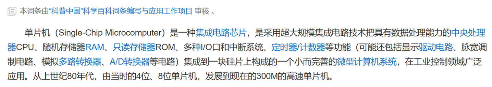

### 为什么不用大电脑

单片机的核心优势：
1. **价格低** - 几块钱就能买到
2. **体积小** - 指甲盖大小
3. **低功耗** - 耗电很少
4. **功能简单** - 越简单越稳定，越不容易死机

### 学习前置要求

- 初中电路基础知识
- 基础编程认知（不会也没关系）
- 没了

### 学习目标

知道单片机的基本功能，掌握核心引脚外设功能，学完即可看懂并上手实际项目。

> 🔗 **下一章开启**：要学懂单片机，必须先搞懂所有电路的底层基础——**电压**，由此开启 [[#BA-1 底层基础篇：电压？！电压到底是什么？|BA-1]] 的内容。

---

## BA-1 底层基础篇：电压？！电压到底是什么？

> 📌 **承接上文**：从 BA-0 的单片机硬件基础，下沉到所有电子电路的最底层核心概念

### 核心问题

单片机里的 0 和 1，到底对应的是什么物理量？电路正常工作的前提是什么？

### 电压的核心定义

**电压**，又称**电位差**，是两点之间的电势差，国际单位为**伏特 (V)**。

**关键在于：电压描述的是一个「差值」。**

### 核心逻辑

- 电压是电流产生的前提
- 必须形成**完整回路**才能产生电流
- **0V 是人为定义的参考电位**（GND/地线）
- 电压数值默认是**对 GND 的差值**
- 负电压表示**低于 GND** 的电位

**电压产生电流使灯泡亮起**：

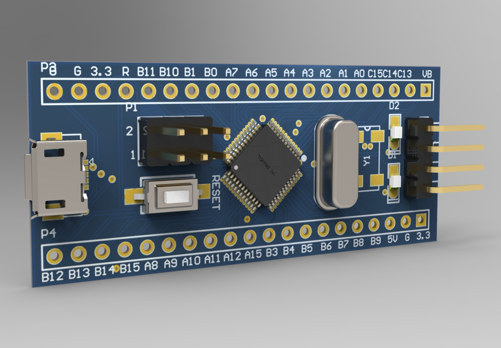

**没有回路，电压产生不了电流**：


**灯泡两侧电压计算**（U=I×R，I=0时U=0≠3.7V）：

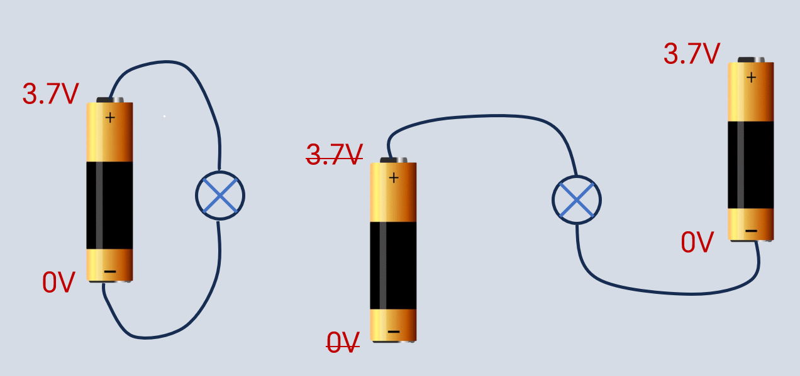

> 💡 **例子**：对于 -3.7V、0V、3.7V，也可以定义为 0V、3.7V、7.4V，甚至 100V、103.7V、107.4V。取决于系统的哪一处标为 GND。

**负电压含义：0V是人为定义的参考电位（GND）**：

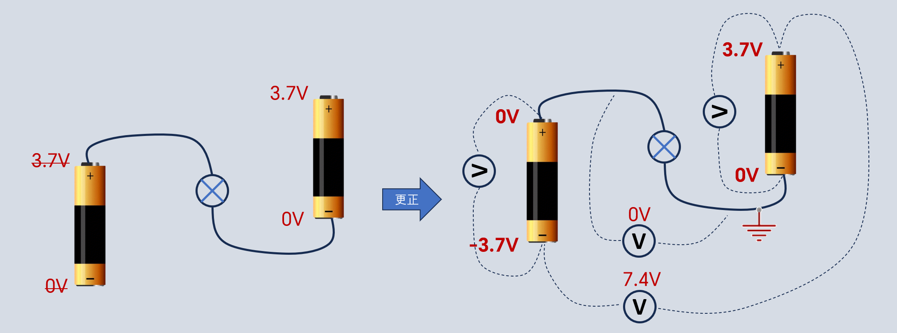

**电压数值是对GND的差值，-3.7V表示低于GND处3.7V**：

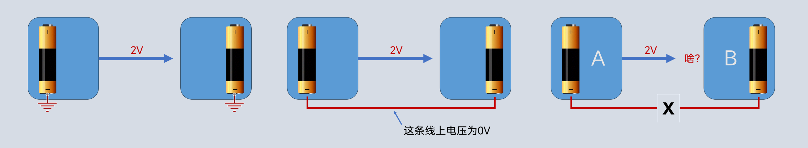

### 重要提醒

在没有相互连接的两个独立系统中，无法得出另一个系统相对于当前系统的电位信息。

> 🔗 **引出下一章**：解决了「电压是什么」的基础问题，自然引出下一个问题：多个电子模块之间，怎么统一电压的参考标准？由此开启 [[#BA-2 系统前提篇：电子积木的电压规则——共地|BA-2 共地规则]] 的内容。

---

## BA-2 系统前提篇：电子积木的电压规则——共地

> 📌 **承接上文**：承接 BA-1 的「电压是相对 GND 的差值」核心逻辑，解决多模块协同的基础前提问题

### 核心问题

A 模块认为的 2V，B 模块为什么识别不到？怎么让整个电子系统的电平信号有统一的参考标准？

### 共地的定义

**共地**：电子系统中所有设备的 GND（地线/0V 参考电位点）连接在一起，共享同一个参考电位。

**所有GND连接到同一个0V参考点**：

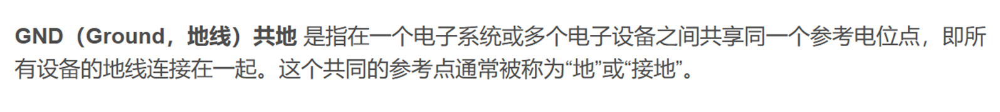

### 核心作用

为整个电子系统提供**统一的电位参考**，避免信号悬空、电平识别异常。

### 什么是悬空

如果没有共同参考，A 认为的 2V，B 表示不知道是啥，啥都有可能，这种状态称为：**悬空（开路）**。

**未共地时A模块的2V对B模块来说是悬空状态**：

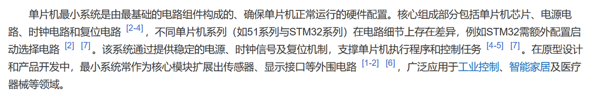

**务必将所有GND连接在一起实现共地**：

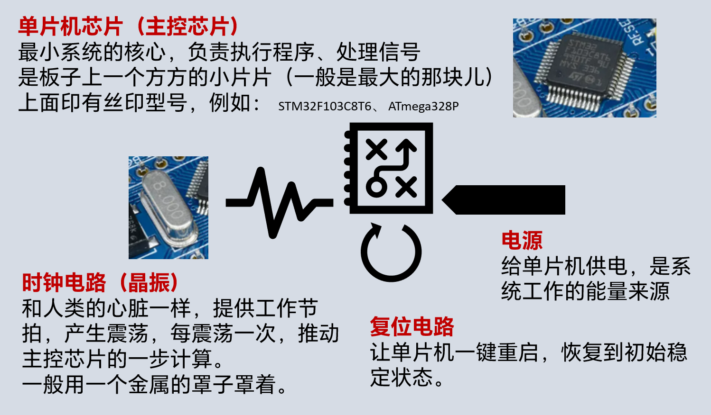

### ⚠️ 新手高频易错点

**未共地会导致：**
- 通信失败
- 舵机乱动
- 各种莫名其妙的异常

> 🚨 **重要提醒**：共地是新手开发阶段最易忽略的核心问题！实操问题排查时，必须优先检查共地！

> 🔗 **引出下一章**：解决了「系统正常工作的参考标准」问题，接下来自然要搞懂：单片机本身要正常跑起来，最少需要什么电路？由此开启 [[#BA-3 运行核心篇：电子积木，启动！|BA-3 最小系统]] 的内容。

---

## BA-3 运行核心篇：电子积木，启动！

> 📌 **承接上文**：承接 BA-1 的电源基础、BA-2 的共地规则，解决「单片机怎么才能正常运行」的核心问题

### 核心问题

单片机要正常跑程序、实现功能，最基础、不能再精简的硬件电路是什么？我们后续要用到的所有功能，都是通过什么实现的？

### 最小系统定义

**最小系统**：确保单片机正常运行的最基础硬件配置，移除任何一个核心组件都无法正常工作。

简单来讲：*这玩意儿再拆任何一点儿东西就死掉了，真不能拆了。*

### 核心组成

| 组件 | 作用 |
|------|------|
| **主控芯片** | 系统核心，负责执行程序、处理信号 |
| **电源电路** | 为系统工作提供能量来源 |
| **时钟电路（晶振）** | 提供系统工作节拍，每一次震荡推动主控完成一步计算 |
| **复位电路** | 实现单片机一键重启，恢复初始稳定状态 |

> 💡 **补充**：STM32 等系列需额外配置启动选择电路。

### 最小系统板

把最小系统全部电路集成在一块板子上，称为**最小系统板**。

**单片机最小系统板：集成最小系统全部电路的开发板**：

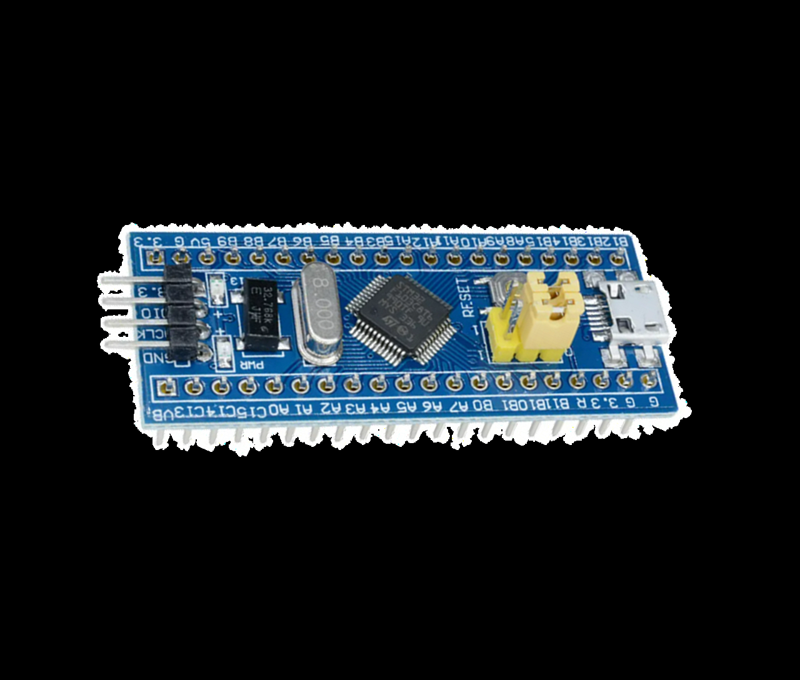

我们可以利用这个板子，再通过板子上的**引脚**，使用导线连接到其他模块上实现各种功能。

**最小系统板的引脚，用于连接其他模块实现功能**：

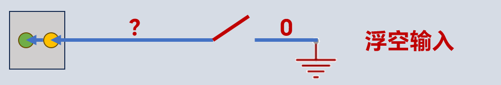

**后续所有内容围绕单片机引脚的功能展开**：

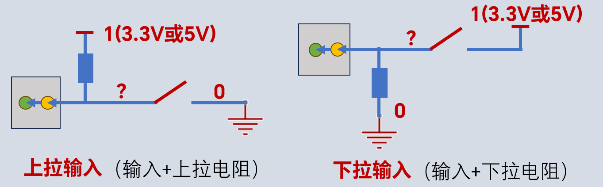

> 🎯 **全教程主线**：接下来的内容，将主要围绕单片机的这些**引脚功能**展开描述。后续所有外设章节，全部是基于最小系统的引脚，拓展出的不同功能。

> 🔗 **引出下一章**：承上启下，解决了「单片机怎么启动运行」的问题，同时引出全教程的核心主线——所有功能都是通过最小系统板的引脚实现的，由此开启 [[#BA-4-1 基础输入篇：GPIO，先读到 0 和 1|BA-4 GPIO]] 的内容。

---

## BA-4-1 基础输入篇：GPIO，先读到 0 和 1

> 📌 **承接上文**：承接 BA-3 引出的「引脚功能」主线，从单片机最基础的输入能力讲起

### 核心问题

外界的开关信号（比如按键有没有按下），怎么传给单片机？单片机怎么读取引脚的电平状态？

### GPIO 是什么

**GPIO**（General Purpose Input/Output）：通用输入输出口，单片机最基础的外设。

可以通过代码配置为：
- **输入模式** - 读取引脚电平
- **输出模式** - 控制引脚输出

### 输入模式

输入模式下，可以读取当前引脚是**高电平/低电平**：
- **高电平 [1]** - 一般为单片机的工作电压，多为 3.3V 或 5V
- **低电平 [0]** - 指 GND/0V

最典型应用：**按键检测**

**GPIO输入模式最典型应用：按键检测**：

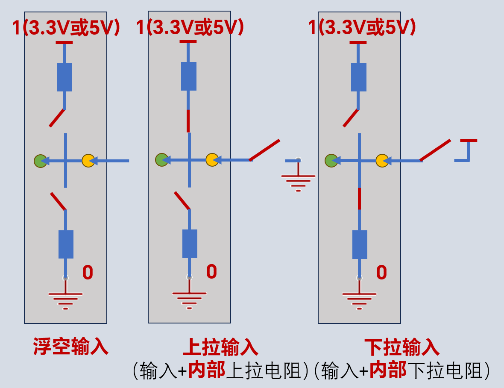

### ⚠️ 悬空问题

按键按下时，引脚为 0 低电平。但是按键释放时，引脚到按键这段未连接到任何电平，处于**悬空**状态！

因此读取的值可能是 0，也可能是 1 —— 随机的！

### 解决方案：上拉/下拉电阻

为了解决悬空的问题，需要增加**上拉电阻**或**下拉电阻**。

**上拉电阻/下拉电阻解决按键释放时悬空问题**：

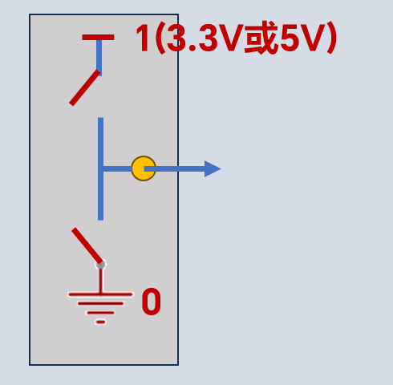

#### 两种实现方式

1. **外部电阻**：在芯片外部连接 1kΩ ~ 100kΩ 的电阻（常用 4.7kΩ、10kΩ）
2. **内部电阻**：现代很多芯片可以内部开启/关闭上拉/下拉电阻

### 输入模式分类

- **浮空输入** - 没有上下拉，电平不确定
- **上拉输入** - 默认高电平，按下变低
- **下拉输入** - 默认低电平，按下变高

> 🔗 **引出下一章**：完成了 GPIO「读」的能力讲解，自然引出反向能力：单片机怎么通过引脚向外输出 0 和 1，控制外部元件？由此开启 [[#BA-4-2 基础输出篇：GPIO，再输出 0 和 1|BA-4-2 GPIO 输出模式]] 的内容。

---

## BA-4-2 基础输出篇：GPIO，再输出 0 和 1

> 📌 **承接上文**：承接 BA-4-1 的 GPIO 输入逻辑，完成 GPIO 基础能力的闭环

### 核心问题

单片机怎么通过引脚，向外输出高/低电平，直接控制外部元件（比如 LED 的亮灭）？

### 推挽输出

**推挽输出**：芯片内部有两个开关，可以分别控制引脚连接到 VCC（一般 3.3V 或 5V）或 GND。

- 连接到上方 VCC 电源轨时，引脚输出**高电平 1**
- 连接到下方 GND 时，引脚输出**低电平 0**

**推挽输出：芯片内部两个开关分别控制引脚连接VCC或GND**：

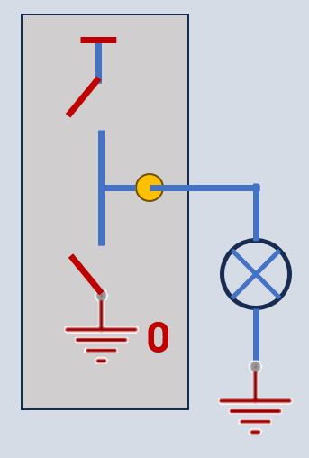

#### 特点

- 相当于直接连接到电源或地
- 具备一定的驱动（为元件供电）能力
- 单引脚最大电流一般在 **10mA 级**

#### 典型应用

**LED 亮灭控制**：
- 输出高电平时，LED 正极接 VCC，负极接 GND → LED 亮起
- 输出低电平时，LED 正负极均为 GND → LED 熄灭

**推挽输出控制LED亮灭：连接VCC灯亮，连接GND灯灭**：

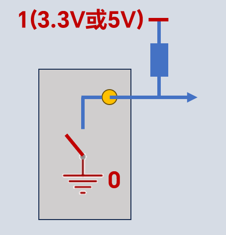

### 开漏输出

**开漏输出**：只使用一个开关，但是增加一个上拉电阻（也可以芯片内部上拉）。

- 开关未连接时 → 上拉至高电平 1
- 开关连接时 → 输出低电平 0

#### 特点

- 只能拉低电平、**无法主动输出高电平**
- 上拉电阻 1kΩ ~ 100kΩ 串接到电路中，几乎无法驱动 LED、蜂鸣器等元件

#### 为什么用开漏输出？

实现**「线与」逻辑**（多用于通信）：
- 多设备输出引脚直接并接在同一总线
- 任一设备拉低总线即为低电平
- 所有设备释放才由上拉电阻置高
- **无输出短路风险**

> 🔗 **引出下一章**：完成了 GPIO「输出 0 和 1」的基础能力，立刻抛出核心局限：引脚只能输出纯 0 或纯 1，那怎么表示 0.666 这样的中间值？怎么实现 LED 亮度调节、电机转速控制这种连续变化的需求？由此开启 [[#BA-5 模拟输出篇：PWM，不只是 0 和 1 了，还有 0.666|BA-5 PWM]] 的内容。

---

## BA-5 模拟输出篇：PWM，不只是 0 和 1 了，还有 0.666

> 📌 **承接上文**：承接 BA-4-2 GPIO 只能输出 0/1 的局限，解决「数字信号模拟连续模拟量」的核心需求

### 核心问题

只有 0 和 1 两种输出状态，怎么模拟出 0~1 之间的连续数值？怎么实现 LED 亮度、电机转速、舵机角度的连续控制？

### PWM 是什么

**PWM**（Pulse Width Modulation）：脉冲宽度调制。

通过快速切换 0/1 高低电平，用**高电平在一个周期内的时间占比**，模拟出连续的模拟电压。

**PWM原理：通过快速切换0/1用高电平占比表示大小**：

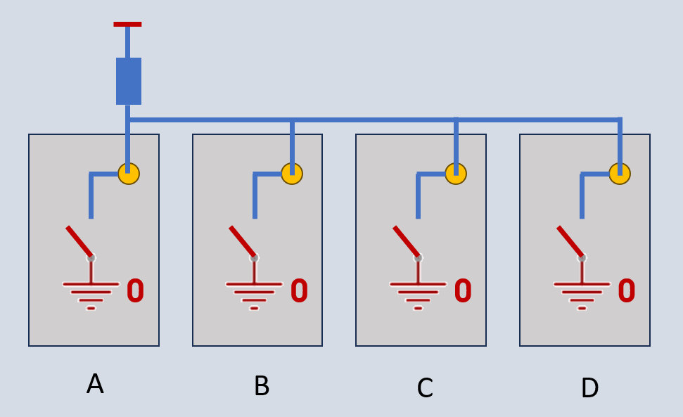

> 💡 **通俗理解**：PWM 是用数字信号（只有 0/1）模拟出模拟信号（0~1，比如 0.666），来传递一个数值信息。

### 两大核心参数

#### 1. 频率

- 定义：1 秒内信号完成一个完整高低电平周期的次数
- 频率越高，模拟的模拟信号越平稳
- **应用**：控制蜂鸣器音调

**频率：1秒内信号完成完整周期的次数，越高模拟信号越平稳**：

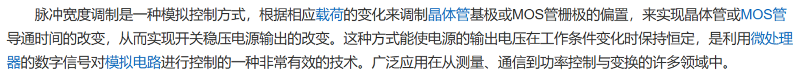

#### 2. 占空比

- 定义：一个脉冲周期内，高电平时间与总周期时间的比例
- 占空比越大，模拟电压越接近高电平
- **应用**：
  - LED 亮度调整
  - 电机转速控制（需要电机驱动板）
  - 舵机角度控制

**PWM控制舵机角度：占空比越大模拟电压越趋近高电平**：

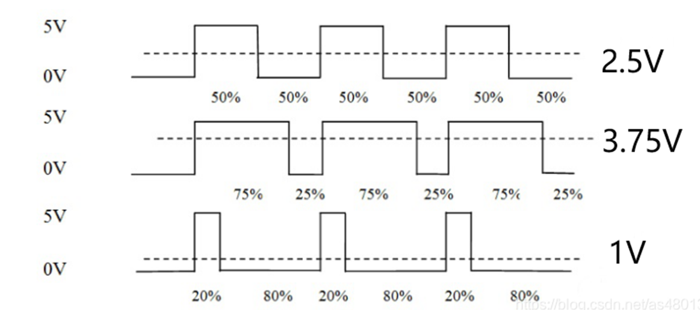

> 🔗 **引出下一章**：搞懂了 PWM 是什么、能做什么，立刻抛出实操问题：怎么让单片机精准、稳定、不占用 CPU 地生成我们想要的 PWM 信号？由此开启 [[#BA-6 硬件实现篇：0.666，用 TIM 产生|BA-6 TIM 定时器]] 的内容。

---

## BA-6 硬件实现篇：0.666，用 TIM 产生

> 📌 **承接上文**：承接 BA-5 的 PWM 需求，解决 PWM 的硬件生成问题，同时引入单片机核心的「硬件外设」概念

### 核心问题

用主程序循环模拟 PWM，会占用全部 CPU 资源、精度还不够，有没有专门的硬件来干这件事？

### 外设的概念

**外设 (Peripherals) / 硬件资源 (Hardware)**：单片机内部独立的硬件单元。

配置完成后可**自主完成特定功能**，无需占用 CPU 主程序资源。

**单片机外设：配置完成后可自主完成特定功能的硬件单元**：

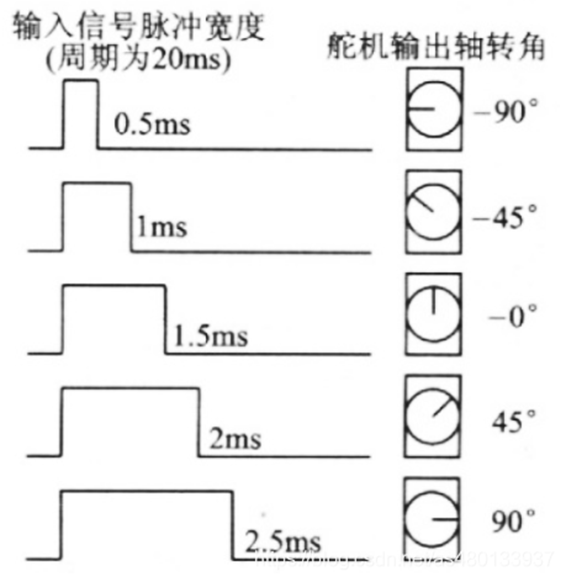

> 💡 GPIO、TIM、ADC 等全部属于单片机外设。外设像现实中的工具一样，有着对应的特点功能。

### TIM 是什么

**TIM**（Timer/Counter）：定时器/计数器，单片机内部独立的硬件外设。

核心功能：**精准计数与定时**，配置完成后可自主运行。

**TIM定时器/计数器：类似机械计数器，达到最大值时进位溢出**：

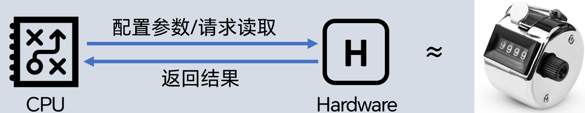

**计数器溢出原理**：

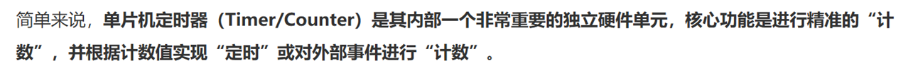

### PWM 生成的三大核心参数

往 TIM 配置三个关键设定参数：
1. **PSC**（预分频值）
2. **ARR**（自动重装值）
3. **CCR**（比较值）

**TIM配置三大参数：预分频值PSC、自动重装值ARR、比较值CCR**：

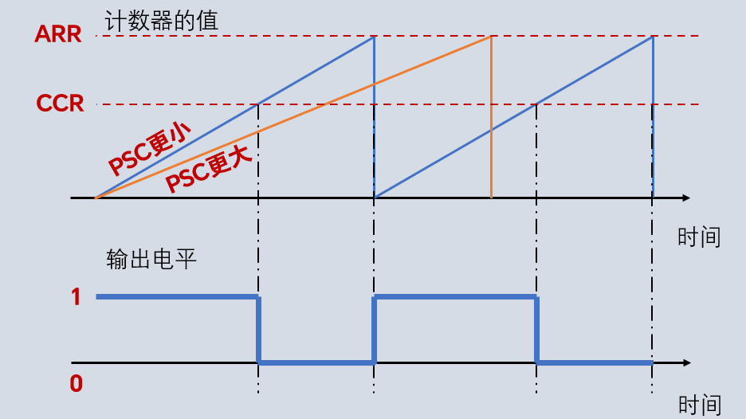

#### 分频器的作用

分频器可以输入 PSC 个脉冲再输出一个脉冲，可以降低频率到原来的 `1/PSC`。

- PSC 变小 → 输出脉冲频率变大
- PSC 变大 → 输出脉冲频率变小

**分频器原理：输入PSC个脉冲再输出一个脉冲**：

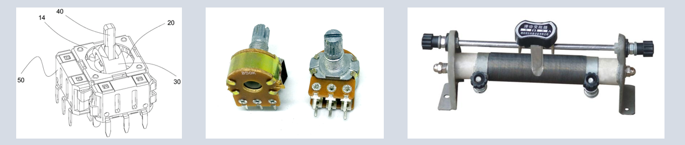

#### 计算公式

```
PWM 频率 = 主频 ÷ [(PSC + 1) × (ARR + 1)]
PWM 占空比 = CCR ÷ (ARR + 1) × 100%
```

**PWM频率与占空比计算公式**：


**路径**：时钟频率 → 分频器 → 计数器（TIM）→ IO 输出

### 核心优势

硬件生成 PWM：
- **精度高**
- **不占用 CPU 资源**
- 完美解决软件模拟 PWM 的精度不足、占用 CPU 的问题

> 🔗 **拓展能力**：TIM 除了生成 PWM，还能实现精准定时、外部事件计数，这些能力会在 [[#BA-8 实时处理篇：IRQ，中断一下，请求先看这个|BA-8 IRQ 中断章节]] 中被充分使用。

> 🔗 **镜像对应**：本章节讲了「怎么输出指定的模拟量」，自然引出反向需求：怎么读取外界输入的模拟电压？由此开启 [[#BA-7 模拟输入篇：ADC，读取 0.666，转换为 0 和 1|BA-7 ADC]] 的内容。

---

## BA-7 模拟输入篇：ADC，读取 0.666，转换为 0 和 1

> 📌 **承接上文**：与 BA-5/BA-6 的模拟输出形成镜像闭环，解决「外界模拟量转单片机数字量」的核心需求

### 核心问题

外界的连续电压信号（比如摇杆、电位器、滑动变阻器、传感器输出），怎么转换成单片机能识别、处理的数字信号？

### ADC 是什么

**ADC**（Analog-to-Digital Converter）：模数转换器。

将连续的**模拟电压信号**转换为离散**数字信号**的单片机外设，实现模拟量到数字量的转换。

**ADC示例：5V单片机中将3.1V电压转为数字信号**：

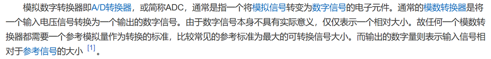

### 核心参数

#### 1. 量程

- 默认以单片机 VCC 为最大参考电压
- 部分单片机可通过 **ADC_VREF** 引脚指定参考电压（一般仍然不能超过单片机的 VCC）

**ADC_VREF引脚用于指定ADC的量程/最大值**：

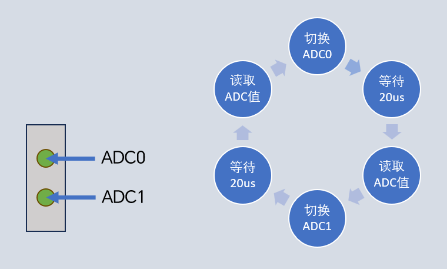

#### 2. 精度/分辨率（N bit）

- 表示 ADC 转换结果有 **2^N 个电压台阶**
- 位数越高，电压分辨能力越强
- 常见：8bit、12bit

> 💡 **例子**：5V 单片机中，12bit 精度可以把 3.1V 转为 2539/4095

#### 3. 采样率/转换时间

- ADC 完成一次模拟-数字转换所需的时间
- 内部一般通过**逐次逼近**的方式得到结果

### ⚠️ 新手注意事项

多数单片机多路 ADC 为**异步采样**（一次只能获取一个通道数值），而非同步采样。

因此读取两路电压时需要进行**通道切换**。

受硬件电路特性影响，**通道切换后需等待一定时间（如 20μs）再进行 ADC 采集**，否则易出现通道间相互干扰，导致采样结果不准确。

> 🔗 **引出下一章**：完成了「数字 → 模拟 → 数字」的完整交互闭环，立刻抛出实时性问题：主程序在循环运行时，怎么立刻处理按键按下、ADC 采样完成、定时时间到这些紧急事件？由此开启 [[#BA-8 实时处理篇：IRQ，中断一下，请求先看这个|BA-8 IRQ 中断]] 的内容。

---

## BA-8 实时处理篇：IRQ，中断一下，请求先看这个

> 📌 **承接上文**：承接前面所有外设的痛点，解决单片机系统的实时性与 CPU 效率问题

### 核心问题

主程序在正常运行时，有紧急事件需要立刻处理，不用一直循环等待查询，该怎么实现？

### IRQ 是什么

**IRQ**（Interrupt Request）：中断请求。

硬件设备向处理器发送的中断信号，可在主程序正常运行过程中，通过预设触发条件**暂停主程序**，优先执行对应的中断处理函数，执行完成后**返回主程序断点处继续运行**。

**中断概念：触发条件暂停主程序，执行中断处理函数后返回**：

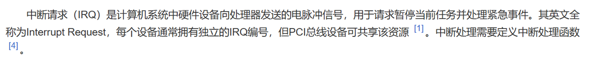

### 常见触发条件

- 高电平触发
- 低电平触发
- 上升沿触发
- 下降沿触发

**中断触发条件类型：高/低电平、上升沿/下降沿触发**：

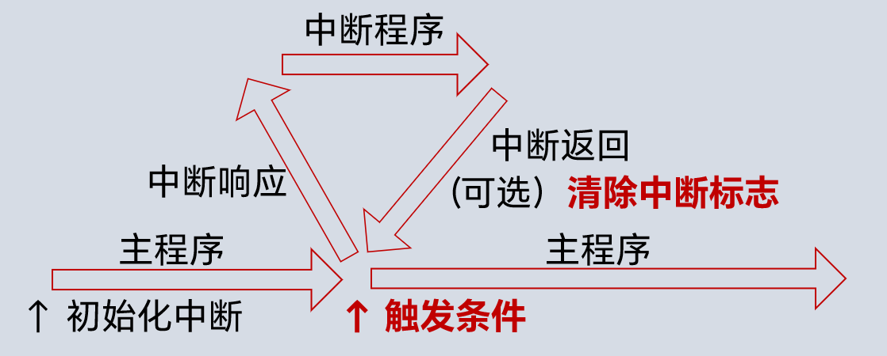

### 常见中断来源

**中断来源：外部引脚、TIM定时器/计数器、硬件外设触发**：

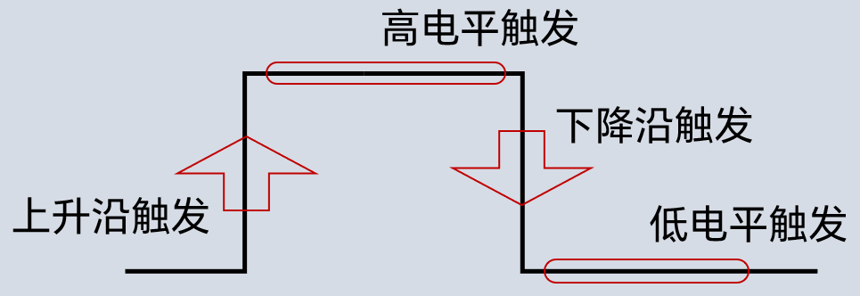

#### 1. 外部引脚触发
- 适用：按键检测、传感器紧急触发
- 例子：其他程序运行时，如果按键按下则灯亮起

#### 2. TIM 计数器/定时器触发
- **计数器触发**：当计数器捕获引脚的信号达到设定的 ARR 时，会清零并产生一次脉冲，该脉冲可触发中断
  - 例子：其他程序运行时，电机每转动一圈（52 个脉冲）则灯亮灭翻转一次
- **定时器触发**：将主频信号（或分频后的信号）接入计数器，达到 ARR 时触发中断
  - 例子：其他程序运行时，每过 500ms 则灯亮灭翻转一次

#### 3. 硬件外设触发
- UART、DMA、ADC、I2C、SPI 等硬件触发
- 用于各种硬件事件的实时处理

> 🔗 **引出下一章**：解决了「单事件实时处理」的问题，自然引出更复杂的需求：怎么用少量的线，和多个外设之间传输大量的 01 数据？由此开启 [[#BA-9 高速通信篇：I2C/SPI，少量线，多数据|BA-9 I2C/SPI 通信协议]] 的内容。

---

## BA-9 高速通信篇：I2C/SPI，少量线，多数据

> 📌 **承接上文**：承接前面单引脚的基础交互能力，解决「多设备、大批量数据的双向传输」问题

### 核心问题

要和屏幕、传感器这些复杂外设传输大量数据，一根一根引脚控制太麻烦了，有没有标准化的方式，用少量线实现大量数据传输？

### 通信协议/总线是什么

用少量的线，按约定规则实现大量数据的双向传输。

I2C 和 SPI 均为**串行同步通信协议**（带时钟同步线）。

### I2C 总线

#### 硬件接线
仅需 **2 根通信线**，搭配 VCC 和 GND：
- **SCL**（Serial Clock）- 串行时钟线
- **SDA**（Serial Data）- 串行数据线

**I2C总线：仅需SCL和SDA两根通信线**：

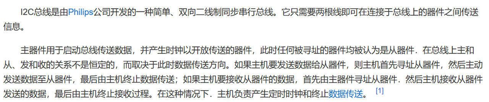

支持**一主机多从机**。

**I2C支持一主多从，可与多个设备双向通信**：

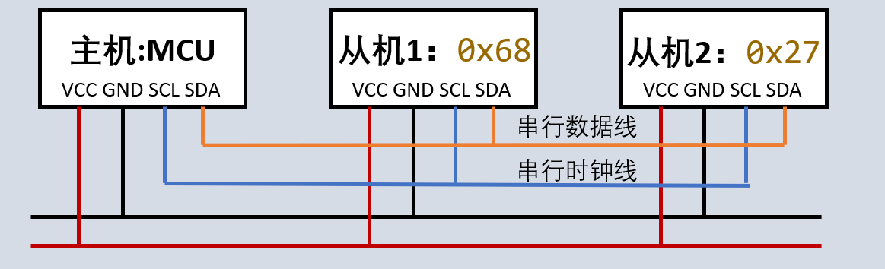

#### 输出特性
SCL 与 SDA 均为**开漏输出**（对应 BA-4-2 的开漏输出知识点）。

#### 典型应用（中低速外设）
- OLED 显示屏（SSD1306）
- LCD 屏幕（LCD1602）
- MPU6050 姿态/加速度传感器

**I2C典型应用：OLED显示屏、LCD屏幕、MPU6050传感器**：

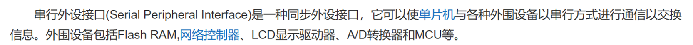

### SPI 总线

#### 硬件接线
**4 根信号线**（单向通信可简化为 3 根）：
- **SCK/SCLK/CLK** - 时钟信号，由主机发出
- **MOSI**（Master Out, Slave In）= TX - 主机发向从机
- **MISO**（Master In, Slave Out）= RX - 从机发向主机
- **CS/CSn/CE**（Chip Select/Chip Enable）- 片选信号，由主机发出

**SPI总线信号线：SCK、MOSI、MISO、CS**：

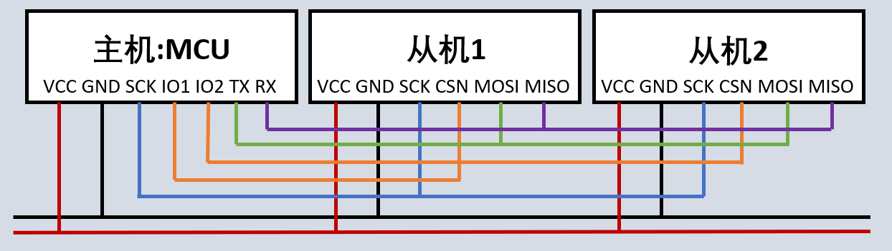

**SPI主机信号线说明**：


#### 核心优势
通信速率**远高于 I2C**，适用于高速数据传输场景。

#### 简化使用
如果只需要单向通信（如主机向 LCD 屏幕发送数据），可以不使用 MISO。

> 💡 **实用提示**：I2C、SPI 在使用时，可以直接调用成熟的库函数使用，一般无需使用底层函数。

**I2C/SPI均为串行同步通信协议**：

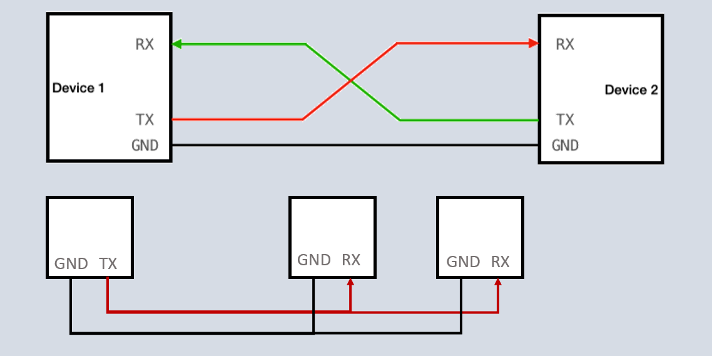

> 🔗 **引出下一章**：解决了「芯片与外设之间的标准化通信」问题，立刻抛出新手痛点：I2C/SPI 配置太复杂、线还是多，有没有更简单的方式，实现单片机和电脑、单片机和单片机之间的通信？由此开启 [[#BA-10 极简通信篇：UART，还是太好用了|BA-10 UART]] 的内容。

---

## BA-10 极简通信篇：UART，还是太好用了

> 📌 **承接上文**：承接 BA-9 的通信协议，提供新手最友好、门槛最低的极简通信方案

### 核心问题

有没有不用时钟线、接线极简、配置简单的通信方式，方便我调试程序、和电脑/其他单片机通信？

### UART 是什么

**UART**（Universal Asynchronous Receiver-Transmitter）：极简的**异步串行通信协议**。

无需时钟线，仅需 **TX（发送端）、RX（接收端）交叉接线**，通信双方约定好参数即可实现双向通信，使用门槛极低。

**UART极简通信：仅需TX和RX交叉接线**：

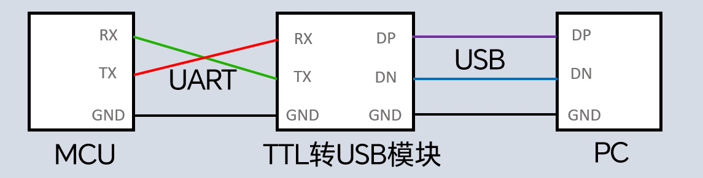

> 💡 补充：还有 USART，在原有基础上多了一根时钟线，但在现代设计中，USART 逐渐被 UART 取代。

### 典型应用

- 单片机与单片机通信
- 单片机与电脑通信
- 单片机与蓝牙模块通信
- **新手最常用的程序调试工具**

### 与电脑通信：TTL 转 USB

电脑的接口只有 USB 接口，并不能直接使用 UART 通信，需要一个中间的转接环节。

**TTL转USB模块：实现UART与USB协议及电平转换**：

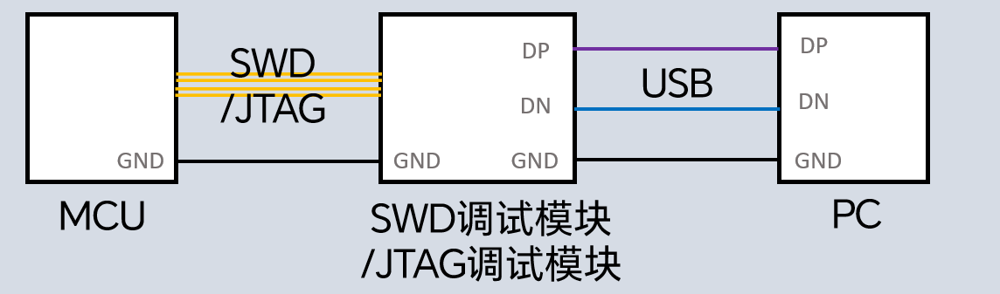

#### TTL 转 USB 模块的作用
- 将 USB 中的通信信息和 UART 的信息进行**协议转换**，相互转发
- 同时进行**电平转换**

#### 什么是电平？
- **TTL**：用 0V 表示 0、3.3V/5V 表示 1
- **USB**：靠 DP(D+)、DN(D-) 两根线的电压差（±3.3V）来表示 0 和 1

**TTL与USB电平差异：TTL用0V/3.3V表示0/1，USB用电压差**：


### 程序下载

下载程序也是类似的过程，只不过将 UART 改为程序下载调试的协议：
- **SWD** - 常用，2 线
- **JTAG** - 较旧，4~5 线

**程序下载协议：SWD（2线）和JTAG（4~5线）**：

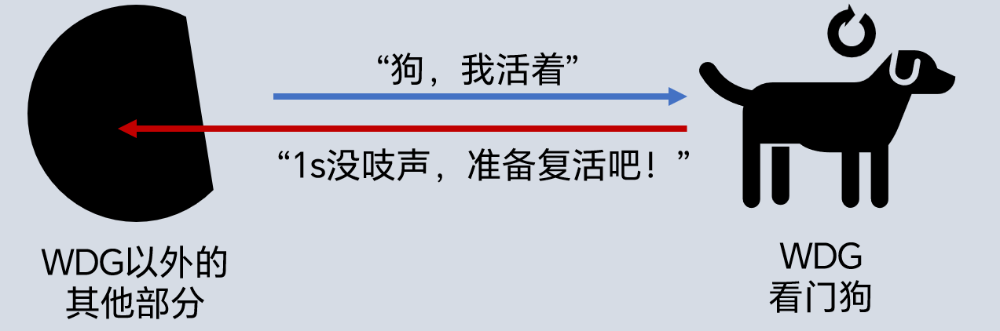

通过对应调试模块实现电脑与单片机的程序传输与在线调试。

> 🔗 **引出下一章**：到本章节，已经可以实现单片机的所有基础功能：输入输出、模拟量交互、实时处理、对外通信，自然引出最终的优化需求：怎么让已经做好的系统，变得更可靠、更高效？由此开启 [[#BA-11 优化升级篇：WDG 与 DMA，锦上添花|BA-11 WDG+DMA 最终优化篇]] 的内容。

---

## BA-11 优化升级篇：WDG 与 DMA，锦上添花

> 📌 **承接上文**：承接前面所有章节的完整功能，完成整个速通教程的最终闭环，解决系统的可靠性与效率问题

### 核心问题

已经实现了所有基础功能，怎么让系统跑飞卡死时自动重启？怎么让数据传输不占用 CPU 资源，进一步提升系统效率？

### WDG 看门狗 —— 提升可靠性

#### 核心作用

**WDG**（Watchdog）：看门狗。

顾名思义，一只看门的狗，只不过这狗聪明，见屋里主人挂了就去找医生给主人复活。

**本质**：一个**递减计数器**。
- 程序定期「喂狗」重置计数器
- 若程序卡死/跑飞未按时喂狗，计数器归零时会自动触发单片机复位，让系统恢复正常

**看门狗WDG：递减计数器，未按时喂狗则触发复位**：

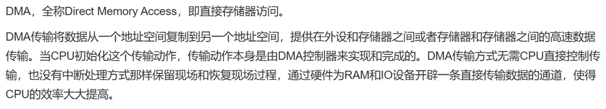

#### 核心特性

一般采用**独立电路**与**独立内置低速时钟**，即使主时钟、核心电路故障，仍可正常工作。

### DMA —— 提升效率

#### 核心作用

**DMA**（Direct Memory Access）：直接存储器访问。

**无需 CPU 参与**（既不使用主程序，也不使用中断），即可自主完成：
- 外设与 RAM 之间的数据搬运
- RAM 与 RAM 之间的数据搬运

全程不占用 CPU 资源，也无需中断处理。

只需要配置好 DMA，复制过程将自主完成。

**DMA直接存储器访问：无需CPU即可完成数据搬运**：

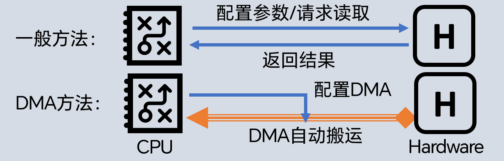

#### 典型应用

- 配置 DMA 将 **UART 收到的数据**实时搬运到某个 char 数组
- 将 **ADC 转化后的数值**实时更新到某个 int 变量

主程序直接读取这个 char 数组/int 变量，就是对应外设的实时数据值。

## 全教程总结

### 学习路径回顾

```
底层基础 → 最小运行 → 核心外设 → 模拟交互 → 实时处理 → 批量通信 → 系统优化
  BA-1       BA-3     BA-4 GPIO    BA-5/7      BA-8       BA-9/10     BA-11
  电压      最小系统   输入输出     PWM/ADC     中断       I2C/UART   WDG/DMA
  ↓
BA-2 共地（系统前提）
BA-6 TIM（PWM 硬件实现）
```

### 新手高频易错点清单

1. **未共地** - 通信失败、舵机乱动等异常
2. **GPIO 悬空** - 按键读取值随机
3. **ADC 通道切换无等待** - 采样结果不准确
4. **TIM 公式参数错误** - PWM 频率/占空比不符合预期

### 核心概念关联

- **GPIO** 是所有外设的基础
- **PWM ↔ ADC** 形成数字与模拟的双向转换闭环
- **TIM** 不仅生成 PWM，还用于精准定时和事件计数
- **中断** 提升系统实时性
- **通信协议**（I2C/SPI/UART）实现大量数据传输
- **WDG + DMA** 分别从可靠性和效率两方面优化系统

### 下一步

学完本章节所有内容，已经具备单片机入门的全部核心能力，可直接上手实际项目开发！

**继续实践**： · [[面包板笔记]] · [[PID控制笔记]] · [[步进电机笔记]]
