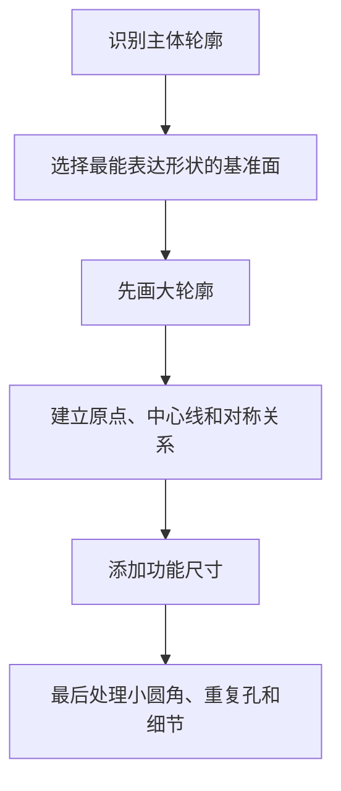

# SolidWorks 02 草图绘制与完全定义

> 上一篇：[[SolidWorks-01-界面与基础操作]] · [[SolidWorks-00-阿奇教程学习索引]] · 下一篇：[[SolidWorks-03-零件特征与设计树]]

对应教程：P3～P8，以及“草图绘制面”“封闭轮廓”“转换实体引用”等附加课。

## 一、草图的作用

草图是二维轮廓，特征把它变成三维实体。稳定草图应回答三个问题：

1. 画在哪个平面或平面上？
2. 形状由哪些几何关系控制？
3. 大小和位置由哪些尺寸控制？

![[工科学习/attachments/SolidWorks/02-草图完全定义.png]]

## 二、创建草图的标准流程

1. 选择前视、上视、右视基准面，或选择已有平面。
2. 点击“草图”。
3. 按 `Ctrl+8` 正视。
4. 绘制大致轮廓，不急着输入全部精确尺寸。
5. 添加水平、垂直、重合、相切、对称等几何关系。
6. 用智能尺寸确定大小和位置。
7. 拖动蓝色实体检查剩余自由度，直到需要的线条变黑。
8. 退出草图，再创建特征。

## 三、常用草图实体

### 3.1 直线与中心线

- `L` 启动直线；连续单击绘制线段，双击或 `Esc` 结束。
- 水平/垂直自动推断只在出现对应图标时成立，不要凭视觉判断。
- 中心线属于构造几何，不参与封闭轮廓；常用作对称轴、旋转轴和尺寸基准。
- 推荐在 `工具 → 自定义 → 键盘` 中将“构造几何线”设为 `Alt+C`：绘制前按下可切换构造线模式；选中已有线段后按下，可在普通实线与构造线之间切换。完整自定义方案见 [[SolidWorks-07-快捷键与复习清单#3.1 推荐自定义快捷键]]。

### 3.2 矩形

- 边角矩形：适合已知两个对角点。
- 中心矩形：适合关于原点对称的板件，中心放在原点后更稳定。
- 平行四边形：用于斜向轮廓，不建议用自由拖拽代替角度尺寸。

### 3.3 圆、圆弧和槽口

- 圆需要中心位置和直径/半径。
- 三点圆弧适合已知起点、终点和弧高。
- 切线圆弧可从已有线段端点连续创建。
- 直槽口适合长圆孔，比“两个圆+两条线+修剪”更稳。

### 3.4 多边形与样条曲线

- 多边形先确定边数、中心和内接/外接方式。
- 样条曲线用控制点和曲率控制；机械轮廓不要放过多控制点。
- 复杂自由曲面才优先使用样条，规则机械轮廓尽量使用圆弧和直线。

## 四、几何关系

| 关系 | 作用 | 常见对象 |
|---|---|---|
| 重合 | 点落在点、线或曲线上 | 端点与原点、端点闭合 |
| 水平/垂直 | 限制方向 | 直线、两点 |
| 平行/垂直 | 两线方向关联 | 支架边线 |
| 相切 | 平滑连接 | 直线与圆弧、两圆弧 |
| 同心 | 圆心相同 | 台阶孔、多层圆柱 |
| 相等 | 长度或半径相等 | 重复槽、对称圆角 |
| 中点 | 点位于线段中点 | 对中定位 |
| 对称 | 两实体关于中心线对称 | 左右对称外形 |
| 共线 | 两直线位于同一直线 | 分段边线 |

### 添加关系

按 `Ctrl` 选择两个或多个草图实体，在左侧“添加几何关系”中选择可用关系。选择顺序不重要，但实体类型决定可用关系。

### 过定义怎么处理

表现：草图变黄/红，尺寸或关系冲突。

1. 不要直接删除大量尺寸。
2. 查看“哪些尺寸或关系冲突”的提示。
3. 先把最近添加的尺寸改为从动尺寸，判断它是否重复控制。
4. 检查自动添加的水平、垂直、重合关系。
5. 使用 SketchXpert 查看可行的删除组合。

## 五、智能尺寸

1. 启动“智能尺寸”。
2. 选择线、圆、两点或两条线。
3. 移动鼠标决定水平、垂直、斜长、直径、半径或角度类型。
4. 放置尺寸并输入数值。

### 尺寸设计原则

- 按设计意图标注，而不是按“当前图形能标什么”标注。
- 尽量从原点、中心线和功能基准定位。
- 对称结构用中心线+对称关系，避免左右分别标尺寸。
- 不重复标注同一自由度。
- 尺寸名称可重命名，例如 `板宽@草图1`，便于方程和配置调用。

## 六、完全定义

蓝色通常表示欠定义，黑色表示完全定义，红色表示冲突。完全定义并非“尺寸越多越好”，而是所有不应变化的自由度都被设计意图约束。

排查蓝色实体：

1. 用鼠标拖动，观察是平移、转动还是缩放。
2. 检查轮廓是否与原点或基准建立关系。
3. 检查是否缺少角度、长度或圆心位置。
4. 必要时使用 `工具 → 尺寸 → 完全定义草图`，但自动生成后仍要检查设计意图。

SOLIDWORKS 官方说明，“完全定义草图”会根据已有尺寸和关系计算所需约束，但建议先手动加入一部分设计关系与尺寸。

## 七、编辑工具

### 修剪与延伸

- 强力剪裁：按住拖过要删除的线段。
- 剪裁到最近端：保留到最近交点。
- 延伸实体：把线或弧延长到下一个边界。

修剪后应检查端点是否仍重合，是否意外产生微小线段。

### 偏移实体

选择链条后输入距离，适合壁厚、轮廓间隙和密封边。注意反向和“添加尺寸”选项。

### 转换实体引用

把模型边线、面轮廓或其他草图投影到当前草图。生成的线通常带外部引用：上游边变化时会跟随。

稳定性建议：优先转换规则的基准轮廓，少引用圆角后的短边或可能改变编号的边。

### 镜像与阵列

- 镜像：先画一半，选择实体和中心线；适合严格对称结构。
- 线性草图阵列：输入方向、间距、数量；适合规则孔列。
- 圆周草图阵列：输入中心、角度和数量；适合法兰孔。

如果阵列的是实际孔特征，通常在三维特征阶段阵列比草图阵列更易维护。

## 八、实线、构造线与封闭轮廓

- 实线：可参与拉伸、切除等轮廓计算。
- 构造线：只作轴线、尺寸基准和辅助几何。
- 封闭轮廓：边界首尾相接，无缝隙、无多余分叉。
- 所选轮廓：一个草图包含多个封闭区域时，只对指定区域生成特征。

无法拉伸时检查：

1. 端点是否真正重合。
2. 是否有重叠线段。
3. 是否有自相交轮廓。
4. 构造线是否错误地设成实线。
5. 使用“检查草图以用于特征”定位开口。

## 九、推荐的绘图思路

不要把所有细节塞进一个草图。主体、孔、槽、加强筋分成多个草图和特征，更容易修改和排错。

## 十、练习与验收

- [ ] 中心矩形关于原点完全定义。
- [ ] 用中心线+镜像完成对称支架轮廓。
- [ ] 用转换实体引用在现有面上建立等距孔。
- [ ] 完成直线与圆弧相切的封闭轮廓。
- [ ] 故意制造过定义并用 SketchXpert 修复。
- [ ] 修改主尺寸后，轮廓不翻转、不漂移、不失去对称。
