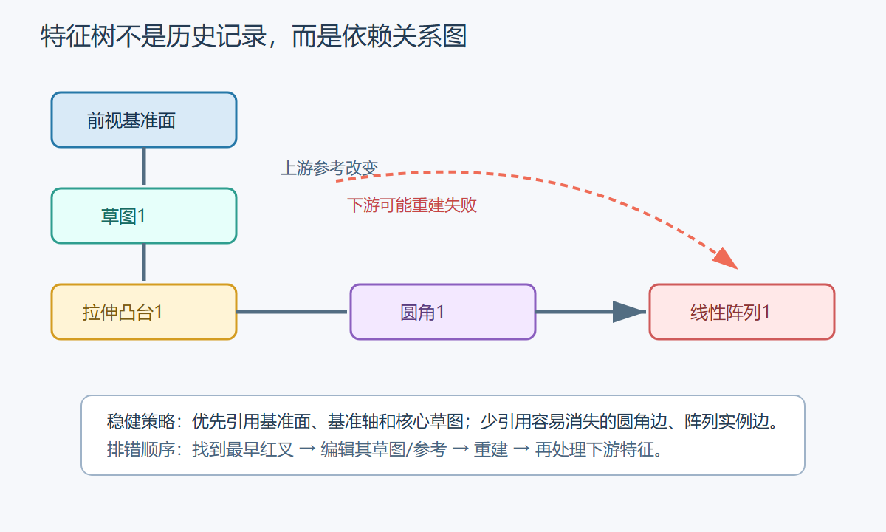

# SolidWorks 03 零件特征与设计树

> 上一篇：[SolidWorks-02-草图绘制与完全定义](SolidWorks-02-草图绘制与完全定义.md) · [SolidWorks-00-阿奇教程学习索引](SolidWorks-00-阿奇教程学习索引.md) · 下一篇：[SolidWorks-04-装配体与配合](SolidWorks-04-装配体与配合.md)

对应教程：P9～P20，包含特征成型、设计树、手机支架、修改报错、父子关系、放样和钣金。

## 一、特征建模的核心

特征是“草图 + 生成规则”。设计树按依赖顺序重建，后面的特征可能引用前面的面、边、草图或基准。

推荐顺序：主体体积 → 主要切除 → 功能孔槽 → 阵列/镜像 → 圆角倒角 → 外观细节。

## 二、拉伸凸台/基体

操作：选择封闭草图 → `特征 → 拉伸凸台/基体` → 设置方向和终止条件。

| 终止条件 | 使用场景 | 特点 |
|---|---|---|
| 给定深度 | 厚度明确 | 最常用，但依赖数值 |
| 两侧对称 | 草图位于零件中面 | 修改厚度时两侧同时变化 |
| 贯穿全部 | 切除必须穿过实体 | 不受实体厚度变化影响 |
| 成形到下一面 | 到最近的相交面 | 适合局部台阶 |
| 成形到面/曲面 | 必须结束于指定面 | 适合斜面或曲面边界 |
| 到离指定面指定距离 | 保留稳定间隙 | 适合薄壁和装配间隙 |

常用选项：

- `反向`：改变生成方向。
- `拔模`：沿拉伸同时加入锥度。
- `薄壁特征`：开放草图也可生成薄壁，但复杂薄壁更建议先实体后抽壳。
- `合并结果`：多实体环境中决定新体是否与已有实体合并。

## 三、拉伸切除

操作与拉伸凸台相似，但从实体移除材料。通孔优先使用“贯穿全部”或“两侧贯穿”，避免零件加厚后孔变成盲孔。

如果草图中有多个封闭区域，可在“所选轮廓”中只选择需要切除的区域。

## 四、旋转凸台与旋转切除

需要：截面草图 + 旋转中心线。

适合轴、套筒、旋钮、皮带轮等回转体。截面不能跨过旋转轴形成自相交实体。

标准步骤：

1. 在穿过轴线的基准面画半剖面。
2. 用中心线表示旋转轴。
3. 尺寸尽量使用直径尺寸表达功能。
4. 执行旋转，输入角度，通常为 `360°`。

旋转切除常用于环槽、锥孔和车削轮廓。

## 五、扫描

扫描需要“轮廓”和“路径”：轮廓沿路径移动形成实体。

1. 建立路径草图。
2. 在路径起点建立垂直基准面，或选择合适平面。
3. 绘制截面，截面与路径起点建立“穿透”关系。
4. 执行扫描凸台/切除。

适合管道、线缆、把手、弹簧切口。失败时检查路径是否不连续、曲率变化是否过急、截面是否过大导致自交。

## 六、放样

放样通过两个或多个截面平滑过渡，可配合引导线和中心线控制形状。

标准步骤：

1. 建立多个平行或有角度的基准面。
2. 每个面绘制一个封闭截面。
3. 执行“放样凸台/基体”，按顺序选择截面。
4. 拖动连接点，避免截面扭转。
5. 需要精确控制时加入引导线；引导线必须与每个截面相交并建立穿透关系。

放样预览扭曲时，先检查所有截面的起始点和选择顺序，再增加引导线；不要一开始就堆很多控制条件。

## 七、孔向导

孔向导比手动画圆再切除更适合标准孔：沉头孔、柱形沉头孔、螺纹孔、定位孔。

1. `特征 → 孔向导`。
2. “类型”页选择标准、孔型、规格、配合等级和终止条件。
3. “位置”页选择平面并放置孔点。
4. 对孔点添加几何关系和尺寸，使其完全定义。

工程图能识别孔向导信息并生成孔标注，这是它相对普通切除孔的重要优势。

## 八、圆角、倒角、抽壳和筋

### 圆角

- 等半径圆角：最常用。
- 全圆角：由三组面构成完整过渡。
- 变量圆角：沿边改变半径。

圆角通常放在设计树后部。大圆角先做，小圆角后做；失败时减少一次选择的边，分批生成。

### 倒角

用于去锐边、装配导向和加工要求。常用“距离-角度”或“距离-距离”。不要用视觉倒角代替工程图中的明确要求。

### 抽壳

选择要移除的面并输入壁厚，生成均匀薄壁。抽壳失败常见原因：壁厚大于局部最小曲率、狭窄区域产生自交、小圆角阻碍偏移。尝试把小圆角移到抽壳之后。

### 筋

用开放草图线创建加强筋，可设置厚度、方向和拔模。筋线应连接到现有实体，并明确厚度位于草图一侧或两侧。

## 九、阵列与镜像

| 命令 | 输入 | 适合 |
|---|---|---|
| 线性阵列 | 方向、间距、数量、原始特征 | 规则孔列、散热片 |
| 圆周阵列 | 轴、角度、数量 | 法兰孔、叶片 |
| 曲线驱动阵列 | 曲线、间距方式 | 沿路径重复 |
| 镜像 | 镜像面、特征/实体 | 对称零件 |

优先阵列“特征”而不是在草图中复制大量几何。若实例结构完全相同且需要对称，镜像实体通常比重新建模稳定。

## 十、基准几何体

- 基准面：偏移、夹角、三点、与曲线法向等方式创建。
- 基准轴：圆柱轴线、两平面交线、两点连线。
- 坐标系：导出、加工和装配定位。
- 点：路径、放样或测量参考。

核心功能尺寸尽量引用稳定的基准面/轴，而不是依赖可能因上游修改而消失的边。

## 十一、多实体零件

取消“合并结果”可在一个零件文件中保留多个实体。适用于概念布局、焊件前期和相互切割。

常用管理：

- 实体文件夹中隐藏、显示、重命名实体。
- “组合”做加、减、公共。
- “移动/复制实体”调整位置。
- “保存实体”拆分为独立零件。

多实体不等于装配体：它没有标准零件配合和独立文件层级。

## 十二、钣金入门

教程附加课提供钣金概览。入门先掌握：

1. 基体法兰/薄片：由草图建立第一块板。
2. 边线法兰：沿边折弯。
3. 薄片、转折、绘制的折弯：添加局部板形。
4. 展开/折叠：检查可制造的平板形状。
5. K 因子、折弯扣除：决定展开长度，必须与实际工艺匹配。

钣金件不只要“看起来正确”，还必须能展开、无重叠，并符合设备最小折弯半径。

## 十三、父子关系与稳健设计

### 为什么会红叉

后续特征引用了上游的面或边，而上游修改使引用对象消失、数量变化或拓扑改变。

### 排错顺序

1. 按 `Ctrl+Q` 完整重建。
2. 在设计树找到最早出现红叉的特征。
3. 右键“什么错了”查看提示。
4. 编辑草图平面、轮廓或丢失参考。
5. 修复并重建，再处理下游错误。

### 降低脆弱性

- 主体先做，圆角和装饰细节后做。
- 用基准面、轴和主草图作参考。
- 不把所有功能塞进一个复杂草图。
- 给草图和特征重命名。
- 对关键尺寸使用方程或全局变量。
- 建模完成后主动修改主尺寸，做“破坏性测试”。

## 十四、练习验收

- [ ] 用拉伸完成支架主体，并用贯穿切除打孔。
- [ ] 用旋转完成阶梯轴。
- [ ] 用孔向导创建沉头孔，并在工程图中自动孔标注。
- [ ] 用阵列完成法兰孔。
- [ ] 用放样连接圆形和方形截面，调整连接点消除扭曲。
- [ ] 修改主体尺寸，模型无红叉、圆角不丢失。

<!-- lhyzs-note-nav:start -->
---
> ← 上一篇：[SolidWorks 02 草图绘制与完全定义](SolidWorks-02-草图绘制与完全定义.md) · 下一篇：[SolidWorks 04 装配体与配合](SolidWorks-04-装配体与配合.md) →
<!-- lhyzs-note-nav:end -->
