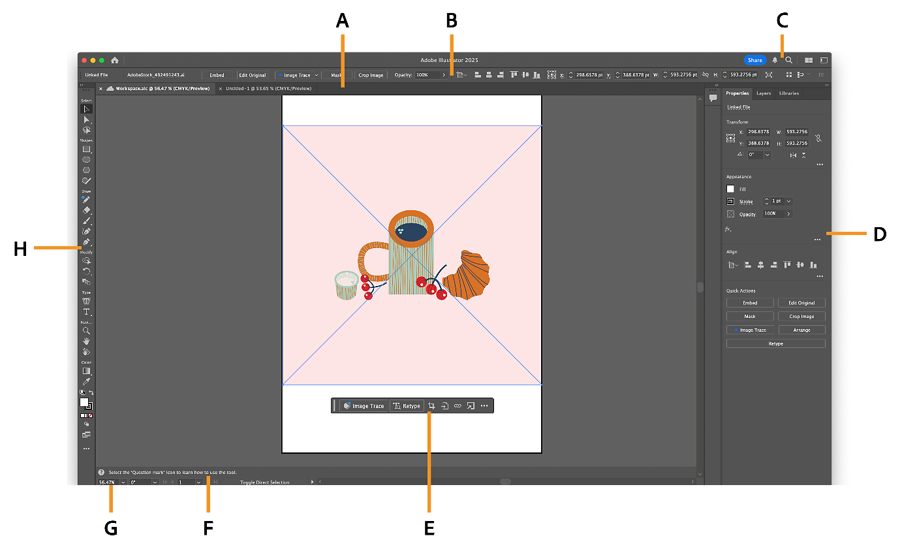
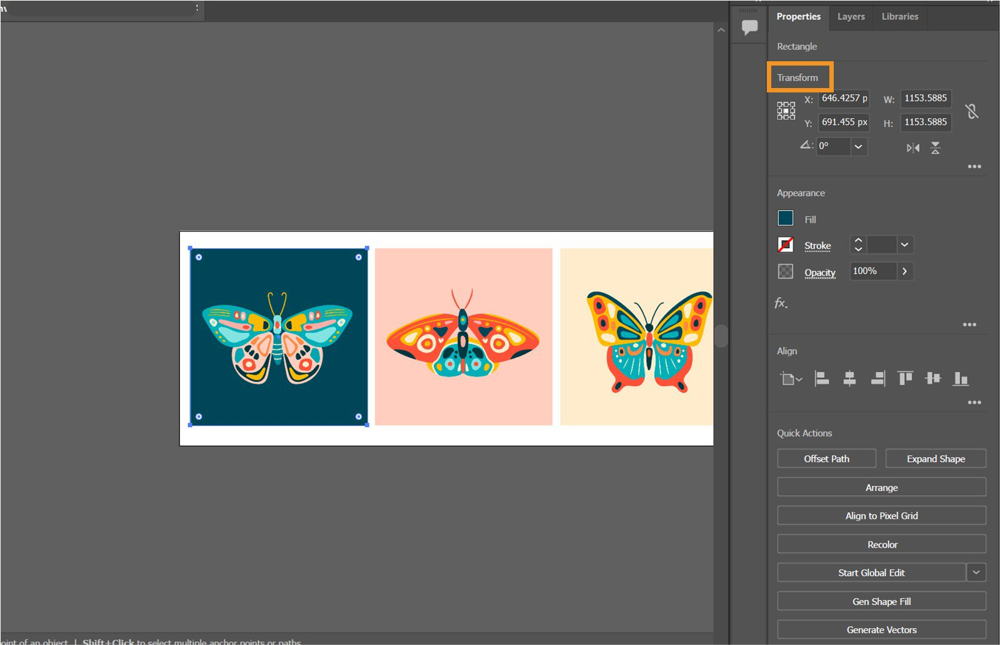
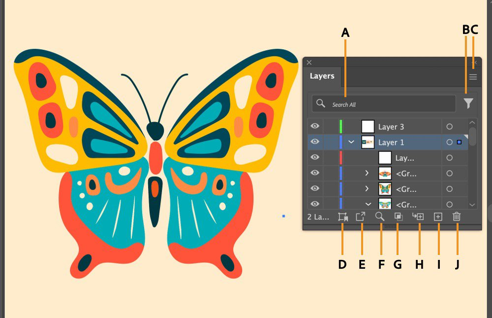
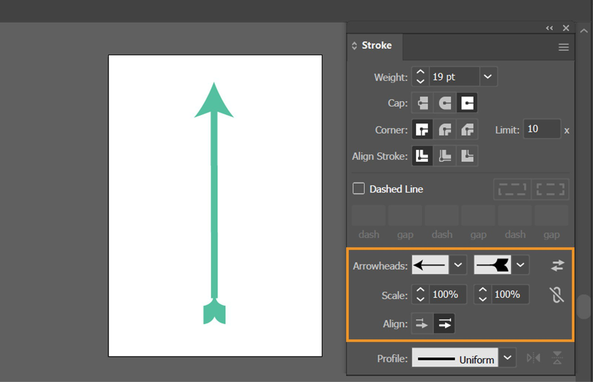
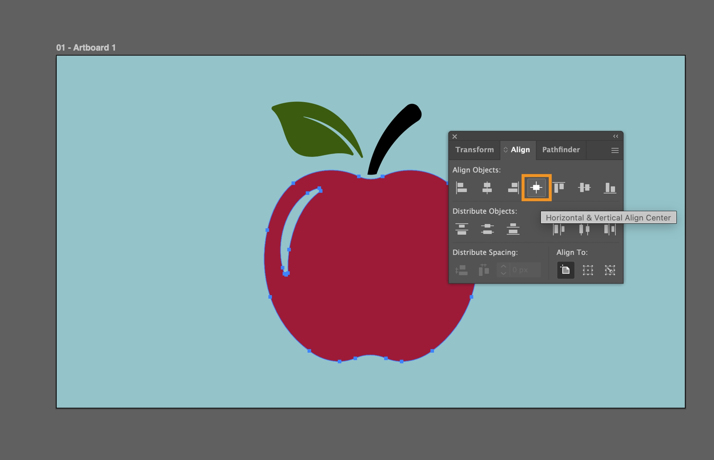
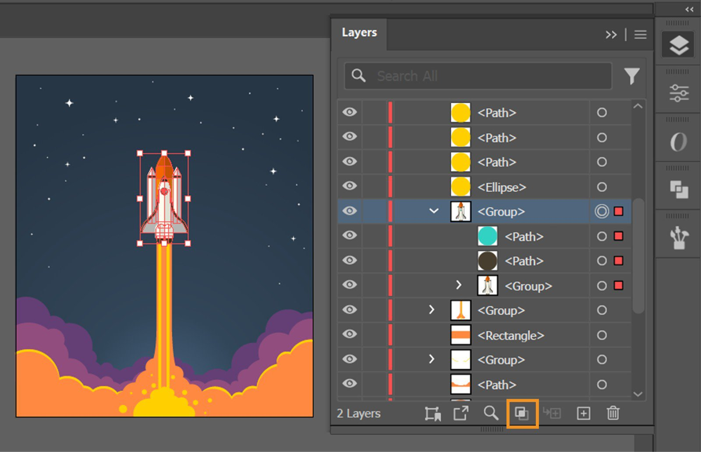
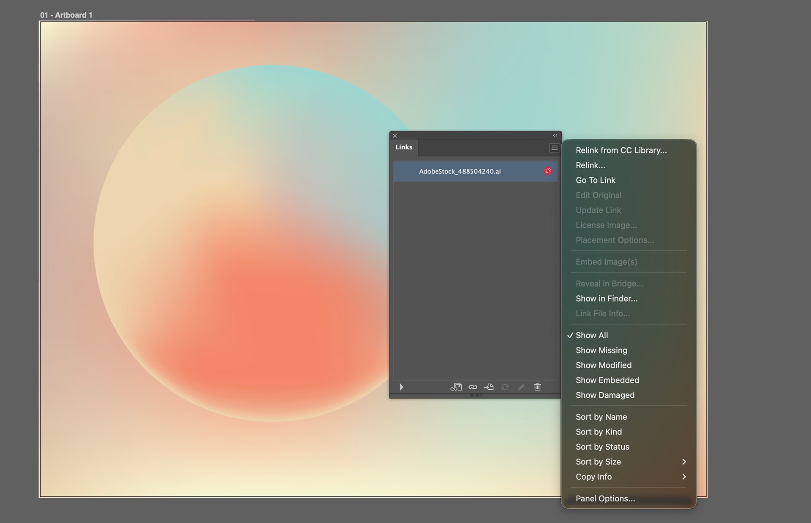
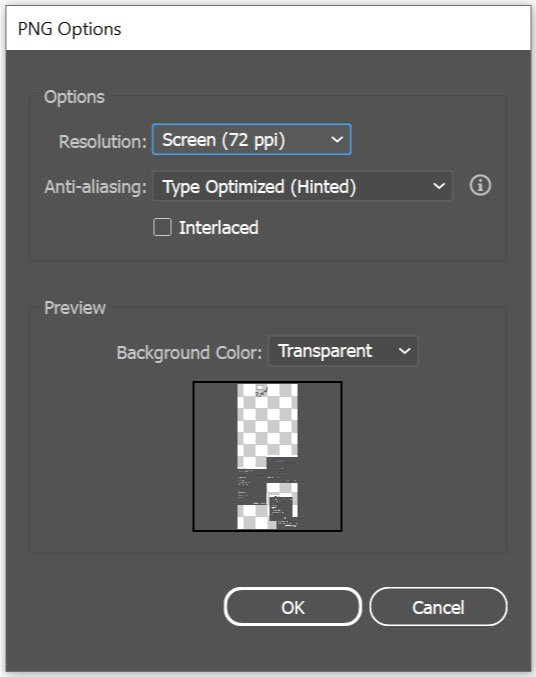
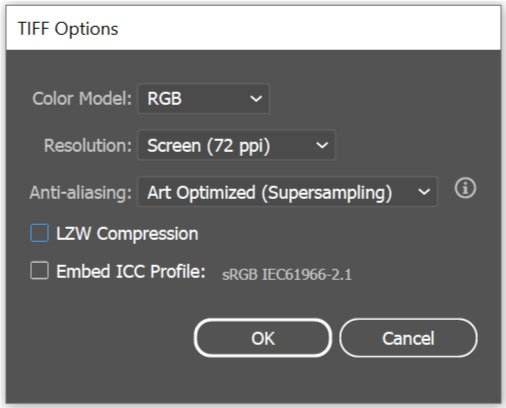

# Adobe Illustrator 2026 科研绘图零基础入门

!!! abstract "先看结论"
    Illustrator（简称 AI，但不要和“人工智能”混淆）最适合做的是：**把实验流程、细胞/器官示意图、机制图、技术路线图、图标和数据图拼成一张结构清楚、可编辑、可缩放的科研插图**。

    推荐的科研绘图链路是：**实验数据处理软件负责算数据 → Illustrator 负责矢量化排版与统一视觉 → 保存 `.ai` 源文件 → 按投稿要求导出 PDF/SVG/TIFF/PNG**。

!!! note "版本说明"
    本笔记按 Adobe Illustrator 桌面版 2026 年 8 月公开的 **30.8** 版资料整理。2026 版界面中最值得新手注意的是：顶部有工具/帮助搜索，右侧常用 Properties（属性）面板，画布上会出现 Contextual Task Bar（上下文任务栏），Layers（图层）和 Links（链接）管理也更适合复杂科研图。不同语言包、Windows/macOS、屏幕缩放和工作区布局会让按钮位置略有差异；菜单名以英文关键词为准，括号内给出常见中文译名。

!!! info "本文图片说明"
    下文界面图均下载自 Adobe 官方 Illustrator 桌面版帮助页面，并保存在本地 `attachments/adobe-illustrator-2026/`，断网也能在 Obsidian 中查看。Adobe 会在当前帮助页中复用仍适用于 30.x 的界面截图，因此工作区总览的标题栏可能显示 Illustrator 2025；截图所在页面已于 2026-06-01 更新，所示 Toolbar、Properties、Contextual Task Bar、Layers 等布局仍是 2026 版的操作逻辑。

!!! tip "你只需要先学会 20% 的功能"
    先掌握：选择、矩形/椭圆、钢笔、填色/描边、图层、对齐、编组、路径查找器/形状生成器、文字、箭头、剪切蒙版、置入和导出。不要一开始就钻研 3D、渐变网格、复杂画笔或生成式功能。

## 0. 这篇笔记适合谁

- 第一次打开 Illustrator，看到锚点、路径、图层就不知道从哪里下手的人。
- 会用 Excel、Origin、R 或 Python 出数据图，但不会把图排成论文插图的人。
- 想画细胞、器官、仪器、信号通路、技术路线图，却不想每一步都靠截图的人。
- 希望最终文件能继续修改、放大不糊、换颜色不必重画的人。

本文的练习案例是一个**虚构的细胞处理—细胞内部变化—检测结果**示意图，仅用于练习软件操作；图中的箭头关系和颜色不代表真实科学结论。真正投稿时，所有机制、方向、单位、比例尺和统计结果都应回到你的实验记录或数据分析结果。

## 1. Illustrator 在科研工作流里到底做什么

### 1.1 它擅长什么

| 任务 | Illustrator 的作用 |
|---|---|
| 技术路线图 | 画步骤框、箭头、分支、编号和说明 |
| 机制图 | 画细胞、细胞器、分子/通路图标，并统一颜色与线条 |
| 实验仪器示意图 | 用矩形、圆角矩形、椭圆、钢笔和剪切蒙版重建轮廓 |
| 多图拼版 | 把 A/B/C 图、统计图、显微照片和说明排成一张 Figure |
| 图标与标注 | 画箭头、虚线、比例尺、放大框、图例和标签 |
| 数据图后期排版 | 置入 Origin/Excel/R 导出的 PDF/SVG，调整位置与版式 |

### 1.2 它不应该替你做什么

- 不要在 Illustrator 里手工“画出”实验数据趋势，也不要为了好看修改柱高、误差棒或散点位置。
- 不要用 Image Trace（图像描摹）把显微照片变成彩色矢量图后，再把它当成定量结果。
- 不要把截图当作最终论文图：截图通常会糊，文字和线条也不能独立编辑。
- 不要把复杂的统计分析、回归、显著性检验交给 Illustrator。

!!! warning "一条最稳的分工"
    **Origin/Excel/R/Python：** 数据清洗、统计、拟合和数据图。
    **Illustrator：** 版式、矢量图标、箭头、标签、图例、拼版和最终导出。
    这与库中已有的 [[[Origin 2026] 科研绘图小白实战教程]]（如果 Obsidian 对文件名中的方括号解析异常，也可以直接搜索标题打开）是一套互补流程。

### 1.3 把工作流记成这一张图

```text
原始数据/实验照片
        ↓
Origin、Excel、R、Python：清洗、统计、出数据图
        ↓  导出 PDF/SVG 或高分辨率 TIFF/PNG
Illustrator：置入素材 → 画矢量对象 → 排版 → 加标注 → 统一风格
        ↓
保存 .ai 源文件 + 导出投稿文件 + 保留版本记录
```

## 2. 先建立一个不会迷路的心智模型

把 Illustrator 想成“无限大的画桌”，而不是普通画图软件。

| Illustrator 里的词 | 零基础理解 | 科研绘图中的例子 |
|---|---|---|
| Artboard（画板） | 最终要导出的那张纸 | 一张 Figure、一个海报页面 |
| Object（对象） | 画面上的一个东西 | 一个细胞、一个箭头、一个文字框 |
| Path（路径） | 对象的几何骨架，由锚点和线段组成 | 细胞轮廓、曲线箭头 |
| Anchor Point（锚点） | 路径上的控制点 | 调整细胞膜弧度的点 |
| Fill（填色） | 对象内部的颜色 | 细胞质浅蓝色 |
| Stroke（描边） | 对象边缘或开放路径的线 | 细胞轮廓、箭头线 |
| Layer（图层） | 管理一组对象的抽屉 | 背景、细胞、箭头、文字 |
| Group（编组） | 把几个对象临时捆在一起移动 | “图标+标签”一起移动 |
| Clipping Mask（剪切蒙版） | 只显示某个形状里面的内容，不删除外面部分 | 把照片裁进圆形、放大框 |
| Appearance（外观） | 对象的填色、描边、透明度、效果集合 | 同一对象同时有填色和双重描边 |

最重要的一句话：**Illustrator 中的对象不是一张“涂上去的像素”，而是一组可以随时修改的几何对象。**

## 3. 第一次打开 2026 版：先认识界面

### 3.1 2026 界面从上到下、从左到右看

官方 2026 工作区概览图可以对照查看：[Adobe Illustrator workspace overview](https://helpx.adobe.com/illustrator/desktop/get-started/learn-the-basics/workspace-overview.html)。打开一个文档后，先定位下面几个区域：



*图 1｜Adobe 官方工作区总览。A：Document Window（文档窗口）；B：Control（控制栏）；C：Application Bar（应用栏）；D：Properties（属性面板）；E：Contextual Task Bar（上下文任务栏）；F：Help Bar；G：Status Bar（状态栏）；H：Toolbar（工具栏）。图中标题栏虽显示 2025，但来源页于 2026-06-01 更新，界面结构适用于当前 30.x 工作流。*

| 区域 | 你会看到什么 | 新手现在怎么用 |
|---|---|---|
| 顶部菜单栏 | File、Edit、Object、Type、Select、Effect、View、Window、Help | 找不到按钮时，先从菜单找 |
| 左侧 Toolbar（工具栏） | 选择、钢笔、文字、形状、缩放等工具 | 画什么就选什么工具；长按图标可展开同组工具 |
| 顶部 Control（控制栏） | 当前选中对象的常用参数 | 快速改填色、描边、位置和尺寸 |
| 右侧 Properties（属性） | 根据当前对象显示对应选项 | 零基础最常用的“总控制台” |
| 画布中央 Document Window | 画板和画板外的灰色区域 | 画板内是最终输出范围，画板外可暂存对象 |
| 画布附近 Contextual Task Bar | 随选中对象变化的快捷操作 | 适合快速改样式，不必替代完整面板 |
| 右侧面板组 | Layers、Align、Pathfinder、Stroke、Appearance、Color、Links 等 | 复杂图一定要用面板，不要只靠鼠标拖 |
| 底部 Status Bar | 缩放比例、当前工具、活动画板 | 检查当前缩放和画板 |

2026 版右上方的工具/帮助搜索可以直接搜 `Align`、`Stroke`、`Clipping Mask`、`Image Trace` 等关键词；当你不知道功能藏在哪个菜单时，这是最快的入口。

### 3.2 建议打开的面板

通过 `Window（窗口）` 菜单打开：

- `Properties（属性）`：先用它完成大多数基础设置。
- `Layers（图层）`：创建、命名、锁定、隐藏和重排图层。
- `Align（对齐）`：让对象整齐排列，避免凭眼睛对齐。
- `Pathfinder（路径查找器）`：合并、相减、相交形状。
- `Stroke（描边）`：线宽、虚线、端点、拐角和箭头。
- `Appearance（外观）`：检查一个对象到底叠了哪些填色和描边。
- `Color（颜色）`、`Swatches（色板）`：统一颜色。
- `Links（链接）`：查看置入的图片是否丢失、是否嵌入。
- `Artboards（画板）`：增加、删除、命名和导出多个画板。

如果面板被拖乱了，可使用 `Window > Workspace > Essentials` 或 `Window > Workspace > Reset Essentials` 恢复；整理好后可用 `Window > Workspace > New Workspace` 保存自己的“科研绘图”工作区。官方工作区管理说明见：[Manage workspaces](https://helpx.adobe.com/illustrator/desktop/get-started/learn-the-basics/manage-workspaces.html)。



*图 2｜选中一个矩形后的 Properties 面板。最常用的是 Transform（位置、宽高、角度）、Appearance（填色、描边、透明度）、Align（对齐）和 Quick Actions（快捷操作）。新手如果不知道去哪里改参数，先选中对象，再看右侧 Properties。*

### 3.3 第一次设置：只改这些

1. 选择 `Edit > Preferences > Units`（Windows）或 `Illustrator > Settings > Units`（macOS），把 `General` 改为 `Millimeters（毫米）`。
2. 在同一设置中把 `Stroke` 和 `Type` 的单位也确认好，避免画板用 mm、线宽却突然显示 pt 而不理解。
3. 选择 `Edit > Preferences > General`，确认 `Keyboard Increment`（键盘微移距离）是方便你排版的数值；科研图通常可先设为 `1 mm`，精细调整时按住 `Shift` 增大步长。
4. 选择 `View > Smart Guides`（智能参考线），方便对象吸附到中心、边缘和锚点。
5. 选择 `View > Rulers > Show Rulers`（显示标尺），快捷键通常是 `Ctrl+R`。

## 4. 创建第一个科研绘图文件

### 4.1 新建画板

1. `File > New`（`Ctrl+N`）。
2. 在 New Document 对话框中把单位改为 `mm`。
3. 练习时输入 `Width 180 mm`、`Height 120 mm`、横向（Landscape），画板数量先设为 1。
4. `Color Mode`：没有投稿要求时可先用 RGB；期刊明确要求 CMYK 时再切换。不要把 Color 面板显示为 RGB 误认为文档已经是 RGB，颜色面板的显示模式和文档色彩模式是两件事。
5. `Raster Effects`：如果会使用阴影、模糊等效果，练习论文图可先用 `300 ppi`；具体投稿以期刊要求为准。
6. 点击 `Create`，马上 `File > Save As` 保存为 `科研绘图_练习_v01.ai`。

!!! warning "画板尺寸要按“最终发表尺寸”考虑"
    不要先在 4K 屏幕上把字画得巨大，最后缩到论文栏宽后才发现看不清。建议先估计期刊的单栏/双栏宽度，按最终尺寸设置画板，再决定字体和线宽。

### 4.2 建立图层抽屉

打开 `Window > Layers`，建立并命名为：

```text
00_参考线（可选，不打印）
01_背景
02_主体对象（细胞、器官、仪器）
03_箭头与连线
04_文字与图例
05_置入数据图/照片
```

图层面板左侧的眼睛控制显示，锁形图标控制编辑；2026 版图层面板还可搜索和筛选对象。锁定已经完成的图层，再处理下一层，能明显减少“误选后拖走整个细胞”的情况。Adobe 的图层说明见：[Layers overview](https://helpx.adobe.com/illustrator/desktop/manage-layers/create-and-organize-layers/layers-overview.html)。



*图 3｜Adobe 2026 图层面板实图。A：搜索；B：筛选；C：面板菜单；D：保存选择；E：收集用于导出；F：定位对象；G：创建/释放剪切蒙版；H：新建图层；I：新建子图层；J：删除。每行左侧“眼睛”控制显示，锁定列位于眼睛右侧；右侧小圆用于选中/定位对应对象。科研图对象很多时，应先给图层和关键组命名。*

## 5. 贯穿练习：画一张最小可用的细胞机制示意图

目标不是画出顶刊插图，而是练会一条完整链路：

```text
外部处理条件  →  细胞主体  →  细胞内部结构变化  →  检测结果/结论
```

完成后的练习图应至少有：一个细胞、一个细胞核或细胞器、两条箭头、三个文字标签、一个图例色块。所有内容都要能被选中、移动和重新上色。

### 5.1 画细胞主体：先用基本形状，不要一上来抠锚点

1. 在 `02_主体对象` 图层中选择左侧 `Ellipse Tool（椭圆工具，L）`。
2. 按住 `Shift` 拖出一个正圆；不按 Shift 可以画椭圆。先画一个较大的椭圆，作为细胞轮廓。
3. 选中对象，在 `Properties > Appearance` 中设置：`Fill` 为浅蓝色，`Stroke` 为深蓝色，线宽约 `1–1.5 pt`。
4. 再复制一个稍小的椭圆作为细胞内部背景：`Ctrl+C`，再 `Ctrl+F` 粘贴到前方，然后在 Properties 中改尺寸和填色。
5. 画细胞核：再次用椭圆工具画一个小椭圆，设置为白色或浅紫色填充、深紫色描边。
6. 画几个小圆作为“颗粒/小分子”练习。按住 `Alt` 拖动可以复制，复制后按 `Ctrl+D` 重复上一次变换。

此时你应当练会：选择对象、调整尺寸、填色、描边、复制和层级关系。不要把所有对象合并成一张图；后面还要分别修改它们。

### 5.2 用 Pathfinder 和 Shape Builder 做简单复杂形状

当两个基本形状叠在一起时，有两种常用方法：

- **Pathfinder（路径查找器）**：选中多个对象，打开 `Window > Pathfinder`，使用 `Unite（联集）`、`Minus Front（减去顶层）`、`Intersect（交集）` 等按钮。
- **Shape Builder（形状生成器，Shift+M）**：选中多个重叠形状后，用鼠标拖过要合并的区域；按住 `Alt` 点击可以删除区域。它很适合把两个椭圆拼成弯月、把矩形切出缺口。

练习：画两个重叠的椭圆，选择它们，按 `Shift+M`，拖过重叠区域合并；再按住 `Alt` 点击不需要的区域。保留原始对象的好处是出错后可以 `Ctrl+Z`，而不是重新画一遍。

### 5.3 画直线和箭头：不要手工画三角形箭头

1. 切换到 `03_箭头与连线` 图层。
2. 选择 `Line Segment Tool（直线段工具）`，从一个对象拖到另一个对象。
3. 确认 `Fill` 设为无（None），`Stroke` 设为深灰或深蓝。
4. 打开 `Window > Stroke`，如果没有显示完整选项，打开面板菜单并选择 `Show Options`。
5. 在 `Weight` 设置线宽；在 `Cap` 选择 `Round Cap`（圆头）；在 `Arrowheads` 中选择末端箭头，并用 `Scale` 调整箭头大小。
6. 如果箭头方向反了，点击 `Swap start and end arrowheads`；如果箭头尖端超出对象太多，使用 `Align` 中的对齐选项。

直线、虚线、圆头和箭头都应由 Stroke 面板控制；这样全图可以统一修改。官方说明见：[Add arrowheads to paths](https://helpx.adobe.com/illustrator/desktop/paint-and-fill/apply-and-edit-strokes/add-arrowheads.html) 和 [Change line caps and joins](https://helpx.adobe.com/illustrator/desktop/paint-and-fill/apply-and-edit-strokes/change-the-caps-or-joins-of-a-line.html)。



*图 4｜Stroke 面板真实界面。上方 Weight 控制线宽，Cap/Corner 控制端点和转角；橙框内两个 Arrowheads 下拉框分别对应路径起点和终点，右侧双箭头可交换方向，Scale 调整箭头大小，Align 决定箭头尖端是否压在线段端点上。示例的 19 pt 很粗，只用于演示；论文图通常从约 1–1.5 pt 试起。*

### 5.4 画曲线和细胞膜：先少点，再调弧度

1. 选择 `Pen Tool（钢笔工具，P）`。
2. 画直线：依次点击几个点。
3. 画曲线：在起点按住鼠标拖动，释放后移动到终点再拖动；拖动方向决定曲线的切线方向。
4. 闭合形状：回到第一个锚点，看到小圆圈后点击。
5. 用 `Direct Selection Tool（直接选择工具，A）` 点击单个锚点，拖动锚点或手柄调整弧度。

零基础最容易犯的错是锚点太多。一个平滑的细胞膜轮廓，通常先用 6–12 个关键锚点，再用手柄调整；锚点越多，越容易抖、越难统一修改。Adobe 2026 钢笔曲线操作见：[Draw curves with the Pen tool](https://helpx.adobe.com/illustrator/desktop/draw-shapes-and-paths/draw-shapes/draw-curves-with-the-pen-tool.html)。

### 5.5 放置文字和标签：文字先保持可编辑

1. 选择 `Type Tool（文字工具，T）`，在画板上单击，输入 `Treatment`、`Cell`、`Readout` 等标签。
2. 选中文字后，在 `Properties` 或 `Window > Type > Character` 中设置字体、字重、字号、行距和字距。
3. 标签放在对象附近，但不要压住箭头、误差棒或关键结构。
4. 需要文字框时，用文字工具拖出一个矩形区域再输入；这比手动换行更稳定。
5. 练习图可先用 Arial、Helvetica、Aptos 等清晰无衬线字体；中文字体要选目标电脑和投稿流程都能使用的字体。

!!! warning "不要过早 Create Outlines"
    `Type > Create Outlines`（创建轮廓）会把文字变成路径，之后不能像文字一样改内容、字号和拼写。保留一个文字仍可编辑的 `.ai` 主文件；只有在投稿系统或跨电脑字体替换风险确实存在时，另存一份“outlined”副本再转轮廓。Adobe 也明确提醒，转为 outlines 后会失去文字属性。

### 5.6 用 Align 把图排整齐

1. 用 `Selection Tool（选择工具，V）` 框选多个标签或色块。
2. 打开 `Window > Align`。
3. 选择 `Align to Selection`，尝试水平居中、垂直居中、水平分布和垂直分布。
4. 如果要相对画板居中，选择 `Align to Artboard`；如果要相对某一个固定对象对齐，选择 `Align to Key Object`。

!!! tip "“Align to” 是最容易被忽略的下拉框"
    同一个“水平居中”按钮，在 Align to Selection、Align to Artboard 和 Align to Key Object 下结果完全不同。排版前先看清参照物。官方 2026 对齐说明见：[Align or distribute selected objects](https://helpx.adobe.com/illustrator/desktop/manage-objects/arrange-objects/align-and-distribute-objects.html)。



*图 5｜Adobe Illustrator 30.5/2026 对齐界面。上排 Align Objects 控制左、中心、右、上、中、下对齐；中排 Distribute Objects 控制等距分布；底部 Align To 决定参照物。图中高亮的是水平和垂直中心对齐。科研流程图要优先用数值和对齐面板，不要全靠目测。*

### 5.7 编组、锁定和调整层级

- `Ctrl+G`：把多个对象编组，便于整体移动。
- `Ctrl+Shift+G`：取消编组。
- `Object > Arrange > Bring to Front / Send to Back`：调整前后遮挡关系。
- `Ctrl+2`：锁定选中对象，防止误拖。
- `Ctrl+Alt+2`：解锁全部对象。
- 图层面板中的眼睛：隐藏/显示；锁：禁止编辑。

建议把“主体细胞”编组，但不要把“所有内容”编成一个超级大组。图层和编组的区别是：**图层负责管理结构，编组负责临时整体操作。**

## 6. 科研绘图最常用的五个实操模块

### 6.1 流程图模块

适合实验流程、技术路线和研究框架。

1. 用 `Rectangle Tool（矩形工具，M）` 或 `Rounded Rectangle Tool` 画第一个步骤框。
2. 在 Properties 中输入精确的 W、H，复制后只改文字，保证框大小统一。
3. 选中所有步骤框，用 Align 的 `Vertical Align Center` 和 `Horizontal Distribute Space` 排列。
4. 画箭头时把箭头放在单独图层，并用 `Object > Arrange > Send to Back` 送到框的后面。
5. 如果有分支，用实线表示主流程、虚线表示补充关系；在图例中说明含义。

### 6.2 细胞/器官模块

先用椭圆、圆角矩形、矩形和曲线搭大轮廓，再用 Pathfinder/Shape Builder 修形；颜色不超过 5–7 个主色。能用简单形状解释清楚时，不必追求 3D 写实。

常见层级可以是：

```text
细胞膜
  ├─ 细胞质
  ├─ 细胞核
  ├─ 线粒体/囊泡/颗粒
  └─ 标签与箭头
```

### 6.3 放大框模块

1. 复制要放大的区域或照片。
2. 画一个圆形/矩形作为蒙版，确保蒙版形状在最上方。
3. 同时选中蒙版和被裁切内容，选择 `Object > Clipping Mask > Make`，或使用 `Ctrl+7`。
4. 想重新调整内容时，用直接选择工具进入蒙版内部移动图片；想取消蒙版，用 `Object > Clipping Mask > Release`。

剪切蒙版只隐藏外部内容，不会删除；蒙版路径本身需要是矢量对象。官方说明见：[Create clipping masks](https://helpx.adobe.com/illustrator/desktop/manage-objects/edit-objects/create-clipping-masks.html)。



*图 6｜Layers 面板中的 Make/Release Clipping Mask 按钮（橙框）。创建时要把蒙版形状放在被裁对象上方；选中蒙版形状和下方内容后再点击。图层中出现 `<Group>` 很正常，展开它可以分别选中蒙版路径和内部对象。*

### 6.4 置入照片、示意图和数据图

选择 `File > Place`：

- 放置照片、显微图、实验装置照片：通常保留为链接的 PNG/TIFF/JPEG，便于更新和控制文件大小。
- 放置 Origin/Excel/R 导出的图：优先 PDF 或 SVG，尽量保留矢量文字、线条和散点。
- 交付前打开 `Window > Links`，检查是否有缺失链接；必要时在 Links 面板中选择 `Embed` 把文件嵌入。
- 2026.8 支持在同一文件夹中自动寻找并重新链接其他缺失文件，但仍应把源图片、`.ai` 和导出文件放在有组织的项目文件夹中。

链接文件较小且便于更新，嵌入文件自包含、交付更稳；二者要根据工作阶段选择。官方说明见：[Links panel overview](https://helpx.adobe.com/illustrator/desktop/add-and-import-files/manage-linked-and-embedded-files/links-panel-overview.html)。



*图 7｜Links 面板检测到缺失链接时会显示红色状态标记。打开面板菜单可使用 Relink 重新定位、Go To Link 找到画板中的对象、Update Link 更新源文件，或 Embed Image(s) 嵌入素材。交付前至少执行一次 `Show Missing` 检查。*

### 6.5 Image Trace：只在合适的时候用

使用方法：选中置入图片，选择 `Window > Image Trace`，选择 `Black and White`、`Grayscale`、`Low Color` 或 `Outline` 等预设，检查预览后点击 `Expand` 转为可编辑路径。

适合：

- 简单的手绘草图、黑白图标、低复杂度线稿。
- 需要把一个简单 logo 或示意轮廓转为矢量路径。

不适合：

- 显微照片、真实组织照片、复杂渐变和噪声很大的图片。
- 任何需要保持像素强度、灰度或定量关系的图。

描摹后路径数量可能暴增，文件会变慢；先用低颜色数、适当噪声过滤和较低精度试验。官方 2026 面板说明见：[Image Trace panel options](https://helpx.adobe.com/illustrator/desktop/manage-objects/traces-mockups-symbols/image-trace-panel-options.html)。

## 7. 颜色、线宽和文字：先建立一套“论文风格”

### 7.1 一个适合新手的限制型配色

不要为了“高级”给每个对象换一个颜色。可以先建立一组色板：

| 用途 | 建议颜色 | Hex 示例 |
|---|---|---|
| 主体/正常状态 | 深蓝 | `#1F4E79` |
| 细胞/背景 | 浅蓝 | `#DCEFF7` |
| 过程/中性信息 | 青绿 | `#4EAAA0` |
| 处理/刺激 | 橙色 | `#F39C5A` |
| 损伤/升高/警示 | 红色 | `#D9534F` |
| 辅助线/文字 | 深灰 | `#333333` |
| 次要背景 | 浅灰 | `#F2F4F7` |

在 `Window > Swatches` 中保存常用颜色；最好使用同一套颜色贯穿全图，并用形状或线型辅助区分，避免只靠颜色表达信息。Color 面板可以切换 RGB/CMYK/HSB 等显示方式，但这不会自动改变文档的色彩模式；官方说明见：[Select colors using the Color panel](https://helpx.adobe.com/illustrator/desktop/manage-colors/select-and-adjust-colors/select-colors-using-the-color-panel.html)。

### 7.2 线宽和文字的实用起点

下面只是练习起点，最终应在“最终发表尺寸”下检查：

- 主轮廓：`1–1.5 pt`。
- 次轮廓、内部结构：`0.7–1 pt`。
- 主箭头：`1.2–1.8 pt`，箭头大小与线宽匹配。
- 最终文字：常见可从 `7–10 pt` 试起；小于期刊可读性要求时不要硬缩。
- 字体层级：标题 > 小标题/组别 > 普通标签 > 注释，不要让所有字一样大。

关键检验：把画面缩到论文页面宽度，甚至打印一张黑白草稿；如果线条、箭头、图例和文字仍清楚，才算真正可用。

## 8. 把 Origin/Excel 的数据图放进 Illustrator

### 8.1 推荐做法

1. 先在 Origin、Excel、R 或 Python 中完成数据处理、统计和数据图。
2. 导出一份 PDF/SVG（优先矢量）和一份 PNG/TIFF（用于预览或期刊指定格式）。
3. 在 Illustrator 中用 `File > Place` 置入 PDF/SVG。
4. 用剪切蒙版、对齐面板和图层完成拼版。
5. 数据变化时，回到原分析软件重新导出，再在 Links 面板中更新或替换，不要手改图中的数值。

### 8.2 为什么不要在 Illustrator 里改数据图

因为修改柱高、散点位置、误差棒和拟合线会切断“原始数据—分析—图形”的证据链。Illustrator 可以改颜色、大小、布局和标签，但统计结果应该由产生它的软件重新生成。

### 8.3 PDF 置入后常见现象

- 图形被拆成许多组：先在 Layers 面板中找到对应对象，再用编组/取消编组；不要一上来全选全拆。
- 文字无法编辑：可能是源软件导出时已经转轮廓，或 PDF 被当成整体对象；保留原始数据图文件。
- 线条看起来有白边/裁切：检查 PDF 页边界、剪切蒙版和 Illustrator 的 GPU 预览；导出前用 `View > Overprint Preview` 或 PDF 阅读器复核。
- 图变模糊：说明放入的是低分辨率位图；回到数据软件重新导出 PDF/SVG，或者按期刊要求导出 300–600 ppi TIFF。

## 9. 保存与导出：源文件和交付文件分开

### 9.1 文件夹建议

```text
科研绘图_项目名/
├─ 01_raw_data/          原始数据、原始照片，只读保存
├─ 02_analysis/          Origin/Excel/R/Python 项目和导出的数据图
├─ 03_assets/            图标、照片、参考素材
├─ 04_illustrator/       .ai 源文件与版本
└─ 05_export/            PDF、SVG、TIFF、PNG 交付文件
```

版本命名示例：`Figure2_mechanism_v03.ai`、`Figure2_mechanism_v03_print.pdf`、`Figure2_mechanism_v03_600dpi.tif`。

### 9.2 保存主文件

- `File > Save`：保存可继续编辑的 `.ai` 主文件。
- 复杂项目建议每完成一个大步骤就另存一个版本，例如 `v01_layout`、`v02_arrows`、`v03_text`。
- 交付前先保存一个文字可编辑版本，再根据需要另存“轮廓化副本”。

### 9.3 导出 PDF

1. `File > Save a Copy` 或 `File > Save As`。
2. 格式选择 `Adobe PDF (pdf)`。
3. 论文线稿、机制图和矢量数据图通常可从 `High Quality Print` 起步；如果期刊给了 PDF/X 标准，按期刊指定。
4. 保留一份可编辑 `.ai`，不要把“Preserve Illustrator Editing Capabilities”当成唯一备份。
5. 用 PDF 阅读器打开导出的文件，检查文字、透明度、箭头、字体和裁切范围。

### 9.4 导出 PNG/TIFF/SVG

1. 选择 `File > Export > Export As`。
2. 勾选 `Use Artboards`，否则可能把画板外的暂存对象也带进去。
3. 栅格格式中设置目标分辨率：一般预览 150–300 ppi，投稿按期刊要求常见为 300–600 ppi。
4. 需要透明背景时，选择透明背景；需要白底投稿时，不要误把透明当成白色。
5. SVG 适合网页、矢量归档和后续编辑，但必须确认投稿系统接受。
6. 2026.7 起，`Export for Screens` 支持导出 TIFF；它适合多画板/多资产批量导出。Adobe 官方导出说明见：[How to export artwork in Illustrator](https://helpx.adobe.com/illustrator/using/exporting-artwork.html)。



*图 8｜PNG Options。Resolution 不要沿用图中演示的 Screen (72 ppi) 直接投稿；论文图片应改成期刊要求的分辨率。Anti-aliasing 中，含大量小字时可测试 Type Optimized，图标/线稿为主时可测试 Art Optimized。Background Color 可选 Transparent 或白底。*



*图 9｜TIFF Options。依次检查 Color Model、Resolution、Anti-aliasing、LZW Compression 和 ICC Profile。LZW 是无损压缩，通常能减小文件；色彩模式和 ICC 配置应服从期刊要求，不要因为界面默认是 RGB 或 72 ppi 就直接确认。*

| 用途 | 优先格式 | 备注 |
|---|---|---|
| 论文线图、机制图、流程图 | PDF / SVG | 优先矢量，放大不糊 |
| 期刊指定图片 | TIFF | 按期刊宽度和 ppi 导出 |
| PPT、组会、聊天分享 | PNG | 透明背景或白底按场景选择 |
| 主文件 | AI | 保留图层、文字、蒙版和可编辑性 |

## 10. 零基础快捷键清单

| 快捷键 | 功能 | 先记住它的原因 |
|---|---|---|
| `V` | 选择工具 | 移动/缩放整体对象 |
| `A` | 直接选择工具 | 调锚点和路径 |
| `P` | 钢笔工具 | 画曲线和不规则轮廓 |
| `T` | 文字工具 | 添加标签 |
| `M` | 矩形工具 | 画步骤框、色块 |
| `L` | 椭圆工具 | 画细胞、细胞核、颗粒 |
| `Shift+O` | 画板工具 | 调整或切换画板 |
| `Shift+M` | 形状生成器 | 合并/删除重叠区域 |
| `Ctrl+G` | 编组 | 整体移动多个对象 |
| `Ctrl+Shift+G` | 取消编组 | 分开修改对象 |
| `Ctrl+2` | 锁定选中对象 | 防止误拖 |
| `Ctrl+Alt+2` | 解锁全部 | 找不到对象时排查 |
| `Ctrl+7` | 创建剪切蒙版 | 做圆形照片、放大框 |
| `Ctrl+Z` | 撤销 | 出错先撤销，不要硬修 |
| `Ctrl+S` | 保存 | 形成肌肉记忆 |

## 11. 新手最常见的坑与排查顺序

1. **点了对象却选不中**：先看 Layers 是否锁定，再检查对象是否被编组或在剪切蒙版里。
2. **拖动时整个细胞一起跑**：你选中的是 Group；用直接选择工具或进入隔离模式编辑内部对象。
3. **箭头没有箭头**：检查是否选中 Stroke、Stroke 面板是否展开 Show Options、箭头是否设置在正确端点。
4. **对象只有轮廓没有颜色**：检查 Fill 是否为 None；对象可能是开放路径，开放路径不能像封闭形状一样填内部。
5. **对齐后位置很奇怪**：检查 Align to 是 Selection、Artboard 还是 Key Object。
6. **文字变成方框或被替换**：目标电脑缺少字体；保存字体清单，或另存一份文字转轮廓副本。
7. **置入图片显示问号/缺失**：打开 Links 面板，Relink 到正确文件；交付前考虑 Embed 或把图片一起打包。
8. **图片被剪掉了**：可能被旧的 Clipping Mask 罩住；用 `Object > Clipping Mask > Release` 检查。
9. **文件越来越卡**：Image Trace 生成了过多路径、嵌入了超大照片、图层缩略图过多或用了复杂透明/渐变；先保留链接图片、减少描摹复杂度。
10. **导出的图很糊**：不要放大截图；重新导出 PDF/SVG 或按要求提高 TIFF/PNG 的 ppi。
11. **颜色在屏幕和 PDF 中不同**：检查文档 RGB/CMYK、色彩配置文件和期刊要求；不要只看 Color 面板上的 RGB/CMYK 标签。
12. **图看起来很花**：删颜色、删装饰、减线条；让颜色、线型和箭头承担信息，而不是承担装饰。

## 12. 一周入门练习路线

### 第 1 天：界面和对象

- [ ] 新建 180 × 120 mm 画板并保存 `.ai`。
- [ ] 打开 Properties、Layers、Align、Stroke、Pathfinder。
- [ ] 用矩形、椭圆画 10 个对象，练习填色和描边。

### 第 2 天：选择和层级

- [ ] 练习 V、A、编组、取消编组、锁定、解锁。
- [ ] 用 Layers 建立背景、主体、箭头、文字 4 层。
- [ ] 练习 Bring to Front / Send to Back。

### 第 3 天：箭头和路径

- [ ] 画直线、虚线、圆头线和带箭头曲线。
- [ ] 用钢笔只画 5–8 个锚点的细胞膜轮廓。
- [ ] 练习 Shape Builder 合并/删除区域。

### 第 4 天：文字和对齐

- [ ] 做 3 个大小一致的流程框。
- [ ] 用 Align 对齐并均匀分布。
- [ ] 保持文字可编辑，做一个标题、三个标签和一个图例。

### 第 5 天：蒙版和素材

- [ ] 把一张照片裁成圆形放大框。
- [ ] 用 Links 面板查看链接/嵌入状态。
- [ ] 用 Image Trace 描摹一个简单黑白图标，比较描摹前后路径数量。

### 第 6 天：拼一张科研图

- [ ] 画出“处理 → 细胞 → 检测结果”的虚构机制图。
- [ ] 使用不超过 6 个主色，统一箭头和字体。
- [ ] 把一张 Origin/Excel 导出的 PDF 置入并排版。

### 第 7 天：交付检查

- [ ] 保存文字可编辑的 `.ai` 主文件。
- [ ] 导出 PDF 和 PNG/TIFF。
- [ ] 在最终尺寸下检查字体、线宽、单位、透明度、裁切、链接和拼写。
- [ ] 复制给别人打开测试；对方不应需要猜测缺了哪些素材。

## 13. 视频与资料路线

### 13.1 先学软件基础

1. [B 站：目前 B 站较完整的 Illustrator 零基础全套教程（2025 版）](https://www.bilibili.com/video/BV1ua7pzrEmM/)
   - 适合：完全没打开过 Illustrator 的人。
   - 建议先看前面的初始设置、基础操作、图形工具、对齐、文字、线段、矩形和画笔部分；后面的 IP/作品集内容与科研绘图关联较弱。
2. [YouTube：Adobe Illustrator 2026 Tutorial – Full Beginner Guide](https://www.youtube.com/watch?v=sDy6KIwVv2M)
   - 适合：想对照 2026 版界面和英文菜单的人。
   - 重点看：Pen、Shapes、Paths、Typography、Layers、Artboards、Export。
3. [Adobe Illustrator Desktop Help](https://helpx.adobe.com/illustrator/desktop.html)
   - 适合：遇到具体按钮、菜单或参数时查官方定义。

### 13.2 再学科研绘图思路

1. [B 站：sci 科研绘图——用 Adobe Illustrator 绘制高分文章机制图](https://www.bilibili.com/video/BV1EY411A7Ti/)
   - 是一个 18 课时左右的科研绘图合集，适合观察细胞、通路、放大框和机制图是如何组织的。
   - 不要照搬作者的科学内容或素材；只学习“如何拆图、如何分层、如何统一颜色与箭头”。
2. [B 站：Adobe Illustrator 科研绘图 + 素材](https://www.bilibili.com/cheese/play/ep2025857)
   - 更偏系统课和案例课，包含基础设置、形状/吸管、铅笔、符号、实时上色、渐变、路径查找器、钢笔、描边和多个细胞/流程图案例。
   - 部分内容可能需要购买或登录；观看前注意作者素材版权。
3. [B 站：夏星科研绘图系列](https://www.bilibili.com/video/BV1qX4y1N71v/)
   - 适合快速观察肾脏、细胞膜、离心机、线粒体、质粒、DNA、染色体等对象的拆解方式。
   - 这些短视频适合“模仿一个小对象”，不建议替代基础软件学习。

### 13.3 官方资料优先查这些页面

- [Illustrator 2026/30.x release notes](https://helpx.adobe.com/illustrator/desktop/new-features/release-notes.html)：确认版本新功能和修复。
- [Workspace overview](https://helpx.adobe.com/illustrator/desktop/get-started/learn-the-basics/workspace-overview.html)：对照 2026 界面各区域。
- [Paths overview](https://helpx.adobe.com/illustrator/desktop/draw-shapes-and-paths/learn-drawing-basics/paths-overview.html)：理解路径、锚点、填色和描边。
- [Layers panel overview](https://helpx.adobe.com/illustrator/desktop/manage-layers/create-and-organize-layers/layers-panel-overview.html)：理解图层面板中的显示、锁定、选择和目标列。
- [How to save artwork](https://helpx.adobe.com/illustrator/using/saving-artwork.html)：理解 AI、PDF、SVG 等格式该怎么保存。
- [How to export artwork](https://helpx.adobe.com/illustrator/using/exporting-artwork.html)：理解 Use Artboards、分辨率和各导出格式。

!!! warning "视频版本差异"
    视频可能使用 2023–2025 版，工具图标、面板布局、中文翻译和上下文任务栏会不同。看视频时重点理解“对象—路径—图层—面板”的逻辑，再回到 2026 版按菜单关键词定位；不要因为按钮位置不同就认为功能消失了。

## 14. 最终提交前的 10 项检查

- [ ] `.ai` 源文件仍可打开、图层命名清楚、文字仍可编辑或已另存轮廓副本。
- [ ] 所有箭头方向与正文叙述一致，没有箭头穿过文字或遮挡数据。
- [ ] 所有文字、单位、上下标、希腊字母和拼写正确。
- [ ] 图例、颜色和线型的含义前后一致。
- [ ] 真实数据图来自分析软件导出，没有手工改变数据关系。
- [ ] 线宽和字号在最终发表尺寸下仍清楚。
- [ ] 显微照片或大图没有被错误 Image Trace，也没有丢失比例尺。
- [ ] Links 面板没有缺失文件；交付时相关素材已一并保存或已嵌入。
- [ ] 已导出 PDF 和期刊要求的 TIFF/PNG/SVG，并用外部阅读器检查。
- [ ] 文件名包含版本号，原始数据、分析项目、素材和导出文件没有互相覆盖。

如果这 10 项都能打勾，你已经不只是“会画几个形状”，而是建立了一条可以复现、修改和交付的科研绘图流程。

## 资料来源与整理说明

本文结合了：

1. Adobe Illustrator 2026 官方版本说明、工作区概览、路径、图层、对齐、描边/箭头、文字、剪切蒙版、Links、Image Trace、保存与导出帮助页面。
2. B 站 Illustrator 零基础基础课、科研机制图合集、科研对象短案例和科研绘图素材课程页面。
3. 本 Obsidian 库已有的 [[[Origin 2026] 科研绘图小白实战教程]]，吸收了“先建立数据链、再讲界面、最后做导出和复现检查”的组织方式。

!!! note "关于 2026 的生成式功能"
    Illustrator 30.x 的 Firefly、Concept to Vector、Generative Shape Fill 等功能在不同地区和账号条件下可能不可用，Adobe 的版本说明也标注了部分功能在中国大陆不可用。它们不是科研绘图入门的必要条件；本文主流程全部基于传统且可复现的矢量工具。使用生成式功能时，仍需核查图像版权、科学准确性和期刊政策。
