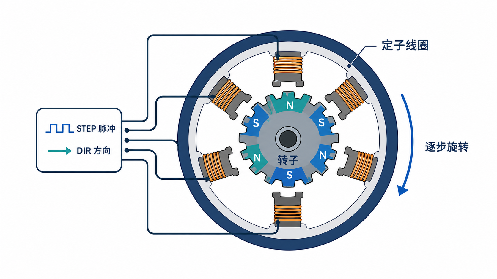

# 步进电机实战笔记

!!! abstract "核心思路"
    驱动器接收 `STEP` 脉冲和 `DIR` 方向信号；每个有效脉冲让电机前进一步。单片机不直接给电机线圈供电。



## 先确认线圈

断电后使用万用表蜂鸣档或电阻档：

1. 任意选择两根电机线测量。
2. 能导通且阻值较小的一对属于同一组线圈。
3. 四线双极步进电机最终应得到两组线圈，例如 `A+ / A-` 与 `B+ / B-`。
4. 两组线圈不要交叉接到同一相，否则电机会抖动但不转。

!!! warning "不要带电插拔电机"
    A4988、DRV8825、TMC2209 等驱动器带电插拔电机时可能被反向电动势损坏。

## 常见驱动器接线

| 驱动器端子 | 接法 |
|---|---|
| `VMOT`、`GND` | 电机电源与电源负极 |
| `VIO/VDD`、`GND` | 单片机逻辑电源与共地 |
| `1A/1B`、`2A/2B` | 两组电机线圈 |
| `STEP` | 单片机脉冲输出 |
| `DIR` | 单片机方向输出 |
| `EN` | 使能控制，具体高低有效看驱动器 |
| `MS1～MS3` | 细分设置 |

首次上电前必须按驱动器说明设置限流。限流过小会丢步，过大会导致电机和驱动器过热。

## 速度与脉冲数

```text
每圈脉冲数 = 电机整步数 × 细分数
脉冲频率 = 转速 RPM × 每圈脉冲数 ÷ 60
```

例如 1.8° 电机每圈 200 整步，使用 16 细分：

```text
每圈脉冲数 = 200 × 16 = 3200
60 RPM 所需频率 = 60 × 3200 ÷ 60 = 3200 Hz
```

原笔记中的“320 转等于一圈”应理解为具体驱动设置下的脉冲数，不能脱离电机步距角和细分倍数直接套用。

## 最小 STEP/DIR 程序

```cpp
const uint8_t STEP_PIN = 2;
const uint8_t DIR_PIN = 5;

void setup() {
  pinMode(STEP_PIN, OUTPUT);
  pinMode(DIR_PIN, OUTPUT);
}

void stepperMove(bool direction, uint32_t pulses, uint16_t pulseUs) {
  if (pulseUs < 2) pulseUs = 2;

  digitalWrite(DIR_PIN, direction);
  delayMicroseconds(5);

  for (uint32_t i = 0; i < pulses; i++) {
    digitalWrite(STEP_PIN, HIGH);
    delayMicroseconds(pulseUs);
    digitalWrite(STEP_PIN, LOW);
    delayMicroseconds(pulseUs);
  }
}

void loop() {
  stepperMove(HIGH, 3200, 150);
  delay(500);
  stepperMove(LOW, 3200, 150);
  delay(500);
}
```

关键修正：

- 正确函数名是 `delayMicroseconds()`。
- 循环条件使用 `i < pulses`，避免多发一个脉冲。
- `pulseUs` 控制的是半周期；数值越小，速度越快。
- 电机不能瞬间从静止跳到很高频率，高速运行需要加减速曲线。

## 非阻塞脉冲框架

```cpp
unsigned long lastStepUs = 0;
unsigned long stepIntervalUs = 500;
bool stepLevel = false;

void updateStepper() {
  unsigned long now = micros();
  if (now - lastStepUs < stepIntervalUs) return;

  lastStepUs = now;
  stepLevel = !stepLevel;
  digitalWrite(STEP_PIN, stepLevel);
}

void loop() {
  updateStepper();
  // 同时处理按键、串口、传感器等任务
}
```

复杂项目优先使用硬件定时器或成熟运动控制库，不要用多个阻塞式 `for + delayMicroseconds()` 同时控制多轴。

## CoreXY 方向关系

CoreXY 使用两台电机合成 X/Y 运动：

| A 电机 | B 电机 | 运动方向 |
|---|---|---|
| 同向 | 同向 | X 或 Y 方向 |
| 反向 | 反向 | 另一条正交轴 |

具体正负方向由皮带绕法、坐标定义和电机接线决定，调试时先低速点动并设置软件限位。

## 常见故障

- **只抖不转**：线圈配对错误、脉冲过快或限流过小。
- **转向相反**：改变 `DIR` 逻辑，或断电后对调同一组线圈的两根线。
- **高速丢步**：加入加减速、降低负载、提高合适的供电电压并正确限流。
- **驱动器过热**：降低电流、增加散热片和风冷。
- **位置越来越偏**：机械卡滞、加速度过高或缺少回零开关。

## 相关笔记

- [PID控制笔记](PID控制笔记.md)
- [半小时学完单片机基础](../STM32/半小时学完单片机基础.md#ba-5-pwm-0-1-0666)

<!-- lhyzs-note-nav:start -->
---
> ← 上一篇：[机械任务与项目推进笔记](机械任务笔记.md) · 下一篇：[面包板与常用模块实战笔记](面包板笔记.md) →
<!-- lhyzs-note-nav:end -->
