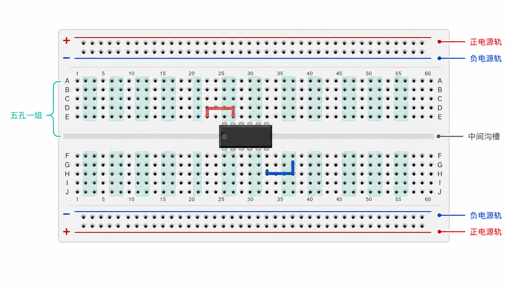

# 面包板与常用模块实战笔记



## 面包板内部连接

- 两侧红、蓝长排通常用作正负电源轨，但有些面包板的电源轨中间是断开的。
- 中间端子区每列的 5 个孔互相导通。
- 中间沟槽两侧不导通，DIP 封装芯片应跨沟槽放置。
- 新面包板第一次使用前，用万用表蜂鸣档确认实际连通关系。

> [!warning] 上电前检查
> 电源极性、供电电压、芯片方向、共地和短路。不要默认所有模块都能接 5 V。

## 推荐布线顺序

1. 断电。
2. 先连接 GND 和电源轨。
3. 放置主控板与模块。
4. 连接信号线。
5. 用万用表检查电源轨之间是否短路。
6. 限流供电或使用较低电流上限首次上电。
7. 单个模块测试通过后再组合。

## 模拟量平均滤波

适合降低 ADC 随机噪声：

```cpp
int readAverage(uint8_t pin, uint8_t samples = 10) {
  long sum = 0;

  for (uint8_t i = 0; i < samples; i++) {
    sum += analogRead(pin);
    delay(2);
  }

  return sum / samples;
}
```

`map()` 用于线性映射整数范围：

```cpp
int adc = readAverage(A0);
int angle = map(adc, 0, 1023, 0, 180);
```

注意：Arduino Uno 的 ADC 通常为 10 位，范围 `0～1023`；不同主控的 ADC 位数和参考电压可能不同。

## SSD1306 OLED 常用操作

```cpp
#include <Adafruit_GFX.h>
#include <Adafruit_SSD1306.h>

Adafruit_SSD1306 display(128, 64, &Wire, -1);

void setup() {
  display.begin(SSD1306_SWITCHCAPVCC, 0x3C);
  display.clearDisplay();
  display.setTextSize(2);
  display.setTextColor(SSD1306_WHITE);
  display.setCursor(0, 0);
  display.println("Hello");
  display.drawLine(0, 30, 127, 30, SSD1306_WHITE);
  display.display();
}
```

`display.display()` 才会把缓冲区内容刷新到屏幕。

## HC-SR04 超声波测距

```cpp
digitalWrite(TRIG_PIN, LOW);
delayMicroseconds(2);
digitalWrite(TRIG_PIN, HIGH);
delayMicroseconds(10);
digitalWrite(TRIG_PIN, LOW);

unsigned long duration = pulseIn(ECHO_PIN, HIGH, 30000);
float distanceCm = duration * 0.0343f / 2.0f;
```

使用 3.3 V 主控时，应确认 `ECHO` 电平是否需要分压。`pulseIn()` 会阻塞，复杂项目可改为定时器输入捕获或中断方案。

## 舵机与 MPU6050

舵机：

```cpp
#include <Servo.h>

Servo servo;

void setup() {
  servo.attach(9);
  servo.write(90);
}
```

舵机启动电流较大，建议单独供电，并与主控共地。

MPU6050 可测三轴加速度和三轴角速度；姿态角通常需要校准和滤波，不能把瞬时加速度直接当成稳定角度。

## 串口绘图仪

按固定列输出数值：

```cpp
Serial.print(value1);
Serial.print('\t');
Serial.print(value2);
Serial.print('\t');
Serial.println(value3);
```

然后在 Arduino IDE 中打开 Serial Plotter。串口波特率必须与 `Serial.begin()` 一致。

## 排错清单

- [ ] 所有模块共地。
- [ ] 电源轨没有中途断开。
- [ ] I2C 地址正确，SDA/SCL 引脚正确。
- [ ] 3.3 V 与 5 V 电平兼容。
- [ ] 大电流负载没有由主控引脚直接供电。
- [ ] 代码中的引脚号与实际接线一致。
- [ ] 单模块已测试，再进行系统联调。

## 相关笔记

- [半小时学完单片机基础](../STM32/半小时学完单片机基础.md)
- [步进电机笔记](步进电机笔记.md)

<!-- lhyzs-note-nav:start -->
---
> ← 上一篇：[步进电机实战笔记](步进电机笔记.md)
<!-- lhyzs-note-nav:end -->
