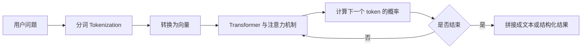
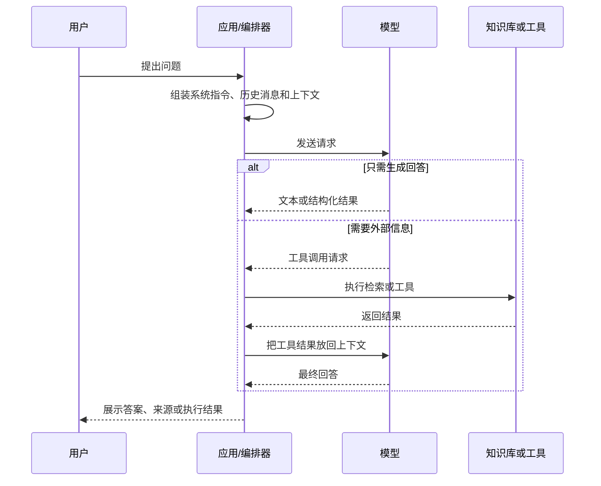
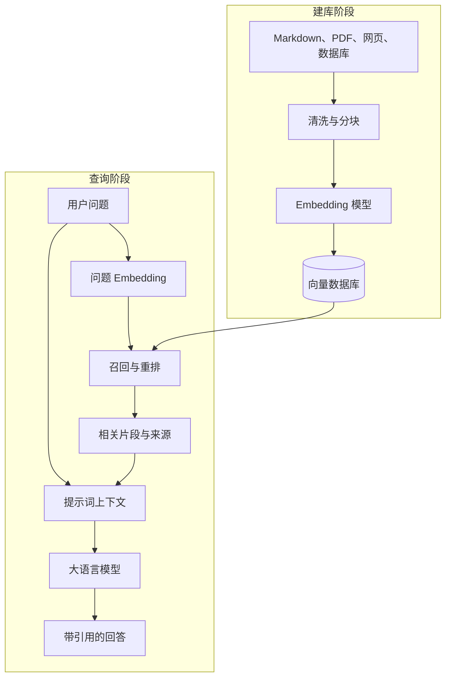

# AI入门基础：原理、术语与从0到1项目

> 这是一份面向零基础的总览。先建立“模型 + 上下文 + 工具 + 工作流 + 评估”的整体框架，再深入 RAG、MCP、Agent 和缓存等术语。

## 一、先记住一句话

一个可用的 AI 应用，不只是调用一个模型，而是把下面几层组合起来：

```text
用户问题
  ↓
应用逻辑：权限、上下文、提示词、历史消息
  ↓
模型：理解输入、预测下一步输出
  ↓
外部能力：知识库检索、工具调用、数据库、API
  ↓
结果处理：结构化输出、引用来源、校验、缓存、日志
  ↓
用户答案或实际动作
```

最实用的判断方法是：

- 只需要生成文字、分类或提取信息：先用模型。
- 需要回答私有资料：加 RAG。
- 需要查询或修改外部系统：加工具调用或 MCP。
- 需要多步决策、循环执行：再考虑 Agent。
- 需要稳定上线：补上评估、权限、限流、缓存和观测。

## 二、AI 到底是怎样工作的

### 1. AI、机器学习、深度学习和大模型的关系

| 名称 | 说明 | 例子 |
| --- | --- | --- |
| AI（人工智能） | 让机器完成通常需要人类智能的任务的总称 | 识图、对话、规划、控制 |
| 机器学习（ML） | 从数据中学习规律，而不是把所有规则手写出来 | 垃圾邮件分类、房价预测 |
| 深度学习（DL） | 使用多层神经网络学习复杂表示 | 图像识别、语音识别 |
| 大语言模型（LLM） | 在大量文本或多模态数据上训练的通用模型，擅长理解和生成内容 | 对话、总结、代码、信息抽取 |

因此，LLM 是 AI 的一种实现，不等于全部 AI；“使用 AI”也不等于“必须使用大语言模型”。

### 2. 训练阶段：模型学习统计规律

大语言模型的核心训练任务可以粗略理解为：给定前面的 token，预测下一个 token。

例如：

```text
输入：太阳从东方
模型预测：升起（概率较高）
```

实际训练通常包括：

1. **预训练（Pre-training）**：在大规模数据上学习语言、代码和世界知识中的模式。
2. **监督微调（SFT）**：用高质量问答或任务示例教模型按要求回答。
3. **对齐（Alignment）**：通过人工偏好、规则或反馈，让回答更有帮助、更安全、更符合指令。

训练完成后，模型内部保存的是大量参数。参数不是一张可以直接查询的百科全书，而是对数据规律的压缩表示。

### 3. 推理阶段：模型逐步生成输出



推理时模型并不是一次性“想完答案”再输出，而是通常循环预测下一个 token，直到生成结束或达到长度上限。所谓“思考过程”，在工程上可以理解为模型产生的中间 token、内部状态和工具调用步骤；它不代表模型拥有人的意识或绝对可靠的推理能力。

### 4. Token、向量和注意力

- **Token**：模型处理的基本文本单位，可能是一个字、一个词或一个词的一部分。中文、英文、代码的 token 数量并不相同。
- **向量（Embedding）**：把文字、图片或其他对象映射成一串数字，使语义相近的对象在向量空间中更接近。
- **注意力（Attention）**：模型在处理当前 token 时，动态判断上下文中哪些 token 更相关。它是 Transformer 能理解长距离关系的关键机制之一。

### 5. 模型输出为什么会出错

模型优化的是“生成看起来合理的输出”，不是直接读取事实数据库。因此它可能：

- 把不确定的内容说得很肯定；
- 混淆日期、数字、专有名词；
- 生成不存在的引用、接口或代码；
- 在上下文过长时忽略重要信息。

工程上的解决思路是：让模型有可靠上下文（RAG）、让它调用可靠工具、要求结构化输出、做事实校验，并用评估集持续测试。

## 三、AI 应用的基本逻辑

一次简单的问答通常是：



这里最容易混淆的三个概念是：

- **模型**负责根据上下文生成下一步输出。
- **应用/编排器**负责控制流程、状态、权限和错误处理。
- **工具或知识库**负责提供模型本身没有、或不应该凭空生成的信息。

## 四、核心术语详解

### 1. 模型、上下文和提示词

| 术语 | 通俗解释 | 例子或注意事项 |
| --- | --- | --- |
| Model / 模型 | 接收输入并生成输出的参数化程序 | 对话模型、视觉模型、嵌入模型 |
| LLM | 以语言理解和生成见长的大模型 | 可以总结文本，也可以生成代码，但不保证事实正确 |
| Multimodal / 多模态 | 同时处理文字、图片、音频或视频 | 让模型读取电路图并解释连接关系 |
| Inference / 推理 | 使用训练好的模型生成结果 | 推理不等于严谨逻辑证明 |
| Token | 模型实际读写的文本单位 | token 数决定上下文长度和成本的一部分 |
| Context window / 上下文窗口 | 一次请求中模型可见的 token 总量 | 包括系统指令、历史消息、检索内容和工具结果 |
| Prompt / 提示词 | 发送给模型的任务描述和上下文 | 好提示词应包含目标、输入、约束和输出格式 |
| System message | 定义角色、边界和总规则的消息 | “你是一个严谨的工程助理，不确定时说明不确定” |
| User message | 用户当前的问题或任务 | 不应把用户输入直接当成最高权限指令 |
| Temperature | 控制采样随机性的参数 | 低温更稳定，高温更有发散性；不能用来消除事实错误 |
| Top-p | 从累计概率范围内采样的参数 | 通常不需要和 temperature 同时大幅调整 |
| Structured output | 按 JSON Schema 等约束输出 | 适合订单抽取、分类、表单填充 |
| Session / 会话 | 一组连续的请求与状态 | 应明确保存哪些历史，不要无限追加 |
| Memory / 记忆 | 跨请求保存的用户偏好或任务状态 | 不是“模型自动记住一切”，而是应用主动存储和注入 |

### 2. Embedding、向量数据库和 RAG

| 术语 | 通俗解释 | 例子或注意事项 |
| --- | --- | --- |
| Embedding / 嵌入 | 把内容编码成表示语义的向量 | “电机调参”和“PID 参数整定”可能较接近 |
| Vector database / 向量数据库 | 存储向量并进行相似度检索的数据库 | 也应保存原文、标题、权限、时间等元数据 |
| Chunk / 分块 | 把长文切成适合检索的小段 | 太大难以精准命中，太小会丢失上下文 |
| Metadata / 元数据 | 描述内容来源和属性的数据 | 文件名、章节、作者、更新时间、权限 |
| Similarity search | 按向量距离寻找语义相近内容 | 不是关键词完全匹配，可能需要混合检索 |
| Rerank / 重排 | 对初步召回的候选片段再次排序 | 先召回 top 20，再重排取 top 5 |
| Grounding / 基于依据生成 | 要求回答建立在给定资料或工具结果上 | 可要求每条结论附来源 |
| RAG（Retrieval-Augmented Generation） | 先检索外部资料，再把资料放进上下文让模型生成 | 适合私有知识、经常更新的资料；不是微调，也不是向量数据库本身 |

RAG 的基本过程：



RAG 与微调的区别：

- **RAG**改变的是“本次请求给模型看的资料”，知识更新快，适合问答和文档检索。
- **微调**改变的是“模型参数或行为模式”，适合固定格式、语气或特定任务习惯，不适合把经常变化的业务资料硬塞进模型。

### 3. Function Calling、Tool、MCP 和 Agent

| 术语 | 通俗解释 | 例子或注意事项 |
| --- | --- | --- |
| Function calling / 函数调用 | 模型输出一个符合 schema 的函数名和参数，由应用执行 | 模型不能直接执行函数，应用必须校验和授权 |
| Tool / 工具 | 模型可请求应用调用的外部能力 | 查天气、读数据库、创建日历事件 |
| Workflow / 工作流 | 由程序预先规定的步骤和分支 | “先检索，再总结，再审核”通常比完全自由的 Agent 稳定 |
| Orchestrator / 编排器 | 管理模型、工具、状态和重试的程序 | 负责循环、超时、权限、日志和失败恢复 |
| Agent / 智能体 | 能根据目标使用模型、工具和状态完成多步任务的系统 | Agent = 模型 + 指令 + 工具 + 状态 + 控制循环，不是一个神秘的新模型 |
| Handoff / 交接 | 把任务转交给更专门的 Agent 或工作流 | 例如客服 Agent 转交退款 Agent |
| Guardrail / 防护栏 | 对输入、输出或工具调用做规则检查 | 阻止越权读文件、危险命令和敏感信息泄露 |
| MCP（Model Context Protocol） | 连接 AI 应用与外部数据、工具、工作流的开放协议 | 可把一次能力接入多个支持 MCP 的客户端 |
| MCP Host | 承载 AI 体验的应用 | 桌面助手、IDE、聊天应用 |
| MCP Client | Host 内负责连接某个 MCP Server 的协议组件 | 管理连接、发现能力、传递调用 |
| MCP Server | 对外暴露资源、工具和提示模板的服务 | 可以连接文件系统、数据库、搜索服务 |
| MCP Tools | 可被模型请求执行的动作 | 具有副作用的工具必须做权限和确认 |
| MCP Resources | 提供给应用或模型的上下文资源 | 文件内容、数据库记录、项目状态 |
| MCP Prompts | 可复用的提示模板 | 由用户或应用选择后使用 |

MCP 可以理解为 AI 应用的“标准化插口”，它规定如何发现和调用外部能力，但不替你决定业务权限，也不等于 Agent。根据 MCP 官方规范，Prompts、Resources、Tools 分别偏向用户控制、应用控制和模型控制。

一个安全的工具调用循环通常是：

```text
模型提出调用请求
  → 应用检查工具名、参数、用户权限和风险
  → 必要时请求用户确认
  → 执行工具并限制超时、次数和输出大小
  → 把结果作为工具消息返回模型
  → 模型生成最终回答或下一步调用
```

### 4. AGENTS.md、Skills 和项目上下文

| 术语                 | 通俗解释                                             | 适用场景                         |
| ------------------ | ------------------------------------------------ | ---------------------------- |
| AGENTS.md          | 放在项目目录中的 Markdown 指令文件，为编码 Agent 提供项目背景、命令、规范和限制 | 告诉 Agent 如何安装、测试、修改代码和避免危险操作 |
| Skills / 技能        | 可复用的专项工作流或知识包                                    | 例如“生成 PDF”“检查前端性能”“操作数据库”    |
| Repository context | 代码仓库的 README、目录、配置、测试和指令的整体上下文                   | 帮助 Agent 了解改动应该落在哪里          |
| Scope / 作用域        | 指令对哪些目录和文件生效                                     | 根目录约束通常覆盖项目，子目录可以增加更具体的规则    |

AGENTS.md 有几个关键点：

- 它是普通 Markdown，不是模型权重，也不是 MCP 配置文件。
- 文件名和位置让编码 Agent 容易发现；内容可以写项目结构、运行命令、风格、测试和安全边界。
- 没有强制字段，重点是写清楚“做什么、怎么验证、哪些不能做”。
- 多层目录中，越靠近目标文件的指令通常越具体；显式用户要求应优先于项目指令。
- 它不能保证 Agent 一定遵守，所以仍需要代码审查、测试和权限控制。

示例：

```markdown
# 项目指令

## 项目概览
- 这是一个 Python + FastAPI 的本地知识库问答服务。

## 常用命令
- 安装：`uv sync`
- 测试：`uv run pytest`
- 启动：`uv run uvicorn app.main:app --reload`

## 修改规则
- 新功能必须补测试。
- 不要修改 `.env` 中的密钥。
- 修改 API 后更新接口文档。
```

### 5. Cache：缓存不是只有一种

**Cache（缓存）**的核心思想是：相同或足够相似的输入，如果结果仍然有效，就不要重复做昂贵工作。

| 缓存类型 | 缓存什么 | 好处 | 主要风险 |
| --- | --- | --- | --- |
| Response cache | 请求到最终答案的映射 | 降低延迟和模型费用 | 答案过期、个性化数据串用户 |
| Prompt / prefix cache | 重复的长系统提示词或上下文前缀 | 减少重复处理 | 受模型服务商和请求结构影响 |
| Embedding cache | 文本到向量的映射 | 文档不变时不重复计算向量 | 文本变了但 key 没变会得到旧向量 |
| Retrieval cache | 问题到检索结果的映射 | 加速 RAG | 知识库更新后召回结果可能过期 |
| Tool/API cache | 外部 API 的查询结果 | 减少网络请求和限流压力 | 实时数据不适合长时间缓存 |
| KV cache | Transformer 推理时保存已生成 token 的中间键值 | 加速同一轮生成的后续 token | 这是模型运行时机制，不等同于业务缓存 |

设计缓存时至少考虑：

1. **Key**：是否包含用户、权限、模型版本、提示词版本和知识库版本？
2. **TTL**：数据允许多旧？实时天气和课程表的 TTL 不应一样。
3. **失效策略**：文档更新、权限变更、模型升级时如何清理？
4. **隐私**：含个人资料、密钥或敏感回答时，不能随意放入共享缓存。
5. **可观测性**：记录命中率、未命中率、过期率和错误命中。

一句经验：缓存解决“重复计算”，不能解决“结果本来就不可靠”；缓存还可能把错误稳定地重复返回。

### 6. 质量、性能和安全术语

| 术语 | 通俗解释 |
| --- | --- |
| Hallucination / 幻觉 | 模型生成听起来合理但没有依据或事实错误的内容 |
| Evaluation / Eval | 用固定测试集和指标检查模型或应用是否变好 |
| Golden set | 人工确认过的标准问题、答案和来源集合 |
| Observability / 可观测性 | 记录请求、耗时、token、检索命中、工具调用和错误 |
| Latency / 延迟 | 从发起请求到结果可用所需的时间；TTFT 指首 token 时间 |
| Throughput / 吞吐量 | 单位时间内可处理的请求或 token 数量 |
| Rate limit / 限流 | 限制用户、IP 或 API key 的请求速度和数量 |
| Fine-tuning / 微调 | 在已有模型上用特定数据继续训练，使其更适应某类任务 |
| RLHF / RLAIF | 用人类或 AI 反馈进行偏好对齐的方法 |
| API key | 调用模型服务的凭证，应放在环境变量或密钥管理器中 |
| Prompt injection | 输入内容试图篡改系统指令或诱导 Agent 越权的攻击 |
| Least privilege / 最小权限 | 工具只拥有完成任务所需的最小访问范围 |
| Human-in-the-loop | 高风险动作在执行前由人确认 |

## 五、从 0 开始做一个 AI 项目：Obsidian 知识库问答助手

### 1. 先定义最小可行版本（MVP）

项目目标：输入一个问题，系统只根据指定的 Markdown 笔记回答，并给出文件名和章节来源。

第一版先明确不做什么：

- 不自动修改笔记；
- 不连接所有外部应用；
- 不追求多 Agent；
- 不把所有历史聊天永久保存；
- 不要求模型回答知识库之外的问题。

这样可以先验证“检索是否命中、回答是否有依据”，而不是一开始就把系统做得很复杂。

### 2. 推荐的最小技术架构

```text
Obsidian Markdown 文件
        ↓
读取、清洗、分块、记录文件名和标题
        ↓
Embedding 模型 → 向量数据库
        ↓
用户问题 → 相似度检索 → 可选重排
        ↓
系统提示词 + 检索片段 + 用户问题
        ↓
LLM → 回答 + 来源
```

可以先用本地 SQLite/文件存储和一个向量库，后续再替换成云服务。模型供应商可以按预算、隐私和部署环境选择；项目结构尽量不要把供应商名称写死在业务逻辑中。

### 3. 项目目录

```text
ai-vault-qa/
├─ app/
│  ├─ config.py          # 环境变量、模型和路径
│  ├─ ingest.py          # 读取 Markdown、分块、建索引
│  ├─ retrieve.py        # 向量检索与重排
│  ├─ llm.py             # 统一模型调用接口
│  ├─ answer.py           # 组装上下文并生成回答
│  └─ main.py             # CLI 或 API 入口
├─ data/
│  └─ index/              # 向量索引，不提交密钥
├─ eval/
│  └─ questions.jsonl     # 评估问题、标准答案和来源
├─ .env.example
├─ AGENTS.md
└─ README.md
```

### 4. 第一步：先做一个不带 RAG 的最小问答

先验证模型调用、提示词和输出处理，再接入知识库。可以把模型封装成统一接口：

```python
def ask_model(messages: list[dict], *, temperature: float = 0.2) -> str:
    """调用具体模型服务；业务层不要依赖某一家 SDK。"""
    raise NotImplementedError


def answer_without_rag(question: str) -> str:
    messages = [
        {
            "role": "system",
            "content": (
                "你是一个严谨的知识库助手。无法确认时直接说不知道，"
                "不要编造来源。"
            ),
        },
        {"role": "user", "content": question},
    ]
    return ask_model(messages, temperature=0.2)
```

这一阶段的验收标准：能正常调用、能处理超时和错误、能安全读取 API key、能记录请求耗时和 token 用量。

### 5. 第二步：接入 RAG

伪代码如下，重点是理解数据流，不必一开始绑定某个框架：

```python
def build_index(markdown_files):
    for file in markdown_files:
        text = read_utf8(file)
        chunks = split_by_heading_and_length(text, max_tokens=600, overlap=80)
        for chunk in chunks:
            vector = embed(chunk.text)
            vector_db.upsert(
                id=stable_hash(file, chunk.heading, chunk.text),
                vector=vector,
                text=chunk.text,
                metadata={"file": file, "heading": chunk.heading},
            )


def answer_with_rag(question):
    hits = vector_db.search(embed(question), top_k=8)
    hits = rerank(question, hits)[:4]
    context = "\n\n".join(
        f"[来源：{h.metadata['file']} / {h.metadata['heading']}]\n{h.text}"
        for h in hits
    )
    prompt = f"""
只根据下面的资料回答问题。
如果资料不足，请回答“知识库中没有足够依据”。
回答末尾列出实际使用的来源。

资料：
{context}

问题：{question}
"""
    return ask_model([{"role": "user", "content": prompt}], temperature=0.1)
```

RAG 常见调参顺序：

1. 先检查文件是否成功读入、编码是否正确。
2. 再检查分块是否在语义边界切开，并保留标题和来源。
3. 再检查 top-k、相似度阈值和重排。
4. 最后才调整提示词和模型参数。

### 6. 第三步：加入工具或 MCP

当用户想问“我的笔记中有哪些待办”“把这个结论写入某个文件”时，单靠 RAG 不够，因为这已经涉及结构化查询或写入动作。

建议分两步：

1. 先在应用内部实现几个窄而安全的函数：`search_notes`、`list_tasks`、`save_draft`。
2. 当需要让多个 AI 客户端复用这些能力时，再把它们包装成 MCP Server。

写入文件、发邮件、执行命令等有副作用的工具，必须加入路径白名单、参数校验、权限检查、预览和人工确认。

### 7. 第四步：决定是否需要 Agent

如果流程固定：

```text
检索 → 生成 → 引用 → 返回
```

就用普通工作流；如果任务需要根据中间结果决定下一步：

```text
理解目标 → 选择检索或工具 → 读取结果 → 判断是否继续 → 汇总
```

才适合引入 Agent 循环。Agent 版本至少要限制：最大步数、最大耗时、可用工具集合、每个工具的权限、失败重试次数和人工确认点。

### 8. 第五步：用评估集验证，而不是凭感觉

建立一个 `questions.jsonl`，每行包含：

```json
{"question":"PID 参数整定有哪些方法？","expected_sources":["PID控制笔记.md"],"must_include":["闭环","误差"],"should_not_claim":["知识库中不存在的实验数据"]}
```

至少测试：

- 能否召回正确文件；
- 回答是否引用了实际片段；
- 资料不足时是否拒答或说明不确定；
- 同一问题多次回答是否稳定；
- 越权问题是否被拒绝；
- 知识库更新后索引和缓存是否更新。

## 六、常见误区

| 误区 | 更准确的理解 |
| --- | --- |
| “模型知道一切，所以不需要数据库” | 模型知识可能过期，也无法自动访问你的私有文件 |
| “RAG 就是向量数据库” | RAG 还包括分块、嵌入、召回、重排、上下文组装和回答约束 |
| “MCP 就是 Agent” | MCP 是连接协议；Agent 是带目标、工具和控制循环的应用系统 |
| “Agent 越自由越智能” | 约束清晰、权限最小、失败可恢复通常更可靠 |
| “上下文越长越好” | 太长会增加成本、延迟，并可能稀释关键证据 |
| “temperature=0 就不会出错” | 低温只减少随机性，不能替代事实依据和评估 |
| “把用户输入直接拼到最高优先级提示词里” | 可能导致提示词注入，应分离不可信输入并做权限控制 |
| “缓存命中就是正确” | 缓存可能过期、越权或复用旧答案，必须设计失效策略 |
| “微调可以替代知识库” | 变化频繁的资料更适合 RAG；微调更适合稳定行为和格式 |

## 七、学习路线

1. **第 1 阶段：会用模型**——提示词、上下文、结构化输出、错误处理。
2. **第 2 阶段：会做应用**——API、会话、日志、权限、流式输出和缓存。
3. **第 3 阶段：会接知识**——Embedding、分块、向量数据库、RAG、引用和评估。
4. **第 4 阶段：会接能力**——函数调用、工具设计、MCP、最小权限和人工确认。
5. **第 5 阶段：会做工程**——Agent 工作流、观测、成本、限流、安全和部署。

## 八、速查清单

开始一个 AI 项目前，先回答这 10 个问题：

- 用户真正要完成的任务是什么？
- 只用模型能不能解决？
- 资料来自哪里，是否需要 RAG？
- 哪些信息必须实时查询？
- 哪些动作会修改数据或产生副作用？
- 工具的最小权限和人工确认点在哪里？
- 失败时应该重试、降级还是拒答？
- 哪些输入、输出和调用结果要缓存？
- 用什么评估集判断系统变好了？
- 如何保护 API key、个人资料和本地文件？

## 九、参考资料

- [Model Context Protocol：入门介绍](https://modelcontextprotocol.io/docs/getting-started/intro)
- [Model Context Protocol：Server primitives](https://modelcontextprotocol.io/specification/2025-06-18/server/index)
- [AGENTS.md 官方网站](https://agents.md/)
- [OpenAI Agents SDK：Agents](https://openai.github.io/openai-agents-python/agents/)
- [MDN：HTTP caching](https://developer.mozilla.org/en-US/docs/Web/HTTP/Guides/Caching)
- [OpenAI：text-embedding-3-small](https://developers.openai.com/api/docs/models/text-embedding-3-small)

!!! tip "建议"
    第一周只做“Markdown → 检索 → 带来源回答”的 RAG MVP。等召回和引用稳定后，再加入工具、MCP 和 Agent；每增加一层能力，都要同时增加权限、日志和评估。
