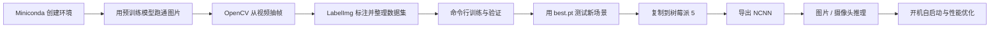
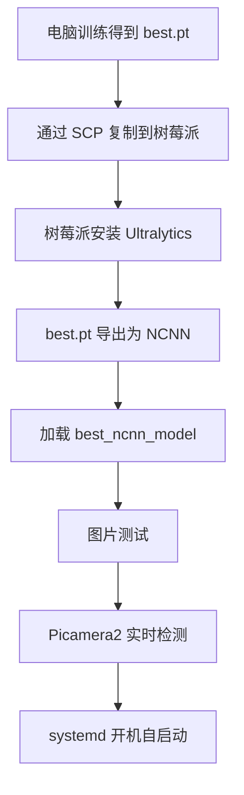

# YOLO26 零基础实战笔记

>

> [!summary] 学完后能做什么
> 1. 用 YOLO26 识别图片、视频和摄像头中的目标。
> 2. 用自己的图片训练一个专用检测模型。
> 3. 把模型导出成适合 ARM 设备的 NCNN 格式。
> 4. 在树莓派 5 上接入摄像头运行，并配置开机自启动。

资料核对日期：2026-08-08。

> [!info] 教程参考与版本说明
> 本笔记按 B 站“手把手带你实战 YOLOv8”合集的实操顺序重排：环境安装 → 模型预测 → 数据集构建 → 模型训练。教程讲的是 YOLOv8，本文已将命令和模型替换为当前 Ultralytics YOLO26。参考入口：[YOLOv8 环境安装（BV13V4y1S7MK）](https://www.bilibili.com/video/BV13V4y1S7MK)。

---

## 一、先看完整路线



这篇笔记以最常见的“目标检测”为例。YOLO26 也支持分割、姿态估计、分类、旋转框等任务，但零基础建议先把检测流程跑通。

### 需要准备

- 一台用于训练的电脑。推荐 NVIDIA 显卡；没有显卡也能学习和测试，但训练会很慢。
- Miniconda；训练环境使用 Python 3.11。
- 树莓派 5，推荐 8 GB 内存，4 GB 也能运行 `yolo26n`。
- 正规 5 V / 5 A 电源和主动散热器。
- 64 位 Raspberry Pi OS。
- USB 摄像头，或树莓派 Camera Module 3。
- 需要长期运行时，推荐使用 SSD 或 NVMe，而不是长期频繁写入 microSD 卡。

> [!tip] 模型选择
> 树莓派 5 首选 `yolo26n.pt`。`n` 表示 nano，速度最快、占用最低。先不要使用 `m/l/x`；即使能运行，帧率通常也不适合实时应用。

---

## 二、在电脑上安装并跑通

### 2.1 用 Miniconda 创建训练环境

先按 [Miniconda Windows 官方安装步骤](https://www.anaconda.com/docs/getting-started/miniconda/install/windows-gui-install) 安装，然后打开 **Anaconda Prompt**。建议选择 `Just Me`，安装路径避免空格和特殊字符。若想在 PowerShell 中使用 Conda，先执行一次：

```powershell
conda init powershell
```

关闭并重新打开 PowerShell，再创建项目和环境：

```powershell
mkdir D:\yolo26-project
cd D:\yolo26-project

conda create -n yolo26 python=3.11 -y
conda activate yolo26

python -m pip install --upgrade pip
pip install --upgrade ultralytics opencv-python
```

以后每次开始学习，只需要：

```powershell
cd D:\yolo26-project
conda activate yolo26
```

检查安装：

```bash
yolo checks
python -c "import cv2; from ultralytics import YOLO; print('OpenCV', cv2.__version__, 'Ultralytics 安装成功')"
```

检查 PyTorch 是否识别 NVIDIA 显卡：

```powershell
python -c "import torch; print('torch=',torch.__version__); print('CUDA=',torch.cuda.is_available()); print(torch.cuda.get_device_name(0) if torch.cuda.is_available() else '当前使用 CPU')"
```

若 `CUDA=False` 但电脑有 NVIDIA 显卡，不要随便照抄旧 CUDA 命令；到 [PyTorch 官方安装页](https://pytorch.org/get-started/locally/) 按显卡和系统生成当前命令，安装后再次检查。

### 2.2 第一次识别

下载测试图片：

```powershell
curl.exe -L https://ultralytics.com/images/bus.jpg -o bus.jpg
```

运行检测：

```bash
yolo detect predict model=yolo26n.pt source=bus.jpg conf=0.25 imgsz=640 save=True
```

第一次运行会自动下载 `yolo26n.pt`。结果通常保存在：

```text
runs/detect/predict/
```

也可以使用 Python：

```python
from ultralytics import YOLO

model = YOLO("yolo26n.pt")
results = model.predict(
    source="bus.jpg",
    conf=0.25,
    imgsz=640,
    save=True,
)

for result in results:
    print(result.boxes)
```

### 2.3 常用输入

```bash
# 单张图片
yolo detect predict model=yolo26n.pt source=photo.jpg save=True

# 整个图片文件夹
yolo detect predict model=yolo26n.pt source=images/ save=True

# 视频
yolo detect predict model=yolo26n.pt source=video.mp4 save=True

# 电脑的 0 号摄像头
yolo detect predict model=yolo26n.pt source=0 show=True
```

常用参数：

| 参数 | 作用 | 入门推荐 |
|---|---|---|
| `conf` | 置信度阈值 | `0.25`～`0.5` |
| `imgsz` | 推理尺寸 | 电脑用 `640`，树莓派可降到 `512` 或 `416` |
| `save` | 保存标注后的结果 | 测试时 `True` |
| `show` | 实时显示窗口 | 有桌面时 `True` |
| `classes` | 只保留指定类别 | 例如 `classes=0` 只检测 person |
| `device` | 使用哪个设备 | NVIDIA 显卡用 `0`，CPU 用 `cpu` |

---

## 三、制作数据集并训练自己的目标

假设要训练一个“零件检测”模型，类别为 `gear` 和 `bearing`。

### 3.1 拍摄与划分原则

- 跑通流程：每类先准备 30～50 张。
- 可用模型：每类尽量 200 张以上。
- 图片要包含不同距离、角度、光线、背景和遮挡。
- 训练集与验证集建议按约 8:2 划分。
- **按原始视频或拍摄场景划分**：例如 4 段视频用于训练，另 1 段视频只用于验证。
- 不要先从同一段视频抽出大量相邻帧，再随机分到训练集和验证集；画面几乎相同会让验证指标虚高。
- 删除模糊、严重重复、目标完全不可辨认的帧；但要保留合理的暗光、遮挡和空背景样本。

### 3.2 用 OpenCV 从视频抽帧

在 `D:\yolo26-project` 新建 `extract_frames.py`：

```python
import argparse
from pathlib import Path

import cv2


def main():
    parser = argparse.ArgumentParser(description="按固定帧间隔从视频抽帧")
    parser.add_argument("--video", required=True, help="输入视频路径")
    parser.add_argument("--out", required=True, help="图片输出目录")
    parser.add_argument("--every", type=int, default=15, help="每隔多少帧保存一张")
    parser.add_argument("--quality", type=int, default=95, help="JPG 质量 0~100")
    args = parser.parse_args()

    if args.every < 1:
        raise ValueError("--every 必须大于等于 1")

    video_path = Path(args.video)
    output_dir = Path(args.out)
    output_dir.mkdir(parents=True, exist_ok=True)

    cap = cv2.VideoCapture(str(video_path))
    if not cap.isOpened():
        raise RuntimeError(f"无法打开视频：{video_path}")

    fps = cap.get(cv2.CAP_PROP_FPS)
    total = int(cap.get(cv2.CAP_PROP_FRAME_COUNT))
    frame_index = 0
    saved = 0

    while True:
        ok, frame = cap.read()
        if not ok:
            break

        if frame_index % args.every == 0:
            output = output_dir / f"{video_path.stem}_{frame_index:06d}.jpg"
            # imencode + tofile 对 Windows 中文路径更友好
            encoded_ok, buffer = cv2.imencode(
                ".jpg", frame, [cv2.IMWRITE_JPEG_QUALITY, args.quality]
            )
            if not encoded_ok:
                raise RuntimeError(f"图片编码失败：{output}")
            buffer.tofile(str(output))
            saved += 1

        frame_index += 1

    cap.release()
    seconds = total / fps if fps > 0 else 0
    print(f"视频：{total} 帧，{fps:.2f} FPS，约 {seconds:.1f} 秒")
    print(f"已保存 {saved} 张图片到：{output_dir}")


if __name__ == "__main__":
    main()
```

命令示例：

```powershell
conda activate yolo26
cd D:\yolo26-project

# 假设原视频约 30 FPS，每 15 帧保存一张，约等于每秒 2 张
python extract_frames.py --video videos\train01.mp4 --out raw\train --every 15
python extract_frames.py --video videos\val01.mp4 --out raw\val --every 15
```

抽帧频率换算：`每秒保存张数 ≈ 原视频 FPS ÷ every`。目标移动慢时可把 `every` 调大到 `30～60`；快速运动或短暂事件可调小到 `5～10`。

### 3.3 用 LabelImg 标注 YOLO 格式

LabelImg 已停止积极维护，而且依赖旧版 Qt。为避免影响 YOLO26 训练环境，单独创建一个 Miniconda 环境：

```powershell
conda create -n labelimg python=3.9 -y
conda activate labelimg
python -m pip install --upgrade pip
pip install labelImg
labelImg
```

标注步骤：

1. 点击 `Open Dir`，选择 `raw\train`。
2. 点击工具栏中的 `PascalVOC`，直到它变成 **YOLO**；否则会保存成 XML，不能直接训练。
3. 点击 `Change Save Dir`，为了操作简单可先仍保存到当前图片目录。
4. 按 `W` 创建矩形框，框住完整目标，选择类别名；按 `Ctrl+S` 保存。
5. 按 `D` 下一张、`A` 上一张、`Del` 删除选中的框。
6. 完成训练集后再打开 `raw\val`，类别名称和顺序必须完全一致。

> [!warning] 类别顺序不能中途修改
> LabelImg 会生成 `classes.txt`。例如第 1 行是 `gear`、第 2 行是 `bearing`，那么标签编号固定为 `0` 和 `1`；这必须与后面的 `dataset.yaml` 一致。LabelImg 官方也提醒：标注过程中更改类别列表，不会自动修正已经保存的标签。

每张图片会有一个同名标签：

```text
raw/train/train01_000000.jpg
raw/train/train01_000000.txt
```

标签文件每行是一个框：

```text
0 0.5125 0.4833 0.2250 0.3167
1 0.7250 0.5500 0.1800 0.2400
```

含义为 `类别编号 中心点x 中心点y 宽度 高度`，后四项都归一化到 `0～1`，类别编号从 `0` 开始。

### 3.4 整理数据集目录

#### 推荐目录结构

```text
yolo26-project/
├─ dataset/
│  ├─ images/
│  │  ├─ train/
│  │  └─ val/
│  └─ labels/
│     ├─ train/
│     └─ val/
├─ dataset.yaml
├─ extract_frames.py
├─ raw/
│  ├─ train/
│  └─ val/
└─ videos/
```

将 LabelImg 生成的图片和标签分别复制到标准目录。先创建目录：

```powershell
New-Item -ItemType Directory -Force dataset\images\train,dataset\images\val,dataset\labels\train,dataset\labels\val
```

再复制训练集和验证集；`classes.txt` 不要放进 `labels`：

```powershell
Copy-Item raw\train\*.jpg dataset\images\train\
Get-ChildItem raw\train\*.txt | Where-Object Name -ne 'classes.txt' | Copy-Item -Destination dataset\labels\train\

Copy-Item raw\val\*.jpg dataset\images\val\
Get-ChildItem raw\val\*.txt | Where-Object Name -ne 'classes.txt' | Copy-Item -Destination dataset\labels\val\
```

图片和标签必须同名：

```text
images/train/001.jpg
labels/train/001.txt
```

没有目标的“空背景图”可以没有 `.txt`，也可以有一个空的同名 `.txt`。训练前随机抽查至少 20 张：框是否贴合、类别是否正确、是否漏标。

### 3.5 编写 `dataset.yaml`

Windows 路径建议使用正斜杠：

```yaml
path: D:/yolo26-project/dataset
train: images/train
val: images/val

names:
  0: gear
  1: bearing
```

Linux 示例：

```yaml
path: /home/user/yolo26-project/dataset
train: images/train
val: images/val

names:
  0: gear
  1: bearing
```

### 3.6 先做一次冒烟测试

不要一上来训练 100 轮。先跑 1 轮，检查目录、标签和显卡是否正常：

```bash
yolo detect train model=yolo26n.pt data=dataset.yaml epochs=1 imgsz=640 batch=8 device=0 workers=4 project=runs/detect name=smoke
```

没有 NVIDIA 显卡时：

```bash
yolo detect train model=yolo26n.pt data=dataset.yaml epochs=1 imgsz=640 batch=4 device=cpu workers=2 project=runs/detect name=smoke
```

> [!warning] 不建议在树莓派上训练
> 树莓派适合部署和推理，不适合常规训练。训练请放在电脑、服务器或云端完成。

### 3.7 正式训练：命令行模板

```bash
yolo detect train model=yolo26n.pt data=dataset.yaml epochs=100 imgsz=640 batch=-1 patience=20 device=0 workers=4 project=runs/detect name=gear_yolo26n
```

| 参数 | 输入什么 | 作用 |
|---|---|---|
| `model` | `yolo26n.pt` | 用预训练权重开始微调 |
| `data` | `dataset.yaml` | 指定图片、标签和类别 |
| `epochs` | `100` | 最多训练轮数 |
| `imgsz` | `640` | 训练输入尺寸；小目标可再尝试更大尺寸 |
| `batch` | `-1` | 根据可用显存自动选择批大小 |
| `device` | `0` / `cpu` | 第 1 张 NVIDIA 显卡或 CPU |
| `workers` | `4` | 数据加载进程数；Windows 报错时可改为 `0` |
| `patience` | `20` | 连续 20 轮无改善则早停 |
| `project`、`name` | 目录名 | 固定结果保存位置，便于复现 |

官方训练接口会优先使用可用 GPU，否则回退到 CPU，详见 [Ultralytics Train 模式](https://docs.ultralytics.com/modes/train/)。

训练完成后重点保留：

```text
runs/detect/gear_yolo26n/weights/best.pt
```

同时会得到 `last.pt`、`results.csv`、混淆矩阵、PR 曲线和训练批次示意图。部署通常使用验证效果最好的 `best.pt`，中断恢复使用 `last.pt`：

```powershell
yolo detect train resume model=runs/detect/gear_yolo26n/weights/last.pt
```

### 3.8 验证、图片/视频/摄像头测试

```bash
yolo detect val model=runs/detect/gear_yolo26n/weights/best.pt data=dataset.yaml imgsz=640
```

用没参与训练的新图片测试：

```bash
yolo detect predict model=runs/detect/gear_yolo26n/weights/best.pt source=test-images/ conf=0.4 imgsz=640 save=True

# 测试一段新视频
yolo detect predict model=runs/detect/gear_yolo26n/weights/best.pt source=test.mp4 conf=0.4 save=True

# 电脑摄像头实时测试
yolo detect predict model=runs/detect/gear_yolo26n/weights/best.pt source=0 conf=0.4 show=True
```

命令行规则是 `arg=value`，不要写成 `--model ...`。训练的输入是图片、同名 YOLO 标签、`dataset.yaml` 和初始权重；主要输出是 `best.pt`、`last.pt`、指标表和可视化图。

不要只看训练曲线。真正要检查的是：

- 漏检是否集中在暗光、小目标或遮挡场景。
- 误检是否来自相似物体或复杂背景。
- 检测框是否完整包围目标。
- 新拍摄场景是否仍然有效。

效果不好时，第一选择通常是补充失败场景的数据并重新标注，而不是盲目修改大量参数。

---

## 四、树莓派 5 部署总览

官方指南推荐树莓派使用 NCNN，因为它针对 ARM 和嵌入式平台做了优化。Ultralytics 的树莓派 5 测试也主要推荐 `yolo26n` 与 `yolo26s`，入门部署选择 `yolo26n`。[官方树莓派部署指南](https://docs.ultralytics.com/guides/raspberry-pi)



---

## 五、准备树莓派 5

### 5.1 烧录系统

使用 Raspberry Pi Imager：

1. 选择 Raspberry Pi 5。
2. 选择 64 位 Raspberry Pi OS。
3. 需要显示检测画面时选择 Desktop；只做后台服务可选择 Lite。
4. 在高级设置中配置用户名、Wi-Fi、主机名和 SSH。
5. 写入 microSD、SSD 或 NVMe，插入树莓派并启动。

Ultralytics 官方指南使用 64 位 Raspberry Pi OS Bookworm 测试。当前 Imager 若提供更新系统，也可先尝试；遇到依赖兼容问题时，优先换回官方指南验证过的 Bookworm 64 位系统。

登录后确认架构：

```bash
uname -m
```

应显示：

```text
aarch64
```

更新系统：

```bash
sudo apt update
sudo apt full-upgrade -y
sudo reboot
```

### 5.2 摄像头接线

关机并拔掉电源后再接 CSI 排线。

> [!warning] 树莓派 5 的接口
> 树莓派 5 使用较小的 22 针 MIPI 接口；部分官方相机使用 15 针接口，需要对应的 22 针转 15 针排线。不要用力反插。

重新开机后测试：

```bash
rpicam-hello -t 5000
```

无桌面环境时拍一张照片：

```bash
rpicam-still -o camera-test.jpg
ls -lh camera-test.jpg
```

Raspberry Pi OS Bookworm 之后的命令是 `rpicam-*`，旧教程里的 `libcamera-*`、`raspistill` 和旧版 Picamera 已不再是推荐方案，详见 [树莓派官方相机软件文档](https://www.raspberrypi.com/documentation/computers/camera_software.html)。

---

## 六、在树莓派上安装 YOLO26

### 6.1 安装系统依赖

```bash
sudo apt update
sudo apt install -y \
  python3-full \
  python3-venv \
  python3-pip \
  python3-opencv \
  python3-picamera2 \
  libopenblas-dev \
  git
```

### 6.2 创建虚拟环境

`--system-site-packages` 很重要，它让虚拟环境能够使用通过 `apt` 安装的 Picamera2：

```bash
mkdir -p ~/yolo26
cd ~/yolo26

python3 -m venv --system-site-packages .venv
source .venv/bin/activate

python -m pip install -U pip wheel
pip install -U "ultralytics[export]"
```

检查：

```bash
python -c "from ultralytics import YOLO; print('YOLO OK')"
python -c "from picamera2 import Picamera2; print('Picamera2 OK')"
yolo checks
```

以后每次进入项目先执行：

```bash
cd ~/yolo26
source .venv/bin/activate
```

### 6.3 从电脑复制模型

在电脑的 PowerShell 中执行，将用户名和地址替换成自己的：

```powershell
scp D:\yolo26-project\runs\gear_yolo26n\weights\best.pt <用户名>@raspberrypi.local:/home/<用户名>/yolo26/
```

如果 `.local` 无法解析，先在树莓派执行：

```bash
hostname -I
```

然后使用 IP：

```powershell
scp D:\yolo26-project\runs\gear_yolo26n\weights\best.pt <用户名>@192.168.1.50:/home/<用户名>/yolo26/
```

---

## 七、导出 NCNN 并测试

### 7.1 在树莓派上导出

```bash
cd ~/yolo26
source .venv/bin/activate

yolo export model=best.pt format=ncnn imgsz=640
```

或者创建 `export_ncnn.py`：

```python
from ultralytics import YOLO

model = YOLO("best.pt")
model.export(format="ncnn", imgsz=640)
```

运行：

```bash
python export_ncnn.py
```

通常会生成：

```text
best_ncnn_model/
├─ model.ncnn.bin
├─ model.ncnn.param
└─ metadata.yaml
```

> [!tip] 为什么在树莓派上导出
> NCNN 模型本身可以从其他电脑导出，但在目标树莓派上安装 `ultralytics[export]` 后直接导出，最容易避免版本和依赖差异。

### 7.2 图片推理

创建 `detect_image.py`：

```python
from ultralytics import YOLO

model = YOLO("best_ncnn_model")

results = model.predict(
    source="camera-test.jpg",
    imgsz=640,
    conf=0.4,
    device="cpu",
    save=True,
)

for result in results:
    print("检测数量：", len(result.boxes))
    if len(result.boxes) > 0:
        print("类别编号：", result.boxes.cls.tolist())
        print("置信度：", result.boxes.conf.tolist())
```

运行：

```bash
python detect_image.py
```

结果通常在：

```text
runs/detect/predict/
```

---

## 八、树莓派摄像头实时检测

### 8.1 有桌面显示器的版本

创建 `camera_detect.py`：

```python
import time

import cv2
from picamera2 import Picamera2
from ultralytics import YOLO

MODEL_PATH = "best_ncnn_model"
IMGSZ = 512
CONF = 0.4

model = YOLO(MODEL_PATH)

picam2 = Picamera2()
config = picam2.create_preview_configuration(
    main={"size": (1280, 720), "format": "RGB888"}
)
picam2.configure(config)
picam2.start()
time.sleep(1)

try:
    while True:
        frame = picam2.capture_array()

        results = model.predict(
            frame,
            imgsz=IMGSZ,
            conf=CONF,
            device="cpu",
            verbose=False,
        )

        annotated = results[0].plot()
        cv2.imshow("YOLO26 - Raspberry Pi 5", annotated)

        if cv2.waitKey(1) & 0xFF == ord("q"):
            break
finally:
    picam2.stop()
    cv2.destroyAllWindows()
```

运行：

```bash
cd ~/yolo26
source .venv/bin/activate
python camera_detect.py
```

按 `q` 退出。

### 8.2 无显示器的后台版本

这个版本不调用 `cv2.imshow()`，每秒打印一次检测结果，适合 SSH 和 systemd。

创建 `camera_detect_headless.py`：

```python
import time

from picamera2 import Picamera2
from ultralytics import YOLO

MODEL_PATH = "best_ncnn_model"
IMGSZ = 512
CONF = 0.4

model = YOLO(MODEL_PATH)
names = model.names

picam2 = Picamera2()
config = picam2.create_video_configuration(
    main={"size": (1280, 720), "format": "RGB888"}
)
picam2.configure(config)
picam2.start()
time.sleep(1)

last_report = 0.0

try:
    while True:
        frame = picam2.capture_array()
        result = model.predict(
            frame,
            imgsz=IMGSZ,
            conf=CONF,
            device="cpu",
            verbose=False,
        )[0]

        now = time.time()
        if now - last_report >= 1.0:
            detections = []
            for class_id, score in zip(result.boxes.cls, result.boxes.conf):
                class_id = int(class_id.item())
                score = float(score.item())
                detections.append(f"{names[class_id]}:{score:.2f}")

            print(
                time.strftime("%F %T"),
                " | ".join(detections) if detections else "未检测到目标",
                flush=True,
            )
            last_report = now
finally:
    picam2.stop()
```

运行：

```bash
python camera_detect_headless.py
```

---

## 九、配置开机自启动

先确定用户名：

```bash
whoami
```

假设用户名为 `yolo`，项目目录为 `/home/yolo/yolo26`。创建服务：

```bash
sudo nano /etc/systemd/system/yolo26.service
```

写入：

```ini
[Unit]
Description=YOLO26 Camera Detection
After=network-online.target
Wants=network-online.target

[Service]
Type=simple
User=yolo
WorkingDirectory=/home/yolo/yolo26
ExecStart=/home/yolo/yolo26/.venv/bin/python /home/yolo/yolo26/camera_detect_headless.py
Restart=on-failure
RestartSec=5
Environment=PYTHONUNBUFFERED=1

[Install]
WantedBy=multi-user.target
```

把上面的 `yolo` 替换成自己的用户名，然后执行：

```bash
sudo systemctl daemon-reload
sudo systemctl enable --now yolo26.service
```

查看状态：

```bash
systemctl status yolo26.service
```

实时查看输出：

```bash
journalctl -u yolo26.service -f
```

停止和禁用：

```bash
sudo systemctl disable --now yolo26.service
```

修改 Python 文件后：

```bash
sudo systemctl restart yolo26.service
```

---

## 十、树莓派性能优化

按收益从高到低依次尝试：

1. 使用 `yolo26n`，不要先上大模型。
2. 使用 NCNN，不要直接长期运行 `.pt`。
3. 将 `imgsz` 从 `640` 降到 `512`，仍慢时降到 `416` 或 `320`。
4. 摄像头采集可保持 1280×720，但模型输入由 `imgsz` 控制；也可直接将相机改为 640×480。
5. 后台运行时关闭 `show`、`save` 和逐帧日志。
6. 不需要每帧检测时，每 2～3 帧执行一次模型。
7. 使用主动散热，避免 CPU 因高温降频。
8. 长期运行使用 SSD/NVMe，并限制保存图片和日志的频率。

检测每 2 帧执行一次的核心写法：

```python
frame_id = 0
last_result = None

while True:
    frame = picam2.capture_array()
    frame_id += 1

    if frame_id % 2 == 0:
        last_result = model.predict(
            frame,
            imgsz=416,
            conf=0.4,
            verbose=False,
        )[0]
```

检查温度和 CPU：

```bash
vcgencmd measure_temp
top
```

> [!note] 对帧率的合理预期
> 帧率会随模型、输入尺寸、相机、散热、系统负载和目标数量变化。官方基准中，YOLO26n 的 640×640 ONNX 推理在树莓派 5 上约为 128 ms/张；NCNN 是官方推荐的 ARM 高性能格式。实际项目应在自己的相机和数据上测试，而不是只参考单一基准。

---

## 十一、常见问题

### `externally-managed-environment`

原因：新版本 Raspberry Pi OS 不允许直接向系统 Python 执行普通 `pip install`。

解决：使用本文的虚拟环境，不要使用 `sudo pip install`。

```bash
python3 -m venv --system-site-packages .venv
source .venv/bin/activate
pip install -U "ultralytics[export]"
```

### `No module named 'picamera2'`

```bash
sudo apt install -y python3-picamera2
```

然后确保虚拟环境是这样创建的：

```bash
python3 -m venv --system-site-packages .venv
```

如果原虚拟环境没有使用该参数，删除 `.venv` 后重新创建。

### 相机找不到

```bash
rpicam-hello --list-cameras
rpicam-still -o test.jpg
```

仍然找不到时：

- 关机后重新检查排线方向。
- 确认使用树莓派 5 对应的 22 针排线。
- 尝试另一个 CAM/DISP 接口。
- 更新系统并重启。

### `cv2.imshow` 报 Qt 或 display 错误

当前是 SSH/Lite/无桌面环境。使用 `camera_detect_headless.py`，不要调用 `cv2.imshow()`。

### 运行一段时间后越来越慢

```bash
vcgencmd measure_temp
free -h
top
```

处理顺序：

1. 加主动散热。
2. 改用 `yolo26n`。
3. 将 `imgsz` 改成 `416`。
4. 减少检测频率。
5. 关闭保存视频和图片。

### NCNN 导出失败

```bash
source .venv/bin/activate
python -m pip install -U pip wheel
pip install -U "ultralytics[export]"
yolo export model=best.pt format=ncnn imgsz=640
```

仍失败时，可以在普通 Linux/Windows 电脑上使用相同版本的 Ultralytics 导出，然后把整个 `best_ncnn_model/` 目录复制到树莓派。

### 训练结果完全不对

优先检查：

- `images/train/001.jpg` 是否对应 `labels/train/001.txt`。
- 类别是否从 `0` 开始。
- 坐标是否为 `0～1`，而不是像素。
- `dataset.yaml` 中的类别顺序是否与标注一致。
- 是否存在大量漏标、错标或框太松的问题。

### 摄像头画面颜色异常

先确认 Picamera2 使用：

```python
main={"size": (1280, 720), "format": "RGB888"}
```

如果自定义 OpenCV 流程后出现红蓝交换，再尝试：

```python
frame = cv2.cvtColor(frame, cv2.COLOR_RGB2BGR)
```

不要在没有观察到颜色问题时重复转换。

---

## 十二、最小项目清单

```text
~/yolo26/
├─ .venv/
├─ best.pt
├─ best_ncnn_model/
│  ├─ model.ncnn.bin
│  ├─ model.ncnn.param
│  └─ metadata.yaml
├─ export_ncnn.py
├─ detect_image.py
├─ camera_detect.py
└─ camera_detect_headless.py
```

验收：

- [ ] `yolo26n.pt` 能识别测试图片。
- [ ] 自定义数据目录和 `dataset.yaml` 正确。
- [ ] 1 轮冒烟训练可以完成。
- [ ] `best.pt` 能识别未参与训练的新图片。
- [ ] 树莓派显示 `aarch64`。
- [ ] `rpicam-still -o camera-test.jpg` 能拍照。
- [ ] 树莓派能导入 Ultralytics 和 Picamera2。
- [ ] `best_ncnn_model` 能完成图片推理。
- [ ] 摄像头实时检测能够稳定运行。
- [ ] systemd 服务可以自动启动并在异常后重启。
- [ ] 连续运行时温度、内存和日志大小正常。

---

## 十三、建议的 7 天练习

| 天数 | 任务 | 完成标准 |
|---|---|---|
| 第 1 天 | 安装并运行预训练模型 | 能识别图片和视频 |
| 第 2 天 | 学会标注和数据目录 | 完成 50 张图片标注 |
| 第 3 天 | 冒烟训练和正式训练 | 得到 `best.pt` |
| 第 4 天 | 收集失败样本并补数据 | 新场景误检、漏检减少 |
| 第 5 天 | 准备树莓派和摄像头 | 能用 Picamera2 拍照 |
| 第 6 天 | 导出 NCNN 并实时检测 | 摄像头画面出现检测框 |
| 第 7 天 | 自启动和性能优化 | 连续运行 1 小时无异常 |

---

## 十四、官方资料

- [本笔记参考的 B 站 YOLOv8 入门合集入口](https://www.bilibili.com/video/BV13V4y1S7MK)
- [Miniconda Windows 安装](https://www.anaconda.com/docs/getting-started/miniconda/install/windows-gui-install)
- [Conda 创建与管理环境](https://docs.conda.io/projects/conda/en/stable/user-guide/tasks/managing-environments.html)
- [LabelImg 官方仓库与 YOLO 标注步骤](https://github.com/HumanSignal/labelImg)
- [Ultralytics YOLO26 模型说明](https://docs.ultralytics.com/models/yolo26/)
- [Ultralytics CLI 语法](https://docs.ultralytics.com/usage/cli/)
- [Ultralytics 训练模式](https://docs.ultralytics.com/modes/train/)
- [Ultralytics 推理模式](https://docs.ultralytics.com/modes/predict/)
- [Ultralytics 模型导出](https://docs.ultralytics.com/modes/export/)
- [Ultralytics 检测数据集格式](https://docs.ultralytics.com/datasets/detect/)
- [Ultralytics 树莓派部署指南](https://docs.ultralytics.com/guides/raspberry-pi/)
- [Raspberry Pi 相机软件](https://www.raspberrypi.com/documentation/computers/camera_software.html)

> [!warning] 商业项目注意许可证
> Ultralytics YOLO26 的代码与模型涉及 AGPL-3.0 和企业许可证。个人学习、开源项目与闭源商业产品的义务不同，正式发布或商业部署前应核对当前许可证要求。
