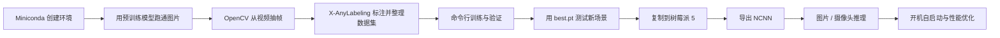
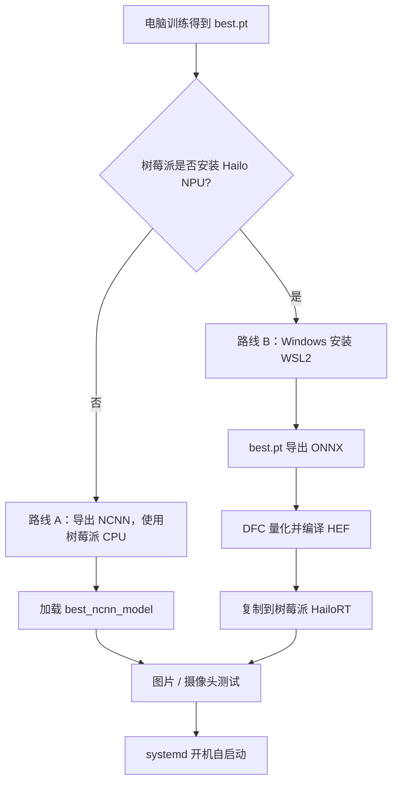

# YOLO26 零基础实战笔记

>

!!! abstract "学完后能做什么"
    1. 用 YOLO26 识别图片、视频和摄像头中的目标。
    2. 用自己的图片训练一个专用检测模型。
    3. 把模型导出成适合 ARM 设备的 NCNN 格式。
    4. 在树莓派 5 上接入摄像头运行，并配置开机自启动。

资料核对日期：2026-08-08。

!!! info "教程参考与版本说明"
    本笔记按 B 站“手把手带你实战 YOLOv8”合集的实操顺序重排：环境安装 → 模型预测 → 数据集构建 → 模型训练。教程讲的是 YOLOv8，本文已将命令和模型替换为当前 Ultralytics YOLO26。参考入口：[YOLOv8 环境安装（BV13V4y1S7MK）](https://www.bilibili.com/video/BV13V4y1S7MK)。

---

## 一、先看完整路线



这篇笔记以最常见的“目标检测”为例。YOLO26 也支持分割、姿态估计、分类、旋转框等任务，但零基础建议先把检测流程跑通。

### 需要准备

- 一台用于训练的电脑。推荐 NVIDIA 显卡；没有显卡也能学习和测试，但训练会很慢。
- Miniconda；训练环境使用 Python 3.11。
- 树莓派 5，推荐 8 GB 内存，4 GB 也能运行 `yolo26n`。
- 正规 5 V / 5 A 电源和主动散热器。
- 64 位 Raspberry Pi OS。
- USB 摄像头，或树莓派 Camera Module 3。
- 需要长期运行时，推荐使用 SSD 或 NVMe，而不是长期频繁写入 microSD 卡。

!!! tip "模型选择"
    树莓派 5 首选 `yolo26n.pt`。`n` 表示 nano，速度最快、占用最低。先不要使用 `m/l/x`；即使能运行，帧率通常也不适合实时应用。

---

## 二、在电脑上安装并跑通

### 2.1 用 Miniconda 创建训练环境

先按 [Miniconda Windows 官方安装步骤](https://www.anaconda.com/docs/getting-started/miniconda/install/windows-gui-install) 安装，然后打开 **Anaconda Prompt**。建议选择 `Just Me`，安装路径避免空格和特殊字符。若想在 PowerShell 中使用 Conda，先执行一次：

```powershell
conda init powershell
```

关闭并重新打开 PowerShell，再创建项目和环境：

```powershell
mkdir D:\yolo26-project
cd D:\yolo26-project

conda create -n yolo26 python=3.11 -y
conda activate yolo26

python -m pip install --upgrade pip
pip install --upgrade ultralytics opencv-python
```

以后每次开始学习，只需要：

```powershell
cd D:\yolo26-project
conda activate yolo26
```

检查安装：

```bash
yolo checks
python -c "import cv2; from ultralytics import YOLO; print('OpenCV', cv2.__version__, 'Ultralytics 安装成功')"
```

检查 PyTorch 是否识别 NVIDIA 显卡：

```powershell
python -c "import torch; print('torch=',torch.__version__); print('CUDA=',torch.cuda.is_available()); print(torch.cuda.get_device_name(0) if torch.cuda.is_available() else '当前使用 CPU')"
```

若 `CUDA=False` 但电脑有 NVIDIA 显卡，不要随便照抄旧 CUDA 命令；到 [PyTorch 官方安装页](https://pytorch.org/get-started/locally/) 按显卡和系统生成当前命令，安装后再次检查。

### 2.2 第一次识别

下载测试图片：

```powershell
curl.exe -L https://ultralytics.com/images/bus.jpg -o bus.jpg
```

运行检测：

```bash
yolo detect predict model=yolo26n.pt source=bus.jpg conf=0.25 imgsz=640 save=True
```

第一次运行会自动下载 `yolo26n.pt`。结果通常保存在：

```text
runs/detect/predict/
```

也可以使用 Python：

```python
from ultralytics import YOLO

model = YOLO("yolo26n.pt")
results = model.predict(
    source="bus.jpg",
    conf=0.25,
    imgsz=640,
    save=True,
)

for result in results:
    print(result.boxes)
```

### 2.3 常用输入

```bash
# 单张图片
yolo detect predict model=yolo26n.pt source=photo.jpg save=True

# 整个图片文件夹
yolo detect predict model=yolo26n.pt source=images/ save=True

# 视频
yolo detect predict model=yolo26n.pt source=video.mp4 save=True

# 电脑的 0 号摄像头
yolo detect predict model=yolo26n.pt source=0 show=True
```

常用参数：

| 参数 | 作用 | 入门推荐 |
|---|---|---|
| `conf` | 置信度阈值 | `0.25`～`0.5` |
| `imgsz` | 推理尺寸 | 电脑用 `640`，树莓派可降到 `512` 或 `416` |
| `save` | 保存标注后的结果 | 测试时 `True` |
| `show` | 实时显示窗口 | 有桌面时 `True` |
| `classes` | 只保留指定类别 | 例如 `classes=0` 只检测 person |
| `device` | 使用哪个设备 | NVIDIA 显卡用 `0`，CPU 用 `cpu` |

---

## 三、制作数据集并训练自己的目标

假设要训练一个“零件检测”模型，类别为 `gear` 和 `bearing`。

### 3.1 拍摄与划分原则

- 跑通流程：每类先准备 30～50 张。
- 可用模型：每类尽量 200 张以上。
- 图片要包含不同距离、角度、光线、背景和遮挡。
- 训练集与验证集建议按约 8:2 划分。
- **按原始视频或拍摄场景划分**：例如 4 段视频用于训练，另 1 段视频只用于验证。
- 不要先从同一段视频抽出大量相邻帧，再随机分到训练集和验证集；画面几乎相同会让验证指标虚高。
- 删除模糊、严重重复、目标完全不可辨认的帧；但要保留合理的暗光、遮挡和空背景样本。

### 3.2 用 OpenCV 从视频抽帧

在 `D:\yolo26-project` 新建 `extract_frames.py`：

```python
import argparse
from pathlib import Path

import cv2


def main():
    parser = argparse.ArgumentParser(description="按固定帧间隔从视频抽帧")
    parser.add_argument("--video", required=True, help="输入视频路径")
    parser.add_argument("--out", required=True, help="图片输出目录")
    parser.add_argument("--every", type=int, default=15, help="每隔多少帧保存一张")
    parser.add_argument("--quality", type=int, default=95, help="JPG 质量 0~100")
    args = parser.parse_args()

    if args.every < 1:
        raise ValueError("--every 必须大于等于 1")

    video_path = Path(args.video)
    output_dir = Path(args.out)
    output_dir.mkdir(parents=True, exist_ok=True)

    cap = cv2.VideoCapture(str(video_path))
    if not cap.isOpened():
        raise RuntimeError(f"无法打开视频：{video_path}")

    fps = cap.get(cv2.CAP_PROP_FPS)
    total = int(cap.get(cv2.CAP_PROP_FRAME_COUNT))
    frame_index = 0
    saved = 0

    while True:
        ok, frame = cap.read()
        if not ok:
            break

        if frame_index % args.every == 0:
            output = output_dir / f"{video_path.stem}_{frame_index:06d}.jpg"
            # imencode + tofile 对 Windows 中文路径更友好
            encoded_ok, buffer = cv2.imencode(
                ".jpg", frame, [cv2.IMWRITE_JPEG_QUALITY, args.quality]
            )
            if not encoded_ok:
                raise RuntimeError(f"图片编码失败：{output}")
            buffer.tofile(str(output))
            saved += 1

        frame_index += 1

    cap.release()
    seconds = total / fps if fps > 0 else 0
    print(f"视频：{total} 帧，{fps:.2f} FPS，约 {seconds:.1f} 秒")
    print(f"已保存 {saved} 张图片到：{output_dir}")


if __name__ == "__main__":
    main()
```

命令示例：

```powershell
conda activate yolo26
cd D:\yolo26-project

# 假设原视频约 30 FPS，每 15 帧保存一张，约等于每秒 2 张
python extract_frames.py --video videos\train01.mp4 --out raw\train --every 15
python extract_frames.py --video videos\val01.mp4 --out raw\val --every 15
```

抽帧频率换算：`每秒保存张数 ≈ 原视频 FPS ÷ every`。目标移动慢时可把 `every` 调大到 `30～60`；快速运动或短暂事件可调小到 `5～10`。

### 3.3 用 X-AnyLabeling 标注并导出 YOLO 格式

X-AnyLabeling 同时支持手工框选、AI（Artificial Intelligence，人工智能）辅助标注和 YOLO 格式导出。不要把它装进 `yolo26` 训练环境，以免标注工具与训练依赖互相影响。

#### 安装方式 A：Windows 桌面包（零基础首选）

1. 打开 [X-AnyLabeling Releases](https://github.com/CVHub520/X-AnyLabeling/releases)。
2. 下载与 Windows 对应的压缩包并解压，不需要安装到训练环境。
3. 仅手工标注时选 CPU（Central Processing Unit，中央处理器）版即可；只有使用 AI 自动标注且电脑已正确配置 CUDA 时才考虑相匹配的 GPU 版。
4. 双击程序启动。GPU 运行库不匹配时，官方说明程序会回退到 CPU。

#### 安装方式 B：独立 Conda 环境（便于更新）

官方当前推荐 Python 3.12；下面安装 CPU 版，足以完成手工标注：

```powershell
conda create --name x-anylabeling-cpu python=3.12 -y
conda activate x-anylabeling-cpu
pip install -U uv
uv pip install "x-anylabeling-cvhub[cpu]"

# 检查环境并启动
xanylabeling checks
xanylabeling
```

#### 第一步：先固定类别表

在项目根目录新建 `classes.txt`，每行一个类别。例如：

```text
gear
bearing
```

在 X-AnyLabeling 中选择 `上传（Upload）→ 上传标签类别文件（Upload Label Classes File）` 并载入它。类别编号按行号从 `0` 开始，因此 `gear=0`、`bearing=1`。

!!! warning "类别顺序一旦开始标注就不要改变"
    插入、删除或调换 `classes.txt` 的行会改变类别编号。训练集、验证集、YOLO 标签和 `dataset.yaml` 必须始终使用完全相同的顺序。

#### 第二步：手工画框

1. 按 `Ctrl+U` 打开 `raw\train` 图片目录；单独打开一张图片可按 `Ctrl+I`。
2. 按 `R` 创建矩形框，紧贴目标的可见外缘，不要留下大量背景，也不要为了“补全”遮挡部分而把框画得过大。
3. 选择类别并保存；可在设置中开启自动保存，或按 `Ctrl+S` 手动保存。
4. 按 `D` 到下一张、`A` 回到上一张，`Ctrl+J` 切换编辑状态。
5. 校验无误后按 `Ctrl+Alt+K` 标记为已检查；按 `Ctrl+Shift+D` 跳到下一张未检查图片。
6. 完成训练集后用同一份 `classes.txt` 标注 `raw\val`。

可选的 AI 辅助流程：在自动标注面板选择兼容的检测模型，运行预标注，再逐张修正错误类别、漏框、重复框和框的位置。自动结果只是初稿，不能未经人工检查就当作真实标签。

#### 第三步：导出 YOLO 检测标签

1. 点击顶部 `导出（Export）`。
2. 选择 YOLO 目标检测格式；不同版本的中文菜单名称可能略有差异。
3. 按提示载入同一份 `classes.txt`，选择输出目录并确认。
4. 训练集和验证集分别导出。默认情况下，标签会输出到图片目录旁的 `labels` 目录。

!!! warning "图片与 YOLO 标签分目录保存"
    官方明确建议不要把导出的 YOLO `.txt` 标签和图片放在同一目录。后续整理成 `images/train`、`images/val`、`labels/train`、`labels/val`，既不容易误读，也符合 Ultralytics 常用结构。

每张有目标的图片应对应一个同名标签文件：

```text
images/train/train01_000000.jpg
labels/train/train01_000000.txt
```

标签文件每行表示一个框：

```text
0 0.5125 0.4833 0.2250 0.3167
1 0.7250 0.5500 0.1800 0.2400
```

含义为 `类别编号 中心点x 中心点y 宽度 高度`，后四项都归一化到 `0～1`，类别编号从 `0` 开始。没有目标的负样本可以没有 `.txt` 文件，也可以保留同名空文件。

### 3.4 整理数据集目录

#### 推荐目录结构

```text
yolo26-project/
├─ dataset/
│  ├─ images/
│  │  ├─ train/
│  │  └─ val/
│  └─ labels/
│     ├─ train/
│     └─ val/
├─ dataset.yaml
├─ extract_frames.py
├─ raw/
│  ├─ train/
│  └─ val/
└─ videos/
```

将 X-AnyLabeling 导出的图片和标签分别整理到标准目录。先创建目录：

```powershell
New-Item -ItemType Directory -Force dataset\images\train,dataset\images\val,dataset\labels\train,dataset\labels\val
```

如果导出结果仍位于 `raw\train`、`raw\val` 旁边的 `labels` 目录，可按实际路径复制；`classes.txt` 不要放进训练标签目录：

```powershell
Copy-Item raw\train\*.jpg dataset\images\train\
Copy-Item raw\train-labels\*.txt dataset\labels\train\

Copy-Item raw\val\*.jpg dataset\images\val\
Copy-Item raw\val-labels\*.txt dataset\labels\val\
```

上面的 `raw\train-labels` 和 `raw\val-labels` 是示例导出位置。如果软件实际生成的是其他目录，替换为真实路径即可。先用文件资源管理器确认目录，不要直接照抄不存在的路径。

图片和标签必须同名：

```text
images/train/001.jpg
labels/train/001.txt
```

没有目标的“空背景图”可以没有 `.txt`，也可以有一个空的同名 `.txt`。训练前随机抽查至少 20 张：框是否贴合、类别是否正确、是否漏标。

### 3.5 编写 `dataset.yaml`

Windows 路径建议使用正斜杠：

```yaml
path: D:/yolo26-project/dataset
train: images/train
val: images/val

names:
  0: gear
  1: bearing
```

Linux 示例：

```yaml
path: /home/user/yolo26-project/dataset
train: images/train
val: images/val

names:
  0: gear
  1: bearing
```

### 3.6 先做一次冒烟测试

不要一上来训练 100 轮。先跑 1 轮，检查目录、标签和显卡是否正常：

```bash
yolo detect train model=yolo26n.pt data=dataset.yaml epochs=1 imgsz=640 batch=8 device=0 workers=4 project=runs/detect name=smoke
```

没有 NVIDIA 显卡时：

```bash
yolo detect train model=yolo26n.pt data=dataset.yaml epochs=1 imgsz=640 batch=4 device=cpu workers=2 project=runs/detect name=smoke
```

!!! warning "不建议在树莓派上训练"
    树莓派适合部署和推理，不适合常规训练。训练请放在电脑、服务器或云端完成。

### 3.7 正式训练：命令行模板

```bash
yolo detect train model=yolo26n.pt data=dataset.yaml epochs=100 imgsz=640 batch=-1 patience=20 device=0 workers=4 project=runs/detect name=gear_yolo26n
```

| 参数 | 输入什么 | 作用 |
|---|---|---|
| `model` | `yolo26n.pt` | 用预训练权重开始微调 |
| `data` | `dataset.yaml` | 指定图片、标签和类别 |
| `epochs` | `100` | 最多训练轮数 |
| `imgsz` | `640` | 训练输入尺寸；小目标可再尝试更大尺寸 |
| `batch` | `-1` | 根据可用显存自动选择批大小 |
| `device` | `0` / `cpu` | 第 1 张 NVIDIA 显卡或 CPU |
| `workers` | `4` | 数据加载进程数；Windows 报错时可改为 `0` |
| `patience` | `20` | 连续 20 轮无改善则早停 |
| `project`、`name` | 目录名 | 固定结果保存位置，便于复现 |

官方训练接口会优先使用可用 GPU，否则回退到 CPU，详见 [Ultralytics Train 模式](https://docs.ultralytics.com/modes/train/)。

### 3.8 重要训练参数详解

!!! info "本节缩写先读这里"
    - **YOLO**：You Only Look Once，只看一次，一类实时视觉模型。
    - **GPU**：Graphics Processing Unit，图形处理器，常用于加速训练。
    - **CPU**：Central Processing Unit，中央处理器。
    - **VRAM**：Video Random Access Memory，显存。
    - **CUDA**：Compute Unified Device Architecture，统一计算设备架构，NVIDIA 的并行计算平台。
    - **OOM**：Out Of Memory，内存或显存不足。
    - **YAML**：YAML Ain't Markup Language，一种人类易读的配置文件格式。
    - **AMP**：Automatic Mixed Precision，自动混合精度。
    - **LR**：Learning Rate，学习率。
    - **SGD**：Stochastic Gradient Descent，随机梯度下降。
    - **MuSGD**：Muon-style Stochastic Gradient Descent，结合 Muon 风格更新与随机梯度下降的优化器。
    - **AdamW**：Adam with Decoupled Weight Decay，采用解耦权重衰减的 Adam 优化器。

#### A. 最常用的基础参数

| 参数           | 含义                        | 常用写法                     | 怎么选                                                                |     |
| ------------ | ------------------------- | ------------------------ | ------------------------------------------------------------------ | --- |
| `model`      | 初始模型或断点文件                 | `yolo26n.pt`             | 自定义训练优先从预训练 `.pt` 权重微调，不建议零基础从 `.yaml` 随机初始化                       |     |
| `data`       | 数据集配置                     | `dataset.yaml`           | 指向训练集、验证集和类别名称                                                     |     |
| `epochs`     | 训练轮数；1 个 epoch 表示完整看一遍训练集 | `epochs=100`             | 小数据集可从 50～150 开始；最终轮数可能被早停缩短                                       |     |
| `time`       | 最长训练时间，单位为小时              | `time=2`                 | 设置后会覆盖 `epochs`，适合限制云端训练时长                                         |     |
| `patience`   | 早停耐心值                     | `patience=20`            | 验证综合指标连续 20 个 epoch 没有改善就停止；不是“总共只训练 20 轮”                         |     |
| `batch`      | 每次权重更新使用的图片数              | `batch=16`、`batch=-1`    | 越大越占显存；`-1` 会尝试使用约 60% 的 CUDA 显存；出现 CUDA OOM 时减半                   |     |
| `imgsz`      | 输入图像尺寸                    | `imgsz=640`              | 越大越利于小目标，但更慢、更占显存；部署到树莓派前还需按实际尺寸测试                                 |     |
| `device`     | 计算设备                      | `device=0`、`device=cpu`  | `0` 是第 1 张 NVIDIA GPU；`cpu` 是 CPU；不填时自动选择                          |     |
| `workers`    | 并行加载数据的工作进程数              | `workers=4`              | 提高供数速度；Windows 多进程报错或内存不足时改为 `0` 或 `2`                             |     |
| `cache`      | 缓存图片                      | `cache=ram`、`cache=disk` | RAM 足够用 `ram`，即 Random Access Memory（随机存取存储器）；否则用 `disk` 或 `False` |     |
| `fraction`   | 使用训练集的比例                  | `fraction=0.2`           | 快速试验时只用 20%；正式训练恢复为 `1.0`                                          |     |
| `pretrained` | 是否使用预训练权重                 | `pretrained=True`        | 通常保持开启；小数据集尤其需要预训练                                                 |     |
| `freeze`     | 冻结前若干层                    | `freeze=10`              | 数据很少或只想快速微调时可试；效果不佳再取消冻结                                           |     |
| `single_cls` | 把所有类别当成一个类别               | `single_cls=True`        | 只关心“有没有目标”而不关心具体类别时使用                                              |     |

!!! tip "`batch=-1` 的实际意义"
    它不是“无限批大小”，而是自动估计单张 GPU 可承受的批大小。Ultralytics 当前文档说明它以约 60% CUDA 显存利用率为目标；首轮若发生 OOM，单 GPU 训练会自动减小批大小重试。

#### B. 优化器与学习率参数

| 参数              | 含义                                   | 默认思路                | 什么时候改                                        |
| --------------- | ------------------------------------ | ------------------- | -------------------------------------------- |
| `optimizer`     | 优化器，即根据误差更新模型权重的方法                   | `optimizer=auto`    | 入门保持自动；YOLO26 长训练通常可自动选择 MuSGD，短训练可能使用 AdamW |
| `lr0`           | Initial Learning Rate，初始学习率          | 交给自动配置              | loss 剧烈震荡或出现非数值时可调小；收敛极慢时才谨慎调大               |
| `lrf`           | Final Learning Rate Fraction，最终学习率系数 | 最终 LR = `lr0 × lrf` | 控制训练末期学习率降到多低                                |
| `cos_lr`        | Cosine Learning Rate，余弦学习率调度         | `cos_lr=False`      | 开启后 LR 按余弦曲线下降，可在较长训练中尝试                     |
| `momentum`      | 动量；利用过去梯度平滑当前更新                      | 通常不改                | 训练震荡时才结合 LR 调整，不要单独大幅乱改                      |
| `weight_decay`  | Weight Decay，权重衰减；一种 L2 正则化          | 通常不改                | 过拟合明显时可小幅增加；过大可能欠拟合。**L2** 指平方范数惩罚           |
| `warmup_epochs` | Warm-up Epochs，学习率预热轮数               | 前几轮逐渐提高 LR          | 训练一开始不稳定时可适当增加                               |
| `amp`           | Automatic Mixed Precision，自动混合精度     | `amp=True`          | NVIDIA GPU 通常保持开启，可降低显存占用并加速；数值异常时再测试关闭      |

!!! warning "新手调参顺序"
    先修正数据与标注，再调整 `imgsz`、`epochs`、`batch`，最后才考虑 `lr0`、`momentum` 和 loss 权重。一次只改一个因素，并使用相同验证集比较。

#### C. 保存、恢复与复现

| 参数 | 含义 | 推荐用法 |
|---|---|---|
| `save` | 是否保存权重 | 保持 `True` |
| `save_period` | 每隔多少个 epoch 额外保存一次检查点 | 长训练可用 `save_period=10`；`-1` 表示不额外周期保存 |
| `resume` | 从 `last.pt` 恢复训练 | 中断后用 `resume=True`；会恢复权重、优化器状态、LR 调度和 epoch 计数 |
| `seed` | Random Seed，随机种子 | 多组对比实验固定同一个数，例如 `seed=0` |
| `deterministic` | 尽量使用确定性算法 | `True` 更利于复现，但可能牺牲少量速度 |
| `val` | 每轮是否在验证集评估 | 保持 `True`，否则无法正常观察泛化和早停 |
| `plots` | 是否生成曲线、混淆矩阵等图 | 保持 `True` |
| `project` | 实验总目录 | 例如 `project=runs/detect` |
| `name` | 当前实验名 | 例如 `name=baseline_e100_640`，名称里记录关键改动 |
| `exist_ok` | 是否允许复用同名目录 | 建议保持 `False`，防止覆盖旧实验 |

恢复中断训练的标准写法：

```bash
yolo detect train model=runs/detect/gear_yolo26n/weights/last.pt resume=True
```

#### D. 重要数据增强参数

数据增强只在训练时改变图片，不会修改硬盘上的原图。先使用默认值；只有当增强不符合真实场景时才调整。

| 参数 | 英文全称 / 含义 | 示例与注意事项 |
|---|---|---|
| `hsv_h` | Hue，色相变化幅度 | 模拟颜色偏移；颜色本身决定类别时不要设太大 |
| `hsv_s` | Saturation，饱和度变化幅度 | 模拟颜色浓淡变化 |
| `hsv_v` | Value，明度变化幅度 | 模拟亮暗变化，室外或光照变化大时很有用 |
| `degrees` | 随机旋转角度 | 零件方向任意可适当增加；始终直立的目标不要过大 |
| `translate` | 平移比例 | 模拟目标靠近画面边缘或部分出框 |
| `scale` | 缩放幅度 | 模拟目标远近变化 |
| `shear` | 剪切变换角度 | 模拟斜视形变，普通项目通常保持较小 |
| `perspective` | 透视变换强度 | 模拟相机视角变化，数值应很小 |
| `fliplr` | Flip Left-Right，左右翻转概率 | 左右对称场景可用；文字、交通方向等场景需谨慎 |
| `flipud` | Flip Up-Down，上下翻转概率 | 只有目标确实可能倒置时才开启 |
| `mosaic` | Mosaic Augmentation，马赛克增强 | 把多张图片拼成一张，常利于尺度变化和小目标；增强过强可能造成不自然场景 |
| `close_mosaic` | 最后若干 epoch 关闭 Mosaic | 例如 `close_mosaic=10`，让训练末期回到更真实的数据分布 |
| `mixup` | MixUp，把两张图及标签按比例混合 | 对复杂场景可能有帮助，但会产生半透明目标，需按业务判断 |

一个更完整但仍适合入门的训练命令：

```bash
yolo detect train model=yolo26n.pt data=dataset.yaml epochs=100 patience=20 imgsz=640 batch=-1 device=0 workers=4 cache=disk optimizer=auto amp=True close_mosaic=10 seed=0 deterministic=True val=True plots=True save_period=10 project=runs/detect name=gear_yolo26n_e100
```

### 3.9 训练过程中各列和曲线怎么看

#### 3.9.1 先理解 IoU

**IoU** 是 Intersection over Union，交并比：预测框与真实框的交集面积，除以两者并集面积。

```text
IoU = 预测框与真实框的交集面积 / 预测框与真实框的并集面积
```

- `IoU=1.0`：两个框完全重合。
- `IoU=0.5`：重合程度达到 50%，判定相对宽松。
- `IoU=0.75`：要求更严格，框的位置要更准。
- IoU 只衡量框的重合，不直接代表类别是否正确。

#### 3.9.2 Precision、Recall、F1 和正负样本

| 缩写 | 英文全称 | 中文 | 含义 |
|---|---|---|---|
| `TP` | True Positive | 真阳性 | 真实有目标，并且正确检测到 |
| `FP` | False Positive | 假阳性 | 实际没有该目标，却被模型误报 |
| `FN` | False Negative | 假阴性 | 真实有目标，但模型漏检 |
| `P` | Precision | 精确率 / 查准率 | 检出的结果中有多少是真的：`TP / (TP + FP)` |
| `R` | Recall | 召回率 / 查全率 | 真实目标中有多少被找到：`TP / (TP + FN)` |
| `F1` | F1 Score | F1 分数 | Precision 与 Recall 的调和平均：`2PR / (P + R)` |

实战理解：

- Precision 高、Recall 低：模型比较保守，误报少但漏检多。
- Precision 低、Recall 高：模型比较激进，找得多但误报多。
- 安防漏检代价高时，更重视 Recall；自动剔除误动作代价高时，更重视 Precision。
- `conf` 是 Confidence Threshold，置信度阈值。提高 `conf` 往往提高 Precision、降低 Recall；降低它通常相反。

#### 3.9.3 AP、mAP50 与 mAP50–95

| 指标 | 英文全称 | 具体含义 | 怎么看 |
|---|---|---|---|
| `PR Curve` | Precision-Recall Curve | 精确率－召回率曲线 | 改变置信度阈值，观察 Precision 与 Recall 的权衡 |
| `AP` | Average Precision | 平均精度 | 一般可理解为某一类别在 PR 曲线下的综合面积，越接近 1 越好 |
| `mAP` | mean Average Precision | 平均精度均值 | 先算每个类别的 AP，再对类别取平均；不是简单的“识别正确率” |
| `mAP50` | mean Average Precision at IoU 0.50 | IoU 阈值为 0.50 时的 mAP | 判定较宽松，数值通常较高，适合看“目标大致找到了没有” |
| `mAP75` | mean Average Precision at IoU 0.75 | IoU 阈值为 0.75 时的 mAP | 比 mAP50 更重视框的位置精度 |
| `mAP50-95` | mean Average Precision over IoU 0.50:0.95 | 在 0.50、0.55、…、0.95 共 10 个 IoU 阈值上计算后再平均 | 更严格、更全面，通常作为主要比较指标 |

例子：

```text
mAP50 = 0.90
mAP50-95 = 0.58
```

这通常表示“多数目标能找到”，但在高 IoU 要求下框得还不够精准。如果两者差距很大，应检查标注框是否紧贴目标、目标是否太小、图片分辨率是否不足。

Ultralytics 当前定义中，`mAP50-95` 会在 IoU 0.50 到 0.95 之间以 0.05 为步长取平均，详见 [YOLO 验证指标](https://docs.ultralytics.com/modes/val/)。

!!! warning "mAP 不能跨数据集直接比较"
    数据集难度、类别数量、目标大小和标注规则不同，mAP 就不可直接横比。只在同一验证集、相同 `imgsz` 和相同评估设置下比较模型。

#### 3.9.4 mAP 到多少才算好

**没有跨项目通用的“及格线”。** 以下是便于初学者判断训练是否值得继续的工程经验区间，不是 Ultralytics 官方标准，也不能代替真实场景验收。

| 参考档位 | mAP50 | mAP50-95 | 可以怎样理解 |
|---|---:|---:|---|
| 尚不可用 | `< 0.50` | `< 0.30` | 通常应先检查错标、漏标、类别定义、数据量和训练是否正常 |
| 演示 / 早期原型 | `0.50～0.70` | `0.30～0.50` | 在简单或受控场景可能能演示，复杂场景容易漏检或框不准 |
| 一般可用候选 | `0.70～0.85` | `0.50～0.65` | 值得进入真实视频测试，但仍需检查每个类别和困难场景 |
| 较好 | `0.85～0.95` | `0.65～0.80` | 若验证集有代表性且无数据泄漏，通常说明检测和定位都较强 |
| 非常高 | `> 0.95` | `> 0.80` | 可能确实很好；若任务不简单，也要排查重复图片、训练/验证集泄漏或验证集过于单一 |

不同任务的合理目标差异很大：单类别、固定机位、光照稳定的工业检测，可以先争取 `mAP50 ≥ 0.90`、`mAP50-95 ≥ 0.70`；小目标多、遮挡强、类别多且拍摄环境变化大的任务，即使 `mAP50-95` 只有 `0.40～0.60`，也可能已有实际价值。这些仍只是起点，最终标准应由漏检和误检的代价决定。

还要一起看下面这些指标：

| 指标 | 可作为起步目标 | 何时应更严格 |
|---|---:|---|
| Precision（精确率） | `≥ 0.80` | 误报会触发停机、告警或人工复核时，可要求 `≥ 0.90～0.95` |
| Recall（召回率） | `≥ 0.80` | 漏掉缺陷、人员或安全事件代价高时，应优先要求 `≥ 0.90～0.95` |
| F1 Score（F1 分数） | `≥ 0.80` 可作为平衡参考 | 只有 Precision 与 Recall 同等重要时才适合用它做主要门槛 |
| 每类别 AP / Recall | 不应有关键类别明显掉队 | 关键类别必须单独定线，不能只看 `Class=all` 的平均值 |

!!! note "loss、patience 和 conf 没有“越过某个数就算好”的统一门槛"
    `box_loss`、`cls_loss` 的尺度会随模型实现和训练设置变化，重点看训练集与验证集的趋势；`patience` 是早停等待轮数，不是模型质量分数；`conf` 是推理置信度阈值，需要在验证集或真实视频上按 Precision–Recall 取舍来调。

一个可直接改写的项目验收模板：

```text
独立测试集：来自未参与训练/验证的新日期、新视频或新机位
mAP50：       ≥ 0.85
mAP50-95：    ≥ 0.60
各关键类别 P：≥ 0.85
各关键类别 R：≥ 0.90
关键目标漏检率：≤ 5%（按业务需要修改）
树莓派 5 实测速度：达到项目要求的 FPS 或单帧延迟
连续真实视频测试：无不可接受的误报、漏报和框抖动
```

使用这份模板时，安全相关任务应把关键类别 Recall 和漏检率设得更严格；误报代价高的任务则优先提高 Precision。验证集只有几十张图片时，单张图片就会使指标大幅波动，应先扩充并重新划分数据，而不是迷信小数点后的差异。

#### 3.9.5 训练日志中的 loss

**loss** 是损失值，即模型当前预测与标注之间的误差代理。通常趋势越低越好，但不同 loss 的数值尺度不同，不能把 `box_loss=1` 与 `cls_loss=1` 当成同一种误差。

| 日志项 | 英文全称 / 中文 | 含义 |
|---|---|---|
| `train/box_loss` | Bounding Box Loss，边界框损失 | 预测框位置和尺寸的误差；下降通常表示框得更准 |
| `train/cls_loss` | Classification Loss，分类损失 | 预测类别的误差；下降通常表示类别判断改善 |
| `val/box_loss` | Validation Bounding Box Loss，验证边界框损失 | 在未参与权重更新的验证集上计算，用于观察泛化 |
| `val/cls_loss` | Validation Classification Loss，验证分类损失 | 验证集上的分类误差 |
| `dfl_loss` | Distribution Focal Loss，分布焦点损失 | 一些 YOLO 模型用于框定位；YOLO26 检测头采用 DFL-free（不使用 DFL）的设计，因此正常情况下可能不显示这一项 |
| `lr/pg0` 等 | Learning Rate / Parameter Group，学习率 / 参数组 | 不同参数组当前使用的学习率；随调度器变化是正常现象 |

训练终端中还可能出现：

- `Epoch`：当前训练轮次 / 总轮次。
- `GPU_mem`：GPU Memory，当前显存占用。
- `Instances`：当前批次中的标注目标数量，不是图片数量。
- `Size`：本轮输入尺寸，通常与 `imgsz` 相关。
- `Class=all`：对所有类别汇总；应继续查看每个类别的单独指标，避免多数类掩盖少数类问题。

#### 3.9.6 `patience` 到底监控什么

`patience=20` 表示：验证综合指标的最好成绩若连续 20 个 epoch 没有刷新，就触发 Early Stopping（早停）。它不是监控某一个训练 loss，也不是 mAP 一次下降就立即停止。

```text
第 36 轮刷新最佳验证成绩
第 37～56 轮都没有超过第 36 轮
patience=20 → 第 56 轮附近停止
```

- 每次刷新最佳成绩，等待计数会重新从 0 开始。
- 早停后部署仍优先使用 `best.pt`，而不是最后一轮的 `last.pt`。
- 数据少、指标波动大时可将 `patience` 调到 30～50。
- 训练很稳定且只想快速试验时可设 10～20。
- `patience=0` 通常表示关闭早停，让训练跑满计划轮数。

#### 3.9.7 常见曲线组合与判断

| 现象 | 可能状态 | 优先处理 |
|---|---|---|
| train loss 和 val loss 都下降，mAP 上升 | 正常学习 | 继续训练，直到指标趋于平稳 |
| train loss 持续下降，val loss 上升且 mAP 不再改善 | Overfitting，过拟合 | 补充数据、清理标注、增强合理多样性、提前停止或减小模型 |
| train loss 和 val loss 都很高，mAP 很低 | Underfitting，欠拟合，或数据有问题 | 先查标签和类别；再增加训练轮数、输入尺寸或模型容量 |
| mAP50 高但 mAP50-95 低 | 能找到目标，但框不够准 | 收紧标注框、补小目标/遮挡数据、尝试更大 `imgsz` |
| Precision 高、Recall 低 | 误报少、漏检多 | 检查漏标与困难样本；推理时适当降低 `conf` |
| Precision 低、Recall 高 | 找得多、误报也多 | 增加易混淆负样本；推理时适当提高 `conf` |
| 某一类别 AP 明显低 | 类别不平衡或定义混乱 | 增加该类数据、检查错标、查看混淆矩阵 |
| loss 出现 `nan` | Not a Number，非数值 | 查坏图/异常标签，减小 LR，关闭 AMP 测试，更新软件版本 |

!!! tip "每次实验至少记录"
    模型、数据版本、`epochs`、实际停止轮数、`imgsz`、`batch`、`optimizer`、`lr0`、mAP50、mAP50-95、Precision、Recall、推理设备和推理速度。否则后面很难判断哪次改动真正有效。

训练完成后重点保留：

```text
runs/detect/gear_yolo26n/weights/best.pt
```

同时会得到 `last.pt`、`results.csv`、混淆矩阵、PR 曲线和训练批次示意图。部署通常使用验证效果最好的 `best.pt`，中断恢复使用 `last.pt`：

```powershell
yolo detect train model=runs/detect/gear_yolo26n/weights/last.pt resume=True
```

### 3.10 验证、图片/视频/摄像头测试

```bash
yolo detect val model=runs/detect/gear_yolo26n/weights/best.pt data=dataset.yaml imgsz=640
```

若要在 Python 中明确读取关键指标：

```python
from ultralytics import YOLO

model = YOLO("runs/detect/gear_yolo26n/weights/best.pt")
metrics = model.val(data="dataset.yaml", imgsz=640)

print("mAP50-95:", metrics.box.map)
print("mAP50:", metrics.box.map50)
print("mAP75:", metrics.box.map75)
print("每个类别的 mAP50-95:", metrics.box.maps)
```

这里 `metrics.box.map` 对应 mAP50–95，不是 mAP50。比较实验时，应固定同一份验证集和相同 `imgsz`。

用没参与训练的新图片测试：

```bash
yolo detect predict model=runs/detect/gear_yolo26n/weights/best.pt source=test-images/ conf=0.4 imgsz=640 save=True

# 测试一段新视频
yolo detect predict model=runs/detect/gear_yolo26n/weights/best.pt source=test.mp4 conf=0.4 save=True

# 电脑摄像头实时测试
yolo detect predict model=runs/detect/gear_yolo26n/weights/best.pt source=0 conf=0.4 show=True
```

命令行规则是 `arg=value`，不要写成 `--model ...`。训练的输入是图片、同名 YOLO 标签、`dataset.yaml` 和初始权重；主要输出是 `best.pt`、`last.pt`、指标表和可视化图。

不要只看训练曲线。真正要检查的是：

- 漏检是否集中在暗光、小目标或遮挡场景。
- 误检是否来自相似物体或复杂背景。
- 检测框是否完整包围目标。
- 新拍摄场景是否仍然有效。

效果不好时，第一选择通常是补充失败场景的数据并重新标注，而不是盲目修改大量参数。

---

## 四、树莓派 5 部署总览

官方指南推荐树莓派使用 NCNN，因为它针对 ARM 和嵌入式平台做了优化。Ultralytics 的树莓派 5 测试也主要推荐 `yolo26n` 与 `yolo26s`，入门部署选择 `yolo26n`。[官方树莓派部署指南](https://docs.ultralytics.com/guides/raspberry-pi)



### 4.1 可选路线：在 Windows 的 WSL2 中编译 `.hef`

`.hef` 是 HEF（Hailo Executable Format，Hailo 可执行格式），只能在 Hailo NPU（Neural Processing Unit，神经网络处理器）上运行。普通树莓派 5 没有 Hailo 加速器时不能使用 `.hef`，应继续使用后文的 NCNN 路线。

可用硬件与编译目标必须一一对应：

| 树莓派加速器 | 芯片 | 编译参数 | 本节是否适用 |
|---|---|---|---|
| Raspberry Pi AI Kit / AI HAT+ 13 TOPS | Hailo-8L | `--hw-arch hailo8l` | 适用 |
| Raspberry Pi AI HAT+ 26 TOPS | Hailo-8 | `--hw-arch hailo8` | 适用 |
| Raspberry Pi AI HAT+ 2 40 TOPS | Hailo-10H | 不能使用上面两个参数 | 不适用；应使用 Hailo 5.x 工具链和 Hailo-10H 对应流程 |

!!! danger "Hailo-8 与 Hailo-8L 的 HEF 不能混用"
    用 `hailo8` 编译的文件放到 Hailo-8L 上会得到 `HEF format is not compatible with device` 一类错误，反过来也一样。开始编译前先在树莓派执行 `hailortcli fw-control identify`，按输出的 `Device Architecture` 选择目标。

Hailo Model Zoo v2.18 已加入 `yolo26n`、`yolo26s`、`yolo26m`，面向 Hailo-8/Hailo-8L，并要求 DFC 3.33.x。Model Zoo 主分支现在面向更新的 Hailo-10/15，不能拿主分支代替下面的 `v2.18`。

#### 4.1.1 在 Windows 安装 WSL2 和 Ubuntu

要求 Windows 10 2004（内部版本 19041）以上或 Windows 11，并在 BIOS / UEFI 中启用 CPU 虚拟化。以管理员身份打开 PowerShell：

```powershell
# 更新 WSL，并让新发行版默认使用 WSL2
wsl --update
wsl --set-default-version 2

# 先查看电脑当前可安装的准确发行版名称
wsl --list --online

# Hailo Model Zoo v2.18 支持 Ubuntu 22.04 / 24.04；本教程选择 22.04
wsl --install -d Ubuntu-22.04
```

安装完成后重启 Windows，打开“Ubuntu 22.04”，按提示创建 Linux 用户名和密码。输入密码时终端不会显示星号，这是正常现象。

回到 PowerShell 验证：

```powershell
wsl --list --verbose
```

确认 Ubuntu 的 `VERSION` 为 `2`。若显示 `1`：

```powershell
wsl --set-version Ubuntu-22.04 2
```

安装卡在 `0.0%` 时可尝试：

```powershell
wsl --install --web-download -d Ubuntu-22.04
```

#### 4.1.2 准备 WSL 编译环境

以下命令都在 Ubuntu 终端中执行，不是在 PowerShell 中执行：

```bash
sudo apt update
sudo apt full-upgrade -y
sudo apt install -y \
  git build-essential graphviz graphviz-dev \
  python3.10 python3.10-dev python3.10-venv python3-pip python3-tk \
  libgl1 libglib2.0-0

mkdir -p ~/hailo26/{wheels,models,calib,output}
python3.10 -m venv ~/hailo26/venv
source ~/hailo26/venv/bin/activate
python -m pip install --upgrade pip setuptools wheel
```

建议至少预留约 40 GB 磁盘空间和 16 GB 内存；模型越大、校准图片越多，编译需要的时间和内存越多。编译文件尽量放在 WSL 的 `~/hailo26` 中，不要直接在 `/mnt/c` 或 `/mnt/d` 上运行大量小文件操作，否则通常更慢。

#### 4.1.3 下载并安装 Hailo DFC

1. 注册并登录 [Hailo Developer Zone](https://hailo.ai/developer-zone/)。
2. 在软件下载区选择面向 **Hailo-8 / Hailo-8L** 的 Dataflow Compiler 3.33.x；Model Zoo v2.18 的更新日志对应 DFC 3.33.1。
3. 下载 Linux x86-64 的 Python wheel 文件。不要下载 ARM 版，也不要选 Hailo-10H 的 5.x 编译器。
4. 假设文件下载到了 Windows 的“下载”文件夹，将它复制进 WSL。把 `<Windows用户名>` 和实际文件名替换掉：

```bash
cp /mnt/c/Users/<Windows用户名>/Downloads/hailo_dataflow_compiler-3.33.1-*.whl \
   ~/hailo26/wheels/

source ~/hailo26/venv/bin/activate
pip install ~/hailo26/wheels/hailo_dataflow_compiler-3.33.1-*.whl
```

再安装与它匹配的 Model Zoo v2.18：

```bash
cd ~/hailo26
git clone --depth 1 --branch v2.18 \
  https://github.com/hailo-ai/hailo_model_zoo.git
pip install -e ~/hailo26/hailo_model_zoo

hailo --version
hailomz --version
hailomz info yolo26n
```

!!! warning "版本必须成套"
    本路线固定使用 Model Zoo v2.18 + DFC 3.33.x + 树莓派 HailoRT 4.23.x。Hailo 的编译器、模型库、运行时和固件存在兼容关系；遇到版本错误时先核对整套版本，不要只升级其中一个包。

WSL2 可以完成解析、量化和编译，但 WSL 中通常不能直接访问装在树莓派上的 Hailo 设备。硬件识别、HEF 运行和最终速度测试应在树莓派上进行。WSL 下的 GPU 优化能力也可能受工具链版本限制；没有可用 GPU 时使用 CPU 量化即可，只是耗时更长。

#### 4.1.4 在训练电脑导出 ONNX

回到 Windows 的 YOLO26 训练环境，用验证效果最好的 `best.pt` 导出。Hailo v2.18 的官方 YOLO26 配置以 `640×640`、静态批量为基准：

```powershell
conda activate yolo26
cd D:\yolo26-project

yolo export `
  model=runs\detect\gear_yolo26n\weights\best.pt `
  format=onnx `
  imgsz=640 `
  batch=1 `
  dynamic=False `
  simplify=True `
  opset=11
```

输出通常是同目录下的 `best.onnx`。模型规格必须匹配：`yolo26n` 权重使用 Model Zoo 的 `yolo26n` 配置，`yolo26s` 使用 `yolo26s`，`yolo26m` 使用 `yolo26m`。自定义过网络结构、增加 P2 检测头或改变导出节点的模型，不能保证套用本命令成功。

将 ONNX 复制进 WSL；下面的 Windows 路径按实际项目修改：

```bash
cp /mnt/d/yolo26-project/runs/detect/gear_yolo26n/weights/best.onnx \
   ~/hailo26/models/gear_yolo26n.onnx
```

#### 4.1.5 准备 INT8 校准图片

Hailo 会使用代表性图片把浮点模型量化为 INT8（8-bit Integer，8 位整数）。校准集只需要图片，不需要标签：

- 优先从训练集抽取约 `500～1024` 张；正式部署建议尽量接近官方配置的 `1024` 张。
- 必须覆盖真实部署中的亮暗、距离、背景、角度、遮挡和目标大小。
- 不要全用连续视频中几乎相同的帧。
- 不要使用独立测试集，避免测试信息参与模型制作。

示例：直接把训练图片复制进 WSL，再确认数量：

```bash
cp /mnt/d/yolo26-project/dataset/images/train/*.jpg ~/hailo26/calib/
cp /mnt/d/yolo26-project/dataset/images/train/*.png ~/hailo26/calib/ 2>/dev/null || true

find ~/hailo26/calib -maxdepth 1 -type f | wc -l
```

如果训练集超过 1024 张，可先在 Windows 中随机抽取一份代表性子集。校准图片质量会直接影响量化后精度；随便放几张图虽然可能生成 HEF，但 mAP 往往明显下降。

#### 4.1.6 ONNX → HAR → HEF 一键编译

下面以 `yolo26n`、2 个类别、Hailo-8L 为例。`hailomz compile` 会自动完成解析、生成 HAR（Hailo Archive，Hailo 中间归档）、校准量化和编译：

```bash
source ~/hailo26/venv/bin/activate
cd ~/hailo26/output

hailomz compile yolo26n \
  --ckpt ~/hailo26/models/gear_yolo26n.onnx \
  --calib-path ~/hailo26/calib \
  --hw-arch hailo8l \
  --classes 2
```

如果使用 26 TOPS 的 Hailo-8，把参数改为：

```bash
--hw-arch hailo8
```

如果类别数不是 2，把 `--classes 2` 改为 `dataset.yaml` 中的真实类别数量。成功后在当前目录查找：

```bash
find ~/hailo26/output -maxdepth 2 -type f \( -name "*.hef" -o -name "*.har" \) -ls
sha256sum ~/hailo26/output/*.hef
```

若提示找不到 `/model.23/...` 节点，通常是 Ultralytics 版本、模型规格或自定义结构导致 ONNX 节点名与 v2.18 配置不一致。先执行 `hailomz parse --help`，再用 Netron 查看 ONNX 的实际输出节点；不要盲目改成别的 YOLO 配置。

#### 4.1.7 把 HEF 导入树莓派 5

先在树莓派 5 安装 AI HAT+ / AI Kit，并按当前 Raspberry Pi OS 官方方式安装运行时。AI Kit 与 AI HAT+ 使用 `hailo-all`；AI HAT+ 2 使用另一套 `hailo-h10-all`，两者不能共存：

```bash
sudo apt update
sudo apt full-upgrade -y
sudo apt install -y dkms hailo-all
sudo reboot
```

重启后验证 NPU：

```bash
hailortcli fw-control identify
```

将 HEF 从 WSL 复制到 Windows 目录：

```bash
mkdir -p /mnt/d/yolo26-deploy
cp ~/hailo26/output/yolo26n.hef \
   /mnt/d/yolo26-deploy/gear_yolo26n_h8l.hef
sha256sum /mnt/d/yolo26-deploy/gear_yolo26n_h8l.hef
```

然后在 Windows PowerShell 中发送到树莓派：

```powershell
ssh pi@<树莓派IP> "mkdir -p ~/yolo26-hailo/models"
scp D:\yolo26-deploy\gear_yolo26n_h8l.hef `
  pi@<树莓派IP>:~/yolo26-hailo/models/
```

在树莓派上确认文件可被 HailoRT 读取并测试纯 NPU 性能：

```bash
cd ~/yolo26-hailo/models
sha256sum gear_yolo26n_h8l.hef
hailortcli parse-hef gear_yolo26n_h8l.hef
hailortcli benchmark gear_yolo26n_h8l.hef
```

`parse-hef` 能正常显示输入输出层、`benchmark` 能完成，表示 HEF 已正确导入并能在该 NPU 上执行。再比较两端的 SHA-256 值；一致说明传输文件未损坏。

!!! warning "“HEF 能运行”不等于“已经能画检测框”"
    YOLO26 是端到端、NMS-free 的检测模型。Hailo 当前官方示例采用 **HEF 神经网络部分 + ONNX Runtime 后处理部分** 的组合：HEF 负责加速，配套的后处理 ONNX、输出映射配置和 `labels.txt` 负责解码类别、分数与坐标。`hailortcli benchmark` 只验证神经网络执行速度，不会替你画框。

如需完整图片、视频或摄像头推理，应以 [Hailo 官方 YOLO26 示例](https://github.com/hailo-ai/hailo-apps/tree/main/hailo_apps/python/standalone_apps/yolo26/object_detection) 为运行模板，并一起复制以下文件：

```text
gear_yolo26n_h8l.hef        # Hailo 加速部分
gear_yolo26n_postproc.onnx  # 从同一个 best.onnx 拆出的后处理部分
config_onnx_gear.json       # HEF 输出与 ONNX 输入的映射
labels.txt                  # 每行一个类别，顺序与 dataset.yaml 一致
```

官方示例仓库提供 `extract_postprocessing.py` 和 `object_detection_onnx_postproc.py`。自定义类别数会改变输出张量形状，因此不能直接照搬 COCO 80 类的 `config_onnx_yolo26n.json`；必须依据自己的 ONNX 和 HEF 输出重新生成映射。先完成本节的 `parse-hef` 与 `benchmark`，再接入官方示例，可把“编译问题”和“后处理问题”分开排查。

#### 4.1.8 常见错误速查

| 报错 / 现象 | 常见原因 | 处理方法 |
|---|---|---|
| `HEF format is not compatible with device` | 把 Hailo-8 HEF 放到 Hailo-8L，或反过来 | 在树莓派执行 `identify`，使用正确 `--hw-arch` 重新编译 |
| `No module named hailo_sdk_client` | DFC wheel 没装进当前虚拟环境 | `source ~/hailo26/venv/bin/activate` 后重新安装 wheel |
| `hailomz` 找不到 `yolo26n` | 克隆了错误的 Model Zoo 分支或版本 | 使用 `git clone --branch v2.18 ...`，再 `pip install -e` |
| 找不到 `/model.23/...` 节点 | ONNX 结构或节点名与官方 YOLO26 配置不一致 | 核对 n/s/m 规格和导出版本；自定义结构需修改解析节点 |
| 编译被系统杀死或 WSL 退出 | 内存不足 | 关闭其他程序、增加 WSL 可用内存和交换文件，优先用 `yolo26n` |
| HEF 能跑但精度明显下降 | 校准图太少、场景不代表部署环境或量化设置不合适 | 重建 500～1024 张多样化校准集，重新编译并在同一测试集复测 |
| 有输出张量但没有检测框 | 缺少或错误使用 YOLO26 后处理 | 使用同一 ONNX 生成的 postproc ONNX、映射配置和正确标签表 |

---

## 五、准备树莓派 5

### 5.1 烧录系统

使用 Raspberry Pi Imager：

1. 选择 Raspberry Pi 5。
2. 选择 64 位 Raspberry Pi OS。
3. 需要显示检测画面时选择 Desktop；只做后台服务可选择 Lite。
4. 在高级设置中配置用户名、Wi-Fi、主机名和 SSH。
5. 写入 microSD、SSD 或 NVMe，插入树莓派并启动。

Ultralytics 官方指南使用 64 位 Raspberry Pi OS Bookworm 测试。当前 Imager 若提供更新系统，也可先尝试；遇到依赖兼容问题时，优先换回官方指南验证过的 Bookworm 64 位系统。

登录后确认架构：

```bash
uname -m
```

应显示：

```text
aarch64
```

更新系统：

```bash
sudo apt update
sudo apt full-upgrade -y
sudo reboot
```

### 5.2 摄像头接线

关机并拔掉电源后再接 CSI 排线。

!!! warning "树莓派 5 的接口"
    树莓派 5 使用较小的 22 针 MIPI 接口；部分官方相机使用 15 针接口，需要对应的 22 针转 15 针排线。不要用力反插。

重新开机后测试：

```bash
rpicam-hello -t 5000
```

无桌面环境时拍一张照片：

```bash
rpicam-still -o camera-test.jpg
ls -lh camera-test.jpg
```

Raspberry Pi OS Bookworm 之后的命令是 `rpicam-*`，旧教程里的 `libcamera-*`、`raspistill` 和旧版 Picamera 已不再是推荐方案，详见 [树莓派官方相机软件文档](https://www.raspberrypi.com/documentation/computers/camera_software.html)。

---

## 六、在树莓派上安装 YOLO26

### 6.1 安装系统依赖

```bash
sudo apt update
sudo apt install -y \
  python3-full \
  python3-venv \
  python3-pip \
  python3-opencv \
  python3-picamera2 \
  libopenblas-dev \
  git
```

### 6.2 创建虚拟环境

`--system-site-packages` 很重要，它让虚拟环境能够使用通过 `apt` 安装的 Picamera2：

```bash
mkdir -p ~/yolo26
cd ~/yolo26

python3 -m venv --system-site-packages .venv
source .venv/bin/activate

python -m pip install -U pip wheel
pip install -U "ultralytics[export]"
```

检查：

```bash
python -c "from ultralytics import YOLO; print('YOLO OK')"
python -c "from picamera2 import Picamera2; print('Picamera2 OK')"
yolo checks
```

以后每次进入项目先执行：

```bash
cd ~/yolo26
source .venv/bin/activate
```

### 6.3 从电脑复制模型

在电脑的 PowerShell 中执行，将用户名和地址替换成自己的：

```powershell
scp D:\yolo26-project\runs\gear_yolo26n\weights\best.pt <用户名>@raspberrypi.local:/home/<用户名>/yolo26/
```

如果 `.local` 无法解析，先在树莓派执行：

```bash
hostname -I
```

然后使用 IP：

```powershell
scp D:\yolo26-project\runs\gear_yolo26n\weights\best.pt <用户名>@192.168.1.50:/home/<用户名>/yolo26/
```

---

## 七、导出 NCNN 并测试

### 7.1 在树莓派上导出

```bash
cd ~/yolo26
source .venv/bin/activate

yolo export model=best.pt format=ncnn imgsz=640
```

或者创建 `export_ncnn.py`：

```python
from ultralytics import YOLO

model = YOLO("best.pt")
model.export(format="ncnn", imgsz=640)
```

运行：

```bash
python export_ncnn.py
```

通常会生成：

```text
best_ncnn_model/
├─ model.ncnn.bin
├─ model.ncnn.param
└─ metadata.yaml
```

!!! tip "为什么在树莓派上导出"
    NCNN 模型本身可以从其他电脑导出，但在目标树莓派上安装 `ultralytics[export]` 后直接导出，最容易避免版本和依赖差异。

### 7.2 图片推理

创建 `detect_image.py`：

```python
from ultralytics import YOLO

model = YOLO("best_ncnn_model")

results = model.predict(
    source="camera-test.jpg",
    imgsz=640,
    conf=0.4,
    device="cpu",
    save=True,
)

for result in results:
    print("检测数量：", len(result.boxes))
    if len(result.boxes) > 0:
        print("类别编号：", result.boxes.cls.tolist())
        print("置信度：", result.boxes.conf.tolist())
```

运行：

```bash
python detect_image.py
```

结果通常在：

```text
runs/detect/predict/
```

---

## 八、树莓派摄像头实时检测

### 8.1 有桌面显示器的版本

创建 `camera_detect.py`：

```python
import time

import cv2
from picamera2 import Picamera2
from ultralytics import YOLO

MODEL_PATH = "best_ncnn_model"
IMGSZ = 512
CONF = 0.4

model = YOLO(MODEL_PATH)

picam2 = Picamera2()
config = picam2.create_preview_configuration(
    main={"size": (1280, 720), "format": "RGB888"}
)
picam2.configure(config)
picam2.start()
time.sleep(1)

try:
    while True:
        frame = picam2.capture_array()

        results = model.predict(
            frame,
            imgsz=IMGSZ,
            conf=CONF,
            device="cpu",
            verbose=False,
        )

        annotated = results[0].plot()
        cv2.imshow("YOLO26 - Raspberry Pi 5", annotated)

        if cv2.waitKey(1) & 0xFF == ord("q"):
            break
finally:
    picam2.stop()
    cv2.destroyAllWindows()
```

运行：

```bash
cd ~/yolo26
source .venv/bin/activate
python camera_detect.py
```

按 `q` 退出。

### 8.2 无显示器的后台版本

这个版本不调用 `cv2.imshow()`，每秒打印一次检测结果，适合 SSH 和 systemd。

创建 `camera_detect_headless.py`：

```python
import time

from picamera2 import Picamera2
from ultralytics import YOLO

MODEL_PATH = "best_ncnn_model"
IMGSZ = 512
CONF = 0.4

model = YOLO(MODEL_PATH)
names = model.names

picam2 = Picamera2()
config = picam2.create_video_configuration(
    main={"size": (1280, 720), "format": "RGB888"}
)
picam2.configure(config)
picam2.start()
time.sleep(1)

last_report = 0.0

try:
    while True:
        frame = picam2.capture_array()
        result = model.predict(
            frame,
            imgsz=IMGSZ,
            conf=CONF,
            device="cpu",
            verbose=False,
        )[0]

        now = time.time()
        if now - last_report >= 1.0:
            detections = []
            for class_id, score in zip(result.boxes.cls, result.boxes.conf):
                class_id = int(class_id.item())
                score = float(score.item())
                detections.append(f"{names[class_id]}:{score:.2f}")

            print(
                time.strftime("%F %T"),
                " | ".join(detections) if detections else "未检测到目标",
                flush=True,
            )
            last_report = now
finally:
    picam2.stop()
```

运行：

```bash
python camera_detect_headless.py
```

---

## 九、配置开机自启动

先确定用户名：

```bash
whoami
```

假设用户名为 `yolo`，项目目录为 `/home/yolo/yolo26`。创建服务：

```bash
sudo nano /etc/systemd/system/yolo26.service
```

写入：

```ini
[Unit]
Description=YOLO26 Camera Detection
After=network-online.target
Wants=network-online.target

[Service]
Type=simple
User=yolo
WorkingDirectory=/home/yolo/yolo26
ExecStart=/home/yolo/yolo26/.venv/bin/python /home/yolo/yolo26/camera_detect_headless.py
Restart=on-failure
RestartSec=5
Environment=PYTHONUNBUFFERED=1

[Install]
WantedBy=multi-user.target
```

把上面的 `yolo` 替换成自己的用户名，然后执行：

```bash
sudo systemctl daemon-reload
sudo systemctl enable --now yolo26.service
```

查看状态：

```bash
systemctl status yolo26.service
```

实时查看输出：

```bash
journalctl -u yolo26.service -f
```

停止和禁用：

```bash
sudo systemctl disable --now yolo26.service
```

修改 Python 文件后：

```bash
sudo systemctl restart yolo26.service
```

---

## 十、树莓派性能优化

按收益从高到低依次尝试：

1. 使用 `yolo26n`，不要先上大模型。
2. 使用 NCNN，不要直接长期运行 `.pt`。
3. 将 `imgsz` 从 `640` 降到 `512`，仍慢时降到 `416` 或 `320`。
4. 摄像头采集可保持 1280×720，但模型输入由 `imgsz` 控制；也可直接将相机改为 640×480。
5. 后台运行时关闭 `show`、`save` 和逐帧日志。
6. 不需要每帧检测时，每 2～3 帧执行一次模型。
7. 使用主动散热，避免 CPU 因高温降频。
8. 长期运行使用 SSD/NVMe，并限制保存图片和日志的频率。

检测每 2 帧执行一次的核心写法：

```python
frame_id = 0
last_result = None

while True:
    frame = picam2.capture_array()
    frame_id += 1

    if frame_id % 2 == 0:
        last_result = model.predict(
            frame,
            imgsz=416,
            conf=0.4,
            verbose=False,
        )[0]
```

检查温度和 CPU：

```bash
vcgencmd measure_temp
top
```

!!! note "对帧率的合理预期"
    帧率会随模型、输入尺寸、相机、散热、系统负载和目标数量变化。官方基准中，YOLO26n 的 640×640 ONNX 推理在树莓派 5 上约为 128 ms/张；NCNN 是官方推荐的 ARM 高性能格式。实际项目应在自己的相机和数据上测试，而不是只参考单一基准。

---

## 十一、常见问题

### `externally-managed-environment`

原因：新版本 Raspberry Pi OS 不允许直接向系统 Python 执行普通 `pip install`。

解决：使用本文的虚拟环境，不要使用 `sudo pip install`。

```bash
python3 -m venv --system-site-packages .venv
source .venv/bin/activate
pip install -U "ultralytics[export]"
```

### `No module named 'picamera2'`

```bash
sudo apt install -y python3-picamera2
```

然后确保虚拟环境是这样创建的：

```bash
python3 -m venv --system-site-packages .venv
```

如果原虚拟环境没有使用该参数，删除 `.venv` 后重新创建。

### 相机找不到

```bash
rpicam-hello --list-cameras
rpicam-still -o test.jpg
```

仍然找不到时：

- 关机后重新检查排线方向。
- 确认使用树莓派 5 对应的 22 针排线。
- 尝试另一个 CAM/DISP 接口。
- 更新系统并重启。

### `cv2.imshow` 报 Qt 或 display 错误

当前是 SSH/Lite/无桌面环境。使用 `camera_detect_headless.py`，不要调用 `cv2.imshow()`。

### 运行一段时间后越来越慢

```bash
vcgencmd measure_temp
free -h
top
```

处理顺序：

1. 加主动散热。
2. 改用 `yolo26n`。
3. 将 `imgsz` 改成 `416`。
4. 减少检测频率。
5. 关闭保存视频和图片。

### NCNN 导出失败

```bash
source .venv/bin/activate
python -m pip install -U pip wheel
pip install -U "ultralytics[export]"
yolo export model=best.pt format=ncnn imgsz=640
```

仍失败时，可以在普通 Linux/Windows 电脑上使用相同版本的 Ultralytics 导出，然后把整个 `best_ncnn_model/` 目录复制到树莓派。

### 训练结果完全不对

优先检查：

- `images/train/001.jpg` 是否对应 `labels/train/001.txt`。
- 类别是否从 `0` 开始。
- 坐标是否为 `0～1`，而不是像素。
- `dataset.yaml` 中的类别顺序是否与标注一致。
- 是否存在大量漏标、错标或框太松的问题。

### 摄像头画面颜色异常

先确认 Picamera2 使用：

```python
main={"size": (1280, 720), "format": "RGB888"}
```

如果自定义 OpenCV 流程后出现红蓝交换，再尝试：

```python
frame = cv2.cvtColor(frame, cv2.COLOR_RGB2BGR)
```

不要在没有观察到颜色问题时重复转换。

---

## 十二、最小项目清单

```text
~/yolo26/
├─ .venv/
├─ best.pt
├─ best_ncnn_model/
│  ├─ model.ncnn.bin
│  ├─ model.ncnn.param
│  └─ metadata.yaml
├─ export_ncnn.py
├─ detect_image.py
├─ camera_detect.py
└─ camera_detect_headless.py
```

验收：

- [ ] `yolo26n.pt` 能识别测试图片。
- [ ] 自定义数据目录和 `dataset.yaml` 正确。
- [ ] 1 轮冒烟训练可以完成。
- [ ] `best.pt` 能识别未参与训练的新图片。
- [ ] 树莓派显示 `aarch64`。
- [ ] `rpicam-still -o camera-test.jpg` 能拍照。
- [ ] 树莓派能导入 Ultralytics 和 Picamera2。
- [ ] `best_ncnn_model` 能完成图片推理。
- [ ] 摄像头实时检测能够稳定运行。
- [ ] systemd 服务可以自动启动并在异常后重启。
- [ ] 连续运行时温度、内存和日志大小正常。

---

## 十三、建议的 7 天练习

| 天数 | 任务 | 完成标准 |
|---|---|---|
| 第 1 天 | 安装并运行预训练模型 | 能识别图片和视频 |
| 第 2 天 | 学会标注和数据目录 | 完成 50 张图片标注 |
| 第 3 天 | 冒烟训练和正式训练 | 得到 `best.pt` |
| 第 4 天 | 收集失败样本并补数据 | 新场景误检、漏检减少 |
| 第 5 天 | 准备树莓派和摄像头 | 能用 Picamera2 拍照 |
| 第 6 天 | 导出 NCNN 并实时检测 | 摄像头画面出现检测框 |
| 第 7 天 | 自启动和性能优化 | 连续运行 1 小时无异常 |

---

## 十四、字母缩写速查

| 缩写 | 英文全称 | 中文 / 用途 |
|---|---|---|
| YOLO | You Only Look Once | “只看一次”，实时视觉模型系列 |
| AI | Artificial Intelligence | 人工智能；这里指自动预标注功能 |
| GUI | Graphical User Interface | 图形用户界面，即可点击操作的桌面界面 |
| CLI | Command-Line Interface | 命令行界面 |
| WSL / WSL2 | Windows Subsystem for Linux / version 2 | 适用于 Linux 的 Windows 子系统 / 第 2 版 |
| BIOS | Basic Input/Output System | 基本输入输出系统；旧式主板固件界面 |
| UEFI | Unified Extensible Firmware Interface | 统一可扩展固件接口；现代主板固件界面 |
| DFC | Dataflow Compiler | Hailo 数据流编译器，把模型量化并编译成 HEF |
| HEF | Hailo Executable Format | Hailo 可执行格式，只能用于与目标架构匹配的 Hailo 芯片 |
| HAR | Hailo Archive | Hailo 编译流程中的中间归档格式 |
| HailoRT | Hailo Runtime | Hailo 设备驱动、运行时和命令行工具的产品名称 |
| NPU | Neural Processing Unit | 神经网络处理器，专门加速 AI 推理 |
| HAT / HAT+ | Hardware Attached on Top | 树莓派顶部扩展板规范 / 新版规范 |
| TOPS | Tera Operations Per Second | 每秒万亿次运算，AI 加速器的理论算力单位 |
| INT8 | 8-bit Integer | 8 位整数模型量化格式 |
| PCIe | Peripheral Component Interconnect Express | 高速外设互连接口，AI HAT 通过它连接树莓派 5 |
| SHA-256 | Secure Hash Algorithm 256-bit | 256 位安全散列算法，用于核对文件传输前后是否一致 |
| COCO | Common Objects in Context | 常用目标检测数据集；官方配置默认包含 80 类 |
| `conf` / CONF | Confidence | 置信度或置信度阈值；代码中的大写形式是常量名 |
| `imgsz` / IMGSZ | Image Size | 模型输入图像尺寸；代码中的大写形式是常量名 |
| CPU | Central Processing Unit | 中央处理器 |
| GPU | Graphics Processing Unit | 图形处理器 |
| VRAM | Video Random Access Memory | 显存 |
| RAM | Random Access Memory | 随机存取存储器，即通常所说的内存 |
| CUDA | Compute Unified Device Architecture | NVIDIA 的统一计算设备架构 |
| AMP | Automatic Mixed Precision | 自动混合精度训练 |
| OOM | Out Of Memory | 内存或显存不足 |
| LR | Learning Rate | 学习率 |
| SGD | Stochastic Gradient Descent | 随机梯度下降 |
| MuSGD | Muon-style Stochastic Gradient Descent | Muon 风格随机梯度下降优化器 |
| AdamW | Adam with Decoupled Weight Decay | 解耦权重衰减的 Adam 优化器 |
| IoU | Intersection over Union | 交并比，框重合程度 |
| AP | Average Precision | 平均精度 |
| mAP | mean Average Precision | 各类别平均精度的均值 |
| P | Precision | 精确率，预测为目标的结果中有多少是正确的 |
| R | Recall | 召回率，真实目标中有多少被模型检出 |
| PR | Precision-Recall | 精确率－召回率 |
| TP | True Positive | 真阳性，正确检出 |
| FP | False Positive | 假阳性，误报 |
| FN | False Negative | 假阴性，漏检 |
| F1 | F1 Score | Precision 与 Recall 的调和平均分数 |
| DFL | Distribution Focal Loss | 分布焦点损失；YOLO26 检测头采用 DFL-free 设计 |
| L2 | L2 Regularization | L2 正则化，以权重平方和作为惩罚项 |
| HSV | Hue, Saturation, Value | 色相、饱和度、明度颜色空间 |
| NMS | Non-Maximum Suppression | 非极大值抑制，用于去除重复框；YOLO26 默认端到端检测头可不依赖它 |
| FPS | Frames Per Second | 每秒帧数 |
| GB | Gigabyte | 吉字节，存储或内存容量单位 |
| NCNN | ncnn | 腾讯开源的轻量级神经网络推理框架名称，不作为首字母缩写展开 |
| ONNX | Open Neural Network Exchange | 开放神经网络交换格式 |
| ARM | Arm processor architecture | Arm 处理器架构；名称历史上源自 Advanced RISC Machines |
| RISC | Reduced Instruction Set Computer | 精简指令集计算机 |
| OS | Operating System | 操作系统 |
| SSD | Solid-State Drive | 固态硬盘 |
| NVMe | Non-Volatile Memory Express | 非易失性存储器高速接口协议 |
| microSD | micro Secure Digital | 微型安全数字存储卡 |
| USB | Universal Serial Bus | 通用串行总线 |
| MIPI | Mobile Industry Processor Interface | 移动产业处理器接口标准 |
| CSI | Camera Serial Interface | 摄像头串行接口 |
| CAM | Camera | 摄像头接口标识 |
| DISP | Display | 显示器接口标识 |
| RGB | Red, Green, Blue | 红、绿、蓝三通道颜色格式 |
| RGB888 | Red, Green, Blue, 8 bits each | 红绿蓝各 8 位的 24 位颜色格式 |
| BGR | Blue, Green, Red | 蓝、绿、红通道顺序，OpenCV 常见格式 |
| SSH | Secure Shell | 安全远程登录协议 |
| SCP | Secure Copy Protocol | 基于 SSH 的安全文件复制协议 |
| IP | Internet Protocol | 网际协议；这里通常指设备的网络地址 |
| YAML | YAML Ain't Markup Language | 数据集和参数配置文件格式 |
| XML | Extensible Markup Language | 可扩展标记语言；systemd 本身不使用它，本笔记代码环境可能在依赖中出现 |
| CSV | Comma-Separated Values | 逗号分隔值表格文件，`results.csv` 用于保存逐轮指标 |
| JPG / JPEG | Joint Photographic Experts Group | 常用有损压缩图片格式 |
| OpenCV | Open Source Computer Vision Library | 开源计算机视觉库；Python 中通常通过 `cv2` 导入 |
| `PYTHONUNBUFFERED` | Python Unbuffered Output | Python 无缓冲输出环境变量，让 systemd 日志及时出现 |
| `TD` | Top Down | Mermaid 流程图从上到下排列的方向代码 |
| Qt | Qt application framework | 跨平台图形界面框架名称，不作为首字母缩写展开 |
| AGPL-3.0 | GNU Affero General Public License version 3.0 | GNU Affero 通用公共许可证第 3 版；GNU 是 GNU's Not Unix 的递归缩写 |

!!! note "不是缩写的名称"
    X-AnyLabeling、NVIDIA、PyTorch、Conda、Miniconda、uv、x86-64、Raspberry Pi 和 Picamera2 都是品牌、项目或架构名称，不应强行按首字母展开；`.pt` 是 PyTorch 常用权重/检查点文件扩展名，`.whl` 是 Python wheel 安装包扩展名。

---

## 十五、官方资料

- [本笔记参考的 B 站 YOLOv8 入门合集入口](https://www.bilibili.com/video/BV13V4y1S7MK)
- [Miniconda Windows 安装](https://www.anaconda.com/docs/getting-started/miniconda/install/windows-gui-install)
- [Conda 创建与管理环境](https://docs.conda.io/projects/conda/en/stable/user-guide/tasks/managing-environments.html)
- [X-AnyLabeling 官方仓库](https://github.com/CVHub520/X-AnyLabeling)
- [X-AnyLabeling 中文安装指南](https://github.com/CVHub520/X-AnyLabeling/blob/main/docs/zh_cn/get_started.md)
- [X-AnyLabeling 中文用户手册与 YOLO 导出](https://github.com/CVHub520/X-AnyLabeling/blob/main/docs/zh_cn/user_guide.md)
- [Ultralytics YOLO26 模型说明](https://docs.ultralytics.com/models/yolo26/)
- [Ultralytics CLI 语法](https://docs.ultralytics.com/usage/cli/)
- [Ultralytics 训练模式](https://docs.ultralytics.com/modes/train/)
- [Ultralytics 验证模式与 mAP 指标](https://docs.ultralytics.com/modes/val/)
- [Ultralytics 推理模式](https://docs.ultralytics.com/modes/predict/)
- [Ultralytics 模型导出](https://docs.ultralytics.com/modes/export/)
- [Ultralytics 检测数据集格式](https://docs.ultralytics.com/datasets/detect/)
- [Ultralytics 树莓派部署指南](https://docs.ultralytics.com/guides/raspberry-pi/)
- [Raspberry Pi 相机软件](https://www.raspberrypi.com/documentation/computers/camera_software.html)
- [Microsoft WSL2 安装文档](https://learn.microsoft.com/zh-cn/windows/wsl/install)
- [Raspberry Pi AI HAT+ 硬件说明](https://www.raspberrypi.com/documentation/accessories/ai-hat-plus.html)
- [Raspberry Pi Hailo AI 软件安装](https://www.raspberrypi.com/documentation/computers/ai.html)
- [Hailo Model Zoo v2.18：YOLO26 与 Hailo-8/8L 配置](https://github.com/hailo-ai/hailo_model_zoo/tree/v2.18)
- [Hailo 官方 YOLO26 HEF + ONNX 后处理示例](https://github.com/hailo-ai/hailo-apps/tree/main/hailo_apps/python/standalone_apps/yolo26/object_detection)
- [Hailo Community：在 WSL2 安装 Dataflow Compiler](https://community.hailo.ai/t/how-to-install-the-hailo-dataflow-compiler-dfc-on-wsl2/2890)
- [Hailo Developer Zone 与软件下载](https://hailo.ai/developer-zone/)

!!! warning "商业项目注意许可证"
    Ultralytics YOLO26 的代码与模型涉及 AGPL-3.0 和企业许可证。个人学习、开源项目与闭源商业产品的义务不同，正式发布或商业部署前应核对当前许可证要求。
